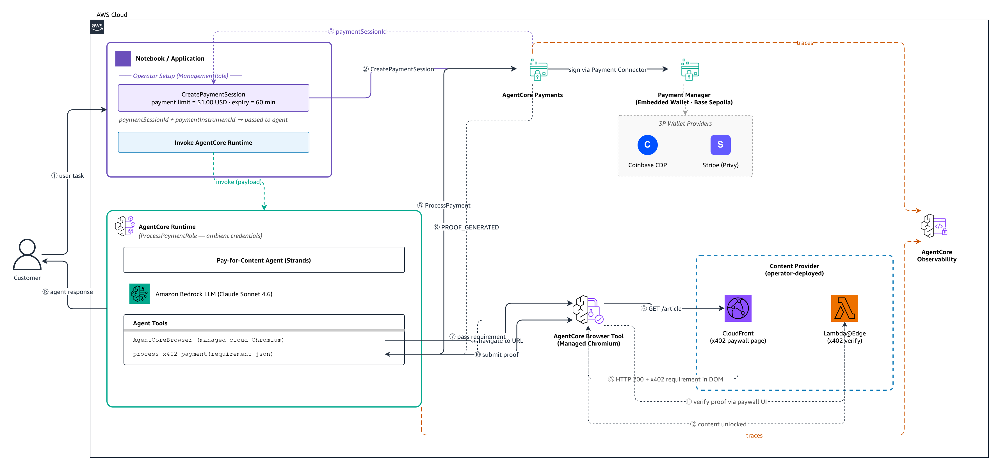
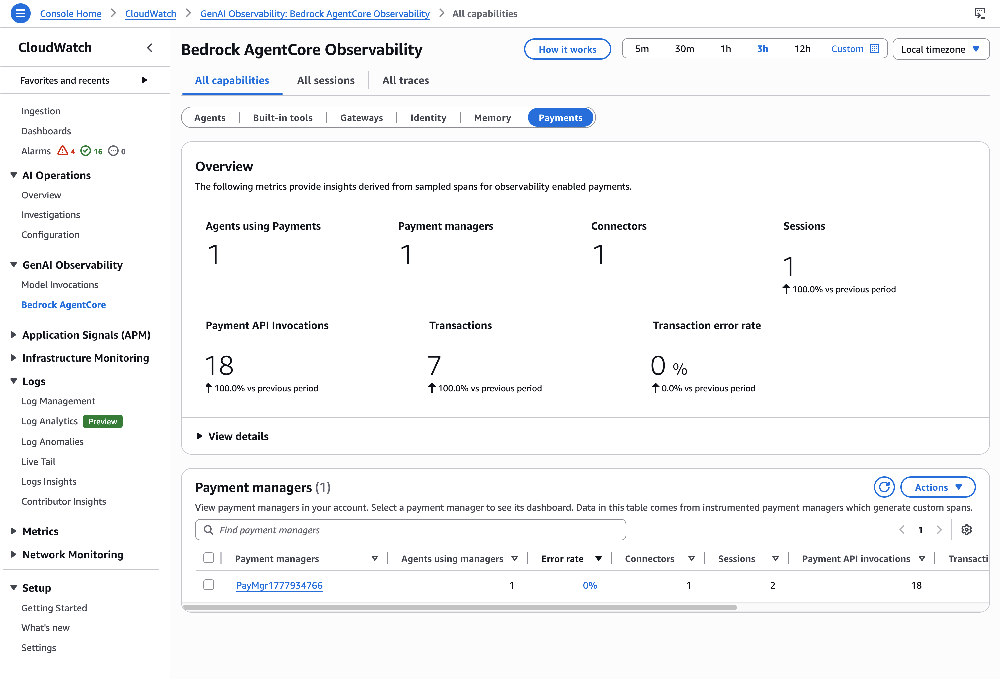
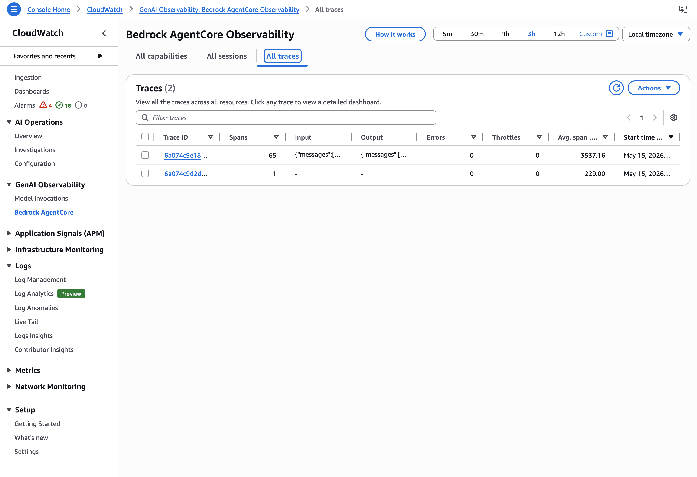
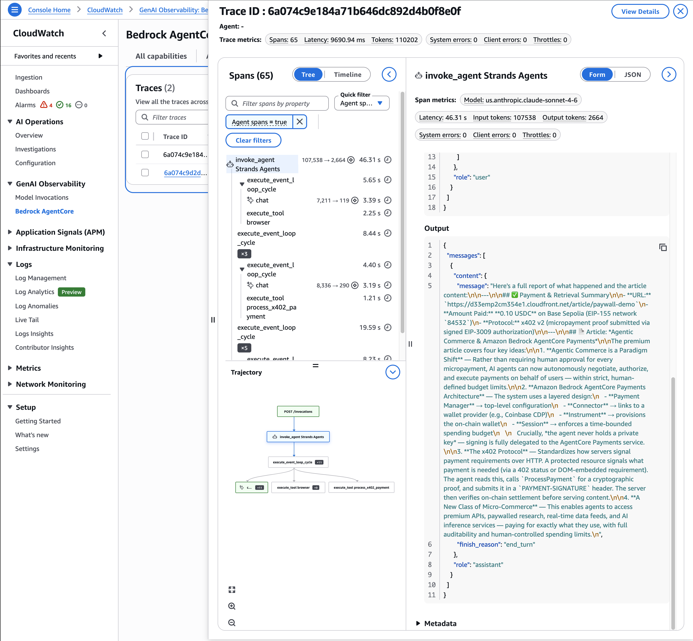

# Pay for Content — Browser Use Case (AgentCore runtime)

| Information         | Details                                                                       |
|:--------------------|:------------------------------------------------------------------------------|
| Use case type       | Agentic browser automation with autonomous micropayment                       |
| Agent type          | Single                                                                        |
| Hosting             | AgentCore runtime (managed microVM, role-segregated)                          |
| Payment protocol    | x402 (HTTP 402 Payment Required)                                              |
| Agentic Framework   | Strands Agents                                                                |
| LLM model           | Anthropic Claude Sonnet 4.6                                                   |
| Complexity          | Intermediate                                                                  |
| SDK used            | boto3 + AgentCore SDK + AgentCorePaymentsPlugin (Strands) + AgentCore CLI     |
| Wallet type         | Embedded crypto wallet (AgentCore-provisioned, Coinbase CDP)                  |
| Network             | Base Sepolia testnet (`eip155:84532`); Solana Devnet available                |

## Overview

Without AgentCore payments, an agent that needs to pay for content must either hold a
private key (exposing credentials to the model) or interrupt the user to complete the
payment manually. This use case shows a third path: the agent **leverages AgentCore
Payments for payment processing**, stays within human-set payment limits, and completes
the entire browse-pay-extract flow autonomously from a managed runtime container.

The agent is deployed to **AgentCore runtime** under `ProcessPaymentRole`, uses the
**AgentCore Browser Tool** to navigate a paywalled website, reads the embedded x402
payment requirement from the page DOM, calls `ProcessPayment` to generate a payment
proof, interacts with the paywall UI, and returns the unlocked content — without any
private key exposure or human intervention.

## Architecture

There are four distinct phases: **resource provisioning** (runs once), **session setup**
(runs before each invocation), **deploy** (runs on agent code change), and **invoke**
(the live payment flow). The content provider CDK stack (`content-provider/`) must be
deployed separately — it cannot be reached via `localhost`.

```
RESOURCE PROVISIONING  (pay_for_content_browser.py Step 3, ControlPlaneRole)
─────────────────────────────────────────────────────────────────────────────────

  cp_client   ──► bedrock-agentcore-control ──► CreatePaymentCredentialProvider,
                                                CreatePaymentManager,
                                                CreatePaymentConnector
  mgmt_client ──► bedrock-agentcore         ──► CreatePaymentInstrument

  Result: CREDENTIAL_PROVIDER_ARN, MANAGER_ARN, PAYMENT_CONNECTOR_ID, PAYMENT_INSTRUMENT_ID


SESSION SETUP  (pay_for_content_browser.py Step 4, ManagementRole)
─────────────────────────────────────────────────────────────────────────────────

  Notebook (ManagementRole)              AgentCore payments
  ─────────────────────────              ──────────────────────────────
  CreatePaymentSession ─────────────────► budget=$1.00 USD, expiry=60 min
                                          paymentSessionId


DEPLOY AGENT TO RUNTIME  (pay_for_content_browser.py Step 5, AgentCore CLI)
─────────────────────────────────────────────────────────────────────────────────

  agent/payment_agent.py            agentcore CLI                 AWS
  agent/requirements.txt          + agentcore deploy            (CodeBuild builds
  agent/Dockerfile                                               from Dockerfile)
  (BedrockAgentCoreApp +    ──►    create / deploy     ──►   AgentRuntime
   AgentCoreBrowser +                                          (execution role:
   process_x402_payment)                                       ProcessPaymentRole)
                                                               + ECR image
                                                               + CodeBuild project
                                                               + CloudWatch logs


INVOKE  (pay_for_content_browser.py Step 6, ManagementRole → AgentCore runtime)
─────────────────────────────────────────────────────────────────────────────────

  App backend (ManagementRole)
   │
   │ InvokeAgentRuntime(arn,
   │     paywall_url, session_id,
   │     instrument_id, manager_arn)
   ▼
  ┌──────────────────────────────────────────────────────────────┐
  │  AgentCore runtime microVM  (ProcessPaymentRole)             │
  │                                                              │
  │  Strands Agent  (Claude Sonnet 4.6)                          │
  │   Tool 1: AgentCoreBrowser ──► managed cloud Chromium        │
  │   Tool 2: process_x402_payment ──► PaymentManager            │
  │   Plugin: AgentCorePaymentsPlugin (payment query tools)      │
  └───────────┬──────────────────────────────┬───────────────────┘
              │ HTTPS                        │ AWS API (ambient creds)
              ▼                              ▼
  ┌───────────────────────┐      ┌───────────────────────────────┐
  │  Content Provider     │      │  AgentCore payments           │
  │  (CDK CloudFront +    │      │  ProcessPayment API           │
  │   Lambda@Edge)        │      │                               │
  │                       │      │  ┌────────────────────────┐   │
  │  HTTP 200             │      │  │  Embedded Wallet        │   │
  │  x402 requirement     │      │  │  (Coinbase CDP)         │   │
  │  in DOM script tag    │      │  │  Base Sepolia testnet   │   │
  │                       │      │  └────────────────────────┘   │
  │  proof submitted via  │ ◄────┤  status: PROOF_GENERATED      │
  │  paywall UI → unlock  │      └───────────────────────────────┘
  └───────────────────────┘
   │ article text
   ▼
  Agent returns content + amount paid to caller


OBSERVABILITY  (automatic)
─────────────────────────────────────────────────────────────────────────────────

  Each invocation emits a CloudWatch GenAI observability trace covering
  the agent loop, tool calls, payment SDK calls, and ProcessPayment API
  latency. Metrics in the bedrock-agentcore namespace.


CLEANUP
─────────────────────────────────────────────────────────────────────────────────

  agentcore remove all -y       — tears down runtime, ECR, log groups
  Session expiry                — agent can no longer spend after expiry
```



**Key design points:**

- **Hosted on AgentCore runtime.** The agent runs inside a managed microVM under
  `ProcessPaymentRole`. Role separation is enforced by infrastructure — the container
  assumes `ProcessPaymentRole` directly, and that role has an explicit Deny on session
  and instrument management. The agent code never calls `sts:AssumeRole`.
- **App backend pattern.** `pay_for_content_browser.py` (under `ManagementRole`) creates
  the session with a budget, then calls `InvokeAgentRuntime`. The agent is stateless and
  wallet-agnostic — the same deployment serves any user the backend authorizes.
- **Embedded wallet.** AgentCore provisions the on-chain wallet — no pre-existing CDP
  wallet or funded account is required. The `linkedAccounts` email field ties the wallet
  to a user identity. Coinbase embedded wallets are provisioned synchronously.
- **Browser pattern vs plugin pattern.** The content provider returns HTTP 200 with the
  x402 requirement embedded in a `<script id="x402-requirement">` tag — not an HTTP 402
  response. The plugin's auto-intercept hook does not fire. Instead the agent reads the
  requirement from the DOM and calls `process_x402_payment` to generate the proof.
  `PaymentManager.generate_payment_header()` produces the signed proof; the agent then
  fills it into the paywall UI.
- **No private keys.** Signing is delegated to the AgentCore-managed embedded wallet.

## IAM Role Design

| Role | Operations allowed | Denied | Used by |
|:-----|:-------------------|:-------|:--------|
| `ControlPlaneRole` | `CreatePaymentCredentialProvider`, `CreatePaymentManager`, `CreatePaymentConnector`, `CreatePaymentInstrument` | `ProcessPayment`, session management | Script (Step 3) |
| `ManagementRole` | `CreatePaymentSession`, `GetPaymentSession`, `InvokeAgentRuntime` | `ProcessPayment` | Script (Step 4, Step 6) |
| `ProcessPaymentRole` | `ProcessPayment`, `GetPaymentInstrument`, `GetPaymentInstrumentBalance`, browser tool, ECR pull, CloudWatch, X-Ray, Bedrock model | All setup and session management ops | **AgentCore runtime** as execution role |
| `ResourceRetrievalRole` | Service-side payment-token retrieval | n/a (assumed by AWS service) | AgentCore service |

## Prerequisites

- Python 3.10+
- Node.js 20+ (for AgentCore CLI and content-provider CDK)
- AWS CLI v2 configured with credentials
- AWS CDK v2 installed
- AgentCore CLI installed: `npm install -g @aws/agentcore`
  > No local Docker required. Step 5 builds via CodeBuild in AWS.
- Coinbase CDP account — `CDP_API_KEY_NAME`, `CDP_API_KEY_PRIVATE_KEY`, `CDP_WALLET_SECRET`
  from [portal.cdp.coinbase.com](https://portal.cdp.coinbase.com)
  - **Enable Delegated Signing**: project → Wallet → Embedded Wallets → Policies → enable Delegated signing
- IAM roles: run `bash setup_roles.sh` once per account
- Content provider deployed: `cd content-provider && PAY_TO=0x<wallet> bash deploy.sh`
  — set `CONTENT_DISTRIBUTION_URL` in `.env` to the printed CloudFront URL

## Running the Python Scripts

```bash
pip install -r requirements.txt
```

```bash
# 1. Create IAM roles (once per account)
bash setup_roles.sh

# 2. Configure environment
cp .env.sample .env
# Edit .env: fill in CDP credentials, role ARNs, CONTENT_DISTRIBUTION_URL

# 3. Run the full use case (provision → deploy → invoke)
python pay_for_content_browser.py
```

> **First run:** Step 3 creates the embedded wallet and prints a WalletHub URL. Open it,
> fund the wallet via [faucet.circle.com](https://faucet.circle.com), and grant signing
> permission. Then set `MANAGER_ARN`, `PAYMENT_CONNECTOR_ID`, `PAYMENT_INSTRUMENT_ID` in
> `.env` and re-run. The script will skip provisioning automatically.

## CLI Commands (runtime Deployment)

```bash
# Install AgentCore CLI
npm install -g @aws/agentcore

# Deploy the agent (handled by pay_for_content_browser.py Step 5 — or run manually)
cd payforcontent
agentcore deploy -y

# Invoke the deployed agent directly
agentcore invoke '{
  "prompt": "Retrieve the premium article from <PAYWALL_URL>. Pay for it using x402.",
  "paywall_url": "<PAYWALL_URL>",
  "payment_manager_arn": "<MANAGER_ARN>",
  "user_id": "test-user-12345",
  "payment_session_id": "<SESSION_ID>",
  "payment_instrument_id": "<INSTRUMENT_ID>"
}'

# View observability traces
agentcore traces list --limit 20

# View runtime logs
agentcore logs

# Clean up runtime deployment
agentcore remove all -y
```

## observability







| Layer | Source | Where it shows |
|-------|--------|---------------|
| runtime | `agentcore deploy` enables OTEL via `opentelemetry-instrument` CMD | AgentCore → All traces |
| Agent (Strands) | Strands emits OTEL spans through the runtime distro | Inside each trace's waterfall |
| Browser tool | `AgentCoreBrowser` emits client-side spans (start, navigate, cleanup) | Inside each trace's waterfall |
| Payment Manager | Vended log delivery (Step 4b) | AgentCore observability → **payments** tab |

The *Agents using payments* counter in the dashboard increments automatically when `PaymentManager`
and `AgentCorePaymentsPluginConfig` are constructed with `agent_name=`. The agent reads `AGENT_NAME`
from the container environment and passes it to both.

> **Browser observability caveat:** `PutDeliverySource` rejects browser ARNs — browser-tool actions
> appear as spans inside the agent trace but no separate Browser-service dashboard exists.

## Troubleshooting

### `CONTENT_DISTRIBUTION_URL` is empty

Deploy the CDK content-provider stack first:
```bash
cd content-provider
PAY_TO=0x<your-wallet-address> bash deploy.sh
```
Then set `CONTENT_DISTRIBUTION_URL` in `.env` to the printed CloudFront URL. `AgentCoreBrowser`
is a cloud-managed browser and cannot reach `localhost`.

### `ProcessPayment` fails with delegated signing error

Enable **Delegated Signing** in your Coinbase CDP project:
[portal.cdp.coinbase.com](https://portal.cdp.coinbase.com) → your project → Wallet → Embedded Wallets
→ Policies → enable **Delegated signing**. Without this the embedded wallet cannot sign transactions.

### Wallet balance shows 0 after funding

The faucet transaction may still be pending on Base Sepolia. Wait ~1 minute and re-run the script.
The script uses `GetPaymentInstrumentBalance` to check balance before proceeding.

### CodeBuild fails with ECR permission error

Ensure `ProcessPaymentRole` has `ecr:GetAuthorizationToken`, `ecr:BatchCheckLayerAvailability`,
`ecr:GetDownloadUrlForLayer`, and `ecr:BatchGetImage`. The `setup_roles.sh` script adds these
as part of the runtime execution role setup.

### Playwright `weakref.NoneType` error

The script pins to Python 3.13 (`runtimeVersion = PYTHON_3_13`). If you see this error, verify
that the pinning was written to `agentcore.json` before deploy (Step 5c in the script).

## Clean Up

Tear down in this order:

```bash
# 1. Remove runtime deployment (AgentRuntime, ECR repo, CodeBuild project, CloudWatch logs)
cd payforcontent && agentcore remove all -y

# 2. Remove content provider CDK stack
cd content-provider/cdk && npx cdk destroy

# 3. Payment session expires automatically after SESSION_EXPIRY_MINUTES (default: 60)
# 4. Delete payment manager / connector / instrument via AWS CLI or boto3 if desired
# 5. Delete IAM roles from IAM console when no longer needed
```

## Shared Responsibility

| Concern | AWS / AgentCore | You (the customer) |
|:--------|:----------------|:-------------------|
| runtime container isolation | microVM per session, automatic teardown | Set `idleTimeout`, `maxLifetime` to your workload |
| Payment signing keys | Held in AgentCore / Coinbase CDP delegated | Enable Delegated Signing in CDP project |
| Spend limits | Service enforces `maxSpendAmount` per session | Set per-session budget appropriate for the task |
| IAM role segregation | runtime assumes the execution role you specified | Author least-privilege role policies (see `setup_roles.sh`) |
| observability ingestion | Traces + metrics emitted automatically | Build alarms on the metrics you care about |
| Wallet funding | Embedded wallet provisioned by AgentCore | Fund via faucet (testnet) or onramp (production) |
| Browser session security | Containerized Chromium, ephemeral | Avoid logging in to production accounts via the agent |
