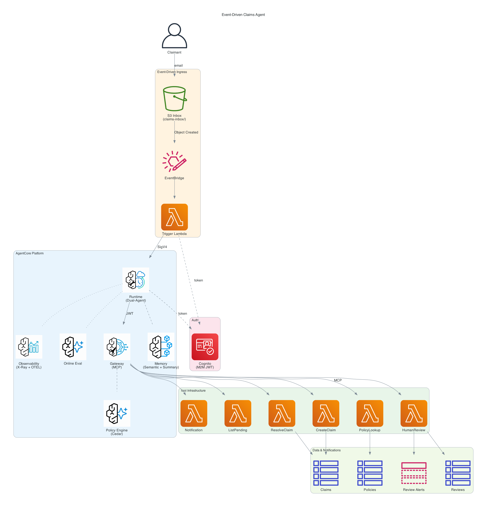
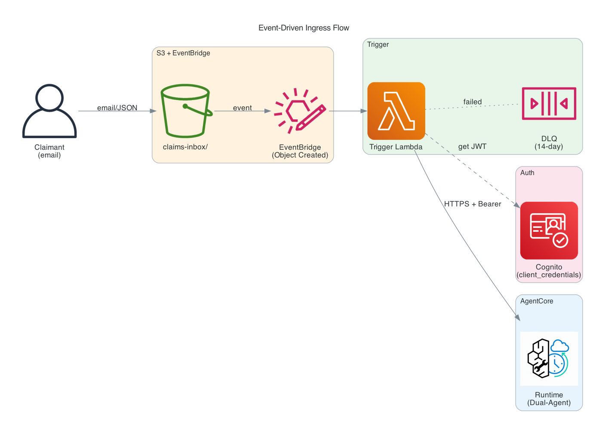
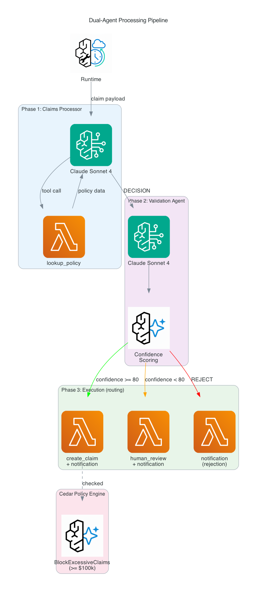
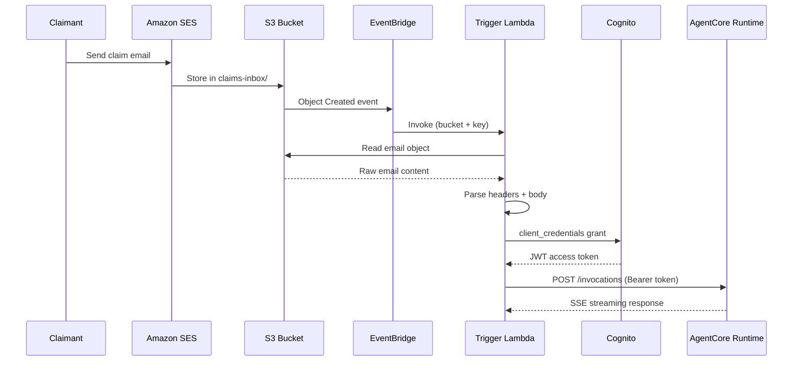
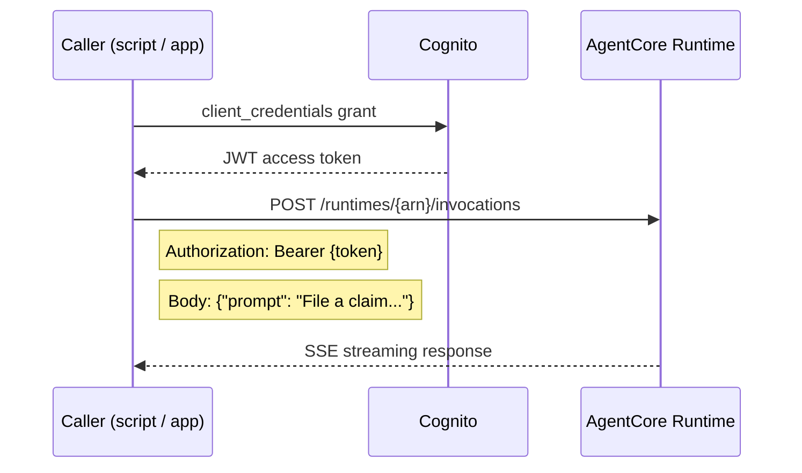
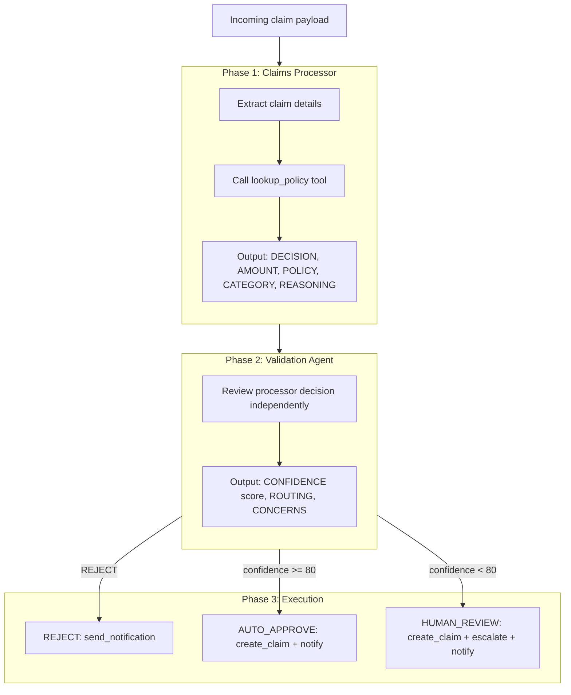
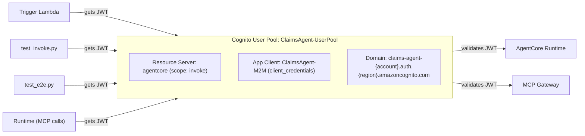

# Architecture: Event-Driven Claims Agent

## System Overview

The Event-Driven Claims Agent is an insurance claims processor built on Amazon Bedrock AgentCore. It accepts claim submissions via email (through S3/EventBridge) or direct API invocation, processes them through a dual-agent pipeline, and routes outcomes to auto-approval or human review.

This document explains:
- **Components** — what each piece does and how they connect
- **Data flows** — how a claim moves from submission to resolution
- **Authentication** — how services authenticate to each other (Cognito M2M, JWT)
- **Tool architecture** — how the agent calls Lambda tools via the MCP Gateway
- **Memory and evaluation** — how the system remembers and monitors quality

## Architecture Diagrams

### High-Level Architecture



### Event-Driven Ingress Flow



### Dual-Agent Processing Pipeline



> **Regenerating diagrams:** The `.py` scripts in `docs/diagrams/` are the source of truth. To regenerate after changes: `uv run python3 docs/diagrams/<script>.py` (requires `diagrams` library and Graphviz).

---

## Component Descriptions

### AgentCore Runtime

- **Build type:** Container (ARM64/Graviton, Python 3.12)
- **Framework:** Strands Agents SDK
- **Auth (inbound):** AWS_IAM (SigV4) — callers sign requests with AWS credentials
- **Auth (outbound to Gateway):** Cognito M2M JWT (`client_credentials` flow)
- **Entrypoint:** `app/claimsagent/main.py`
- **Agents:** Two `Agent` instances (Claims Processor, Validation Agent), lazily initialized as module-level singletons
- **Model:** `global.anthropic.claude-sonnet-4-6` (cross-region inference profile)

### AgentCore Gateway

- **Protocol:** MCP (Model Context Protocol) over streamable HTTP
- **Auth:** Cognito M2M (same user pool as Runtime, separate M2M flow)
- **Search type:** SEMANTIC (tool discovery by description)
- **Targets:** 6 Lambda functions (see tool table below)
- **Policy enforcement:** Cedar Policy Engine runs before every tool call

### Cedar Policy Engine

Two policies are enforced at the Gateway level:

| Policy | Effect | Condition |
|--------|--------|-----------|
| `AllowAllTools` | permit | Any authenticated principal, any tool, on this gateway |
| `BlockExcessiveClaims` | forbid | `create-claim` when `context.input.estimated_amount >= 100000` |

Policy Engine operates in `ENFORCE` mode — blocked tool calls return an authorization error to the agent.

### Lambda Tool Functions

| Tool | Lambda | DynamoDB | Notes |
|------|--------|----------|-------|
| `lookup_policy` | `ClaimsAgent-PolicyLookup` | PoliciesTable (read) | Returns policy details or "not found" |
| `create_claim` | `ClaimsAgent-CreateClaim` | ClaimsTable (write) | Agent passes `status` + `decision` |
| `request_human_review` | `ClaimsAgent-HumanReview` | ReviewsTable (write) | Also publishes to SNS |
| `send_notification` | `ClaimsAgent-Notification` | — | SES send email |
| `list_pending_claims` | `ClaimsAgent-ListPending` | ClaimsTable (scan) | Filters `status=pending_review` |
| `resolve_claim` | `ClaimsAgent-ResolveClaim` | ClaimsTable + ReviewsTable (update) | Human operator resolves |

All handlers return `json.dumps({...})` directly — no HTTP envelope.

### Trigger Lambda

Handles the event-driven path from S3 → Runtime:
1. Receives EventBridge event with S3 object details
2. Reads the file from S3 (email format or raw JSON)
3. Parses email headers to extract `claimant_email` and `subject`
4. Obtains Cognito M2M JWT via `client_credentials` flow
5. Invokes the Runtime via HTTPS with `Authorization: Bearer <token>`
6. Buffers the SSE streaming response

---

## Data Flows

### Event-Driven Path (Email → S3 → EventBridge → Agent)



### Direct Invocation Path (API → Agent)



---

## Dual-Agent Processing Pipeline



### Routing Logic

```python
# From main.py — priority: explicit ROUTING keyword > confidence threshold
if "HUMAN_REVIEW" in validator_response:
    routing = "HUMAN_REVIEW"
elif "AUTO_APPROVE" in validator_response:
    routing = "AUTO_APPROVE"
elif confidence >= 80:
    routing = "AUTO_APPROVE"
else:
    routing = "HUMAN_REVIEW"
```

High-value claims (>$25k) receive lower validator confidence by design (encoded in `VALIDATOR_PROMPT`). Claims ≥$100k are blocked entirely by Cedar before `create_claim` can be called.

---

## Memory Strategy

- **SEMANTIC** — stores and retrieves facts about claims and policies across sessions
- **SUMMARIZATION** — compresses session history for repeat claimants
- Expiration: 90 days
- Graceful degradation: if Memory is not deployed or throws `ResourceNotFoundException`, the agent continues without memory (no crash)

---

## Observability

- **X-Ray tracing:** enabled on the Runtime
- **CloudWatch logs:** `APPLICATION_LOGS` → `/aws/bedrock-agentcore/claims-agent` (1-week retention)
- **Online Evaluation:** 3 built-in metrics (Helpfulness, Correctness, Tool Selection Accuracy) at 100% sampling, bound to the Runtime endpoint

---

## Cognito Authentication Architecture



All callers use the same Cognito pool and `client_credentials` flow. The Runtime validates inbound JWTs (from Trigger Lambda and test scripts) and also obtains its own JWT to authenticate outbound calls to the Gateway.
