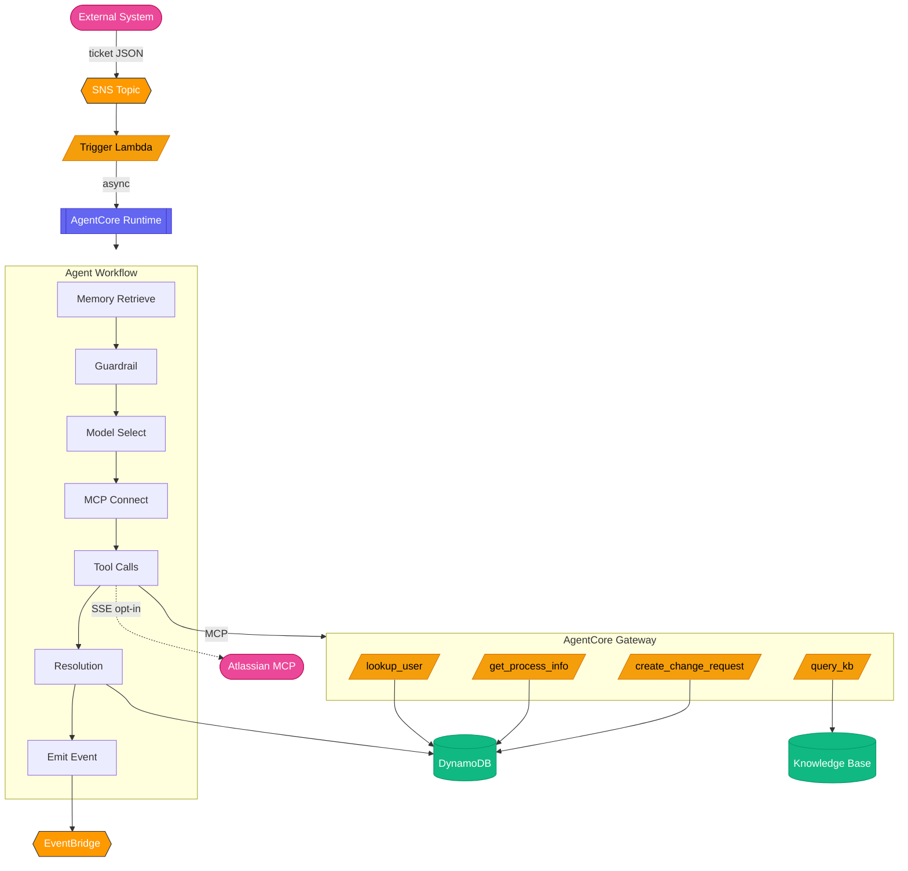
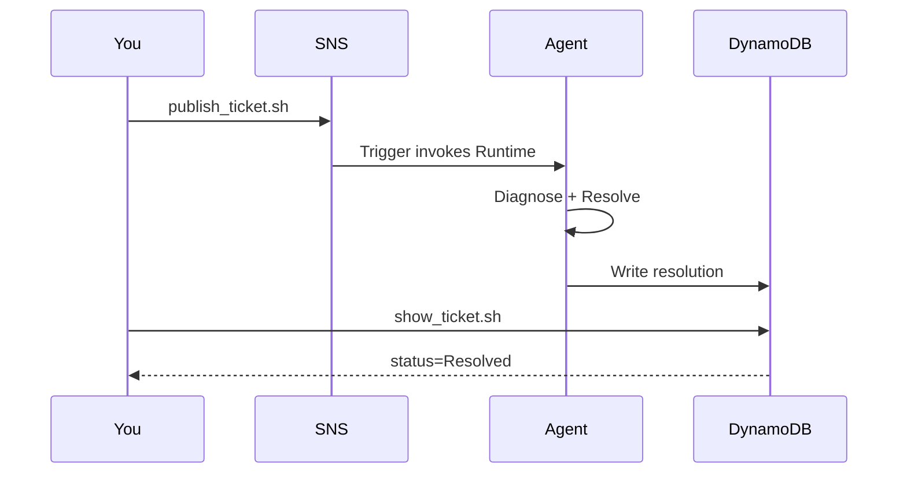
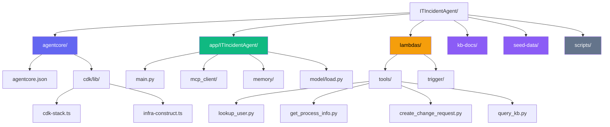

# IT Incident Response Agent on Amazon Bedrock AgentCore

An event-driven IT assistant built with the **AgentCore CLI-first** workflow.
Publish a "ticket" to SNS — an AgentCore Runtime agent picks it up, diagnoses
the issue using a Knowledge Base and Lambda tools (all behind an AgentCore
Gateway), records an episode in AgentCore Memory, and writes a resolution
comment back to the ticket store.

## Overview

### Use case details

| Information           | Details                                                                                                            |
| --------------------- | ------------------------------------------------------------------------------------------------------------------ |
| Use case type         | event-driven                                                                                                       |
| Agent type            | Single agent                                                                                                       |
| Use case components   | tools (MCP Gateway + Lambda), RAG (Knowledge Base), memory, observability, evaluation, guardrails, policy engine   |
| Use case vertical     | IT operations / ITSM                                                                                               |
| Example complexity    | Advanced                                                                                                           |
| SDK used              | Amazon Bedrock AgentCore SDK, AgentCore CLI, Strands Agents SDK, AWS CDK, boto3                                    |

## Architecture

### Demo

<p align="center">
  
</p>

> The agent receives a ticket, applies guardrails, retrieves memory, connects MCP tools, diagnoses the issue, creates a change request, and resolves the ticket — all streamed in real time. On resubmit, AgentCore Memory detects the recurrence and escalates.


<details>
<summary>Mermaid diagram of architecture</summary>


</details>

<details>
<summary>ASCII diagram (full detail)</summary>

```
┌────────────────────────────────────────────────────────────────────────────────────────┐
│                              AWS Account (single stack)                                │
│                                                                                        │
│  ┌─────────────┐    ┌───────────────┐     ┌────────────────────────────────────────┐   │
│  │  External   │    │  SNS Topic    │     │       AgentCore Runtime                │   │
│  │  System     │───▶│  (ticket or   │     │       (Strands Agent container)        │   │
│  │  (Jira/PD)  │    │  issue_key)   │     │                                        │   │
│  └─────────────┘    └──────┬────────┘     │  ┌──────────────────────────────────┐  │   │
│                            │              │  │  Event arrives:                  │  │   │
│                            ▼              │  │                                  │  │   │
│                     ┌──────────────┐      │  │  1. Retrieve Memory (enrich)     │  │   │
│                     │ Trigger      │      │  │  2. Apply Guardrail (PII filter) │  │   │
│                     │ Lambda       │────▶ │  │  3. Select model (cost routing)  │  │   │
│                     │              │      │  │  4. Connect Gateway (MCP)        │  │   │
│                     │ • validate   │      │  │  5. Connect Jira MCP (opt-in)    │  │   │
│                     │ • persist    │      │  │  6. Call tools (enrich + reason) │  │   │
│                     │ • DLQ        │      │  │  7. Write resolution             │  │   │
│                     └──────────────┘      │  │     (DDB or Jira comment)        │  │   │
│                                           │  │  8. Emit event (EventBridge)     │  │   │
│                                           │  │  9. Record memory (episodes)     │  │   │
│                                           │  └───────────────┬──────────────────┘  │   │
│                                           └─────────────────┬┼─────────────────────┘   │
│                                                             ││                         │
│                                              MCP (Gateway)  ││  SSE (Jira, opt-in)     │
│  ┌──────────────────────────────────────────────────────────┼┼──────────────────────┐  │
│  │                    AgentCore Gateway                     │╎                      │  │
│  │       Auth: AWS_IAM (default) or CUSTOM_JWT (Auth0/OIDC) │╎                      │  │
│  │       Semantic Search: enabled  │  Policy Engine (Cedar) │╎                      │  │
│  │                         ▼                                │╎                      │  │
│  │   ┌─────────────┐ ┌────────────────┐ ┌──────────────────┐│╎┌──────────────┐      │  │
│  │   │ lookup_user │ │get_process_info│ │create_change_req ││╎│  query_kb    │      │  │
│  │   │   (Lambda)  │ │   (Lambda)     │ │    (Lambda)      ││╎│  (Lambda)    │      │  │
│  │   └──────┬──────┘ └──────┬─────────┘ └────────┬─────────┘│╎└──────┬───────┘      │  │
│  └──────────┼───────────────┼────────────────────┼───────────┘╎──────┼──────────────┘  │
│             │               │                    │            ╎      │                 │
│             ▼               ▼                    ▼            ╎      ▼                 │
│  ┌──────────────────────────────────────────────────────┐    ╎┌───────────────────┐    │
│  │              DynamoDB Tables                         │    ╎│   Bedrock KB      │    │
│  │  ┌───────┐  ┌──────────┐  ┌────────┐  ┌──────────┐   │    ╎│   (S3 Vectors,    │    │
│  │  │ Users │  │Processes │  │Tickets │  │ Changes  │   │    ╎│    optional)      │    │
│  │  └───────┘  └──────────┘  └────────┘  └──────────┘   │    ╎└───────────────────┘    │
│  └──────────────────────────────────────────────────────┘    ╎                         │
│                                                              ╎                         │
└──────────────────────────────────────────────────────────────╎─────────────────────────┘
                                                               ╎
                                                               ▼ SSE (opt-in)
                                                  ┌──────────────────────────────┐
                                                  │ Atlassian Remote MCP Server  │
                                                  │ (mcp.atlassian.com/v1/sse)   │
                                                  │                              │
                                                  │  • getIssue                  │
                                                  │  • addComment                │
                                                  │  • transitionIssue           │
                                                  │                              │
                                                  │  Auth: AgentCore Identity    │
                                                  │  (USER_FEDERATION / 3LO)     │
                                                  └──────────────────────────────┘
```

</details>

**Supporting services** (inside the AWS account, not shown in diagram for clarity):

| Service                            | Role                                                                  |
| ---------------------------------- | --------------------------------------------------------------------- |
| **AgentCore Memory**               | SUMMARIZATION strategy — episodic recall across incidents per user    |
| **EventBridge**                    | Emits `TicketResolved` events for dashboards, audit, notifications    |
| **Bedrock Guardrail**              | PII anonymization + content/prompt-attack filtering on event payloads |
| **CloudWatch GenAI Observability** | OTEL traces + logs, Online Eval (4 LLM-as-judge evaluators)           |

**AgentCore Services demonstrated (6):**

| #   | Service              | How it's used                                                                                           |
| --- | -------------------- | ------------------------------------------------------------------------------------------------------- |
| 1   | **Runtime**          | Strands agent in container, 8-hour sessions, framework-agnostic                                         |
| 2   | **Gateway + Policy** | MCP protocol, 4 Lambda targets, Cedar policy engine (LOG_ONLY)                                          |
| 3   | **Memory**           | SUMMARIZATION strategy — episodic recall across incidents per user                                      |
| 4   | **Identity**         | AWS_IAM default, CUSTOM_JWT toggle via `@requires_access_token`, Atlassian 3LO (USER_FEDERATION) opt-in |
| 5   | **Observability**    | OTEL auto-instrumentation → CloudWatch GenAI console                                                    |
| 6   | **Evaluations**      | 4 built-in LLM-as-judge evaluators (continuous, declarative)                                            |

**Resilience features (10):**

| Feature                 | Implementation                                                         |
| ----------------------- | ---------------------------------------------------------------------- |
| Idempotency             | Conditional DDB writes (`attribute_not_exists`)                        |
| DLQ + Retries           | SQS dead-letter queue on trigger Lambda                                |
| Bounded autonomy        | Gateway + Policy Engine + per-tool IAM                                 |
| Guardrails              | Bedrock Guardrail (PII anonymize, content filter, prompt attack block) |
| Event schema discipline | `REQUIRED_FIELDS` validation in trigger                                |
| Continuous eval         | Online evaluation (4 LLM-as-judge evaluators) on all traces            |
| Cost shape              | Haiku for LOW priority, Sonnet for MEDIUM+                             |
| Latency                 | Async invoke (fire-and-forget at trigger)                              |
| Emit pattern            | EventBridge `TicketResolved` event for downstream                      |
| Observability           | Full OTEL tracing + CloudWatch alarms                                  |

## CLI-First Approach

This project demonstrates the **recommended** AgentCore development workflow
using the CLI (`@aws/agentcore`) for all AgentCore-managed resources.

> **Note**: The commands below show how this project was scaffolded. You do NOT
> need to run them — the configuration is already committed. They serve as a
> reference for building your own project from scratch.

```bash
# How this project was scaffolded:

# Scaffold a new AgentCore project with Strands framework, container-based Runtime, and short-term Memory
agentcore create --name ITIncidentAgent --framework Strands --build Container --memory shortTerm

# Add long-term Memory with a SUMMARIZATION strategy (rolls each session into a
# per-requester summary that powers cross-incident recall). The memory name
# becomes the MEMORY_{NAME}_ID env var the L3 injects into the Runtime —
# here ITIncidentAgentMemory → MEMORY_ITINCIDENTAGENTMEMORY_ID.
agentcore add memory --name ITIncidentAgentMemory --strategies SUMMARIZATION --expiry 30

# Add a Gateway (MCP protocol) to expose tools to the agent, secured with IAM auth
agentcore add gateway --name ITIncidentGateway --authorizer-type AWS_IAM

# Register each Lambda tool as a Gateway target so the agent can call it via MCP
agentcore add gateway-target --name lookup-user --type lambda-function-arn --tool-schema-file ...
agentcore add gateway-target --name get-process-info --type lambda-function-arn --tool-schema-file ...
agentcore add gateway-target --name create-change-request --type lambda-function-arn --tool-schema-file ...
agentcore add gateway-target --name query-kb --type lambda-function-arn --tool-schema-file ...

# Configure continuous online evaluation (LLM-as-judge) tied to the Runtime's trace output
agentcore add online-eval --name ITIncidentAgentEval --runtime ITIncidentAgent \
  --evaluator Builtin.Correctness Builtin.Helpfulness Builtin.ToolSelectionAccuracy Builtin.GoalSuccessRate \
  --sampling-rate 100

# Add a Policy Engine for bounded autonomy (Cedar policies on tool access)
agentcore add policy-engine --name ITIncidentPolicyEngine \
  --description "Cedar policy engine for bounded autonomy" \
  --attach-to-gateways ITIncidentGateway --attach-mode LOG_ONLY

# Add Cedar policies to the engine
agentcore add policy --name LogAllToolCalls --engine ITIncidentPolicyEngine \
  --statement 'permit(principal, action, resource is AgentCore::Gateway);' \
  --validation-mode IGNORE_ALL_FINDINGS

agentcore add policy --name RequireReasonForChangeRequest --engine ITIncidentPolicyEngine \
  --statement 'forbid(principal, action, resource is AgentCore::Gateway) when { context has "toolName" && context.toolName == "create-change-request" && !(context has "reason") };' \
  --validation-mode IGNORE_ALL_FINDINGS

# Enable OpenTelemetry instrumentation:
# OTEL auto-instrumentation is provided by the Dockerfile CMD
#   ["opentelemetry-instrument", "python", "-m", "main"]  (Container build)
# Plus runtimes[].envVars[] in agentcore.json for X-Ray and OTEL exporter configuration
```

Supplementary infrastructure (DynamoDB, S3, SNS, Lambda tools) is integrated
into the same CDK stack via `InfraConstruct` — deployed together with a single
`agentcore deploy`.

## Prerequisites

1. **AWS account** with CLI configured (`aws sts get-caller-identity` works).
2. **Bedrock model access** in your region for:
   - The agent model (default `us.anthropic.claude-sonnet-4-6`).
   - If using KB: the embedding model (`amazon.titan-embed-text-v2:0`).
   See [Bedrock model access](https://docs.aws.amazon.com/bedrock/latest/userguide/model-access.html).
3. **Node.js 20+** and AgentCore CLI: `npm install -g @aws/agentcore`
4. **Python 3.11+** and **uv** ([install](https://docs.astral.sh/uv/getting-started/installation/))
5. **Docker** (for building the agent container image)
6. **CDK bootstrapped**: `cdk bootstrap aws://ACCOUNT/REGION`

## Getting Started (Quickstart from a fresh clone)

If you just cloned the repo and want the exact path from zero to a deployed
agent, run these steps in order:

```bash
# 1. Configure your account/region
cp .env.example .env
#    Edit .env → set CDK_DEFAULT_ACCOUNT to your 12-digit account ID

# 2. Install CDK dependencies
cd agentcore/cdk && npm install
cd ../..

# 3. Deploy (sources .env, generates aws-targets.json, runs agentcore deploy)
./scripts/deploy.sh
```

That's it. The deploy script handles:
- Sourcing `.env` so CDK sees your env vars (`agentcore deploy` alone does NOT)
- Generating `agentcore/aws-targets.json` from the template (via `envsubst`)
- Validating `CDK_DEFAULT_ACCOUNT` is set
- Calling `agentcore deploy -y --target dev`

<details>
<summary>Alternative (manual path without the wrapper script)</summary>

```bash
set -a && source .env && set +a
cp agentcore/aws-targets.json.template agentcore/aws-targets.json
# Edit aws-targets.json → set account + region, name must be "dev"
agentcore validate
agentcore deploy -y --target dev
```

</details>

> **Note on `npm install`:** Running it inside `agentcore/cdk/` can leave an
> empty `package-lock.json` at the project root (an npm quirk when a parent
> directory has no `package.json`). It's harmless — delete it if it appears.

## Configure

Copy `.env.example` to `.env` and set your AWS account ID. All configuration
options are documented in that file with inline comments.

```bash
cp .env.example .env
# Edit .env → set CDK_DEFAULT_ACCOUNT=<your-12-digit-account-id>
```

The deploy script generates `agentcore/aws-targets.json` automatically from
your `.env` values (this file is gitignored since it contains your account ID).

<details>
<summary>If you need to create aws-targets.json manually</summary>

Copy the template and fill in your values. The target name must be `dev`
(matching what's recorded in `agentcore/.cli/deployed-state.json`):

```json
[{"name": "dev", "account": "YOUR_ACCOUNT_ID", "region": "us-west-2"}]
```

</details>

### Jira Integration (Optional — Atlassian Remote MCP)

| Variable                   | Purpose                                                         | Default                 |
| -------------------------- | --------------------------------------------------------------- | ----------------------- |
| `JIRA_OAUTH_CLIENT_ID`     | Atlassian OAuth 2.0 (3LO) client ID                             | (empty — Jira disabled) |
| `JIRA_OAUTH_CLIENT_SECRET` | Atlassian client secret (stored in AgentCore Identity)          | (empty)                 |
| `JIRA_SITE_URL`            | Atlassian Cloud site (e.g. `https://your-tenant.atlassian.net`) | (empty)                 |
| `JIRA_PROJECT_KEY`         | Jira project key for the issues the agent operates on           | `INC`                   |

When all `JIRA_*` vars are set, the agent connects to the Atlassian Remote MCP
server (`mcp.atlassian.com/v1/sse`) and can read issues, add comments, and
transition status directly in Jira. When unset, the agent uses the DDB mock
ticket store (default path — zero external dependencies).

See "Enable Jira Integration" below for setup steps.

## Deploy

```bash
agentcore deploy -y --target dev
```

This single command:
1. Builds the agent container image (Docker → ECR via CodeBuild)
2. Creates DynamoDB tables, S3 buckets, Lambda tool functions, SNS topic
3. Deploys AgentCore Runtime, Gateway, Memory
4. Wires Lambda ARNs into Gateway targets
5. Enables online evaluation

Expected duration: ~10–15 minutes (container build + resource provisioning).

### Stack Outputs

After deployment, `agentcore status` shows deployed resources. Key outputs:

| Output             | Description                           |
| ------------------ | ------------------------------------- |
| `TicketsTopicArn`  | SNS topic — publish JSON tickets here |
| `TicketsTableName` | DynamoDB table storing ticket state   |
| `AgentRuntimeArn`  | AgentCore Runtime ARN                 |
| `GatewayUrl`       | MCP endpoint of the AgentCore Gateway |
| `MemoryId`         | AgentCore Memory resource ID          |
| `DLQUrl`           | Dead letter queue for failed tickets  |

## Run an End-to-End Demo



```bash
# 1. Publish the bundled sample ticket (shared drive issue for U-1003)
./scripts/publish_ticket.sh

# 2. Watch the agent process it (recent logs)
agentcore logs --since 5m

# 3. After ~30 seconds, check the resolved ticket
./scripts/show_ticket.sh INC-20260604-001
```

You should see a row with `status=Resolved` and a `resolution_comment` written
by the agent.

### Custom Tickets

Publish your own ticket:

```bash
cat > /tmp/my-ticket.json <<'JSON'
{
  "ticket_id": "INC-CUSTOM-001",
  "requester_id": "U-1002",
  "title": "Outlook search returns nothing",
  "description": "Search box shows empty results on macOS, Outlook version 16.84.",
  "priority": "MEDIUM"
}
JSON

./scripts/publish_ticket.sh /tmp/my-ticket.json
```

**Ticket schema** (required fields):

| Field          | Type   | Notes                                                       |
| -------------- | ------ | ----------------------------------------------------------- |
| `ticket_id`    | string | Unique. Used as Memory `session_id`.                        |
| `requester_id` | string | Must exist in the Users table (see `seed-data/users.json`). |
| `title`        | string | Brief summary of the issue.                                 |
| `description`  | string | Detailed description with symptoms.                         |
| `priority`     | string | `LOW` / `MEDIUM` / `HIGH` / `CRITICAL` (default: `MEDIUM`). |

## Local Development

```bash
# Start the agent locally with hot-reload
agentcore dev

# Test with a simple prompt (no gateway connection needed)
agentcore dev "What can you help me with?"

# Test with a ticket payload (requires gateway deployed)
agentcore dev "$(cat seed-data/sample_ticket.json)"
```

### Port Mapping

`agentcore dev` starts two services:

| Port     | Service                 | Notes                                               |
| -------- | ----------------------- | --------------------------------------------------- |
| **8081** | Web UI (Chat inspector) | Browser-friendly, does NOT forward custom headers   |
| **8082** | Runtime container       | Your agent code; accepts `curl` with custom headers |

> **Important**: The container's internal port 8080 is mapped to **host port 8082**.
> Do NOT curl `localhost:8080` — nothing listens there on the host.

To test the runtime directly (e.g., with CUSTOM_JWT auth that requires a User-Id header):

```bash
curl -N http://localhost:8082/invocations \
  -H "Content-Type: application/json" \
  -H "X-Amzn-Bedrock-AgentCore-Runtime-User-Id: test-user" \
  -d '{"prompt": "What can you help me with?"}'
```

### Environment Variables for Local Dev

The CLI passes `agentcore/.env.local` into the dev container. This file is
**gitignored** — create it manually with your runtime env vars:

```bash
# agentcore/.env.local
AGENT_MODEL_ID=us.anthropic.claude-sonnet-4-6
FAST_MODEL_ID=us.anthropic.claude-haiku-4-5-20251001-v1:0
```

| File                      | Used by                            | Purpose                             |
| ------------------------- | ---------------------------------- | ----------------------------------- |
| `.env`                    | CDK synthesis (`agentcore deploy`) | Account, region, deploy-time config |
| `agentcore/.env.local`    | Dev container (`agentcore dev`)    | Runtime env vars passed to agent    |
| CDK `addPropertyOverride` | Deployed Runtime                   | Production env vars (set at deploy) |

> **Tip**: If you get "model identifier is invalid" during local dev:
> 1. Ensure `AWS_REGION=us-west-2` is set in `agentcore/.env.local`
> 2. Set `AGENT_MODEL_ID` to a full model ID with version (e.g., `us.anthropic.claude-sonnet-4-6`)
> 3. Verify the model is available in that region with `aws bedrock list-foundation-models --region us-west-2 --query 'modelSummaries[?contains(modelId, \`claude\`)].modelId'`

## Observability + Evaluation

### Traces and Logs

The agent container includes AWS Distro for OpenTelemetry. Spans and logs
flow to CloudWatch, viewable in the **GenAI Observability** console:

```bash
# View recent runtime logs (last 5 minutes)
agentcore logs --since 5m

# List recent traces
agentcore traces list

# View a specific trace
agentcore traces get <trace_id>
```

### Online Evaluation

This project deploys **Online Evaluation** with 4 built-in evaluators:
- `Correctness` — Did the agent provide accurate information?
- `Helpfulness` — Was the response useful to the user?
- `ToolSelectionAccuracy` — Did the agent choose the right tools?
- `GoalSuccessRate` — Did the agent accomplish the user's goal?

**Configuration**: Defined declaratively in `agentcore/agentcore.json` under `onlineEvalConfigs[]`:

```json
"onlineEvalConfigs": [{
  "name": "ITIncidentAgentEval",
  "agent": "ITIncidentAgent",
  "evaluators": ["Builtin.Correctness", "Builtin.Helpfulness", "Builtin.ToolSelectionAccuracy", "Builtin.GoalSuccessRate"],
  "samplingRate": 100
}]
```

**Important**: Online Evaluation requires **CloudWatch Transaction Search** so that OTEL spans land in the `aws/spans` log group. The stack **enables this automatically** via a custom resource (`lambdas/infra/transaction_search.py`) whenever `onlineEvalConfigs` is non-empty — no manual `aws application-signals start-monitoring` step is needed. The first deploy may take 10-15 minutes for the `/aws/spans` log group to provision before eval results appear.

**To disable Online Evaluation** (e.g., for first-time setup without Transaction Search):
set `onlineEvalConfigs` to `[]` in `agentcore/agentcore.json` and redeploy. With it empty, the Transaction Search custom resource is not created.

**Cost**: Typical agent workload (100 requests/day) costs **$5-15/month**. CloudWatch Transaction Search is optional.

### OpenTelemetry & Tracing (declarative)

OTEL auto-instrumentation is provided by the Dockerfile `CMD`
(`["opentelemetry-instrument", "python", "-m", "main"]`), and the OTEL/X-Ray
environment variables are configured declaratively in `agentcore/agentcore.json`:

```json
"runtimes": [{
  "name": "ITIncidentAgent",
  "envVars": [
    { "name": "_AWS_XRAY_DAEMON_ADDRESS", "value": "localhost:2000" },
    { "name": "_AWS_XRAY_TRACING_ENABLED", "value": "true" },
    { "name": "OTEL_TRACES_EXPORTER", "value": "otlp" },
    { "name": "OTEL_EXPORTER_OTLP_PROTOCOL", "value": "http/protobuf" }
  ]
}]
```

The L3 construct injects these env vars into the Runtime automatically — no imperative CDK code needed. Traces flow to CloudWatch X-Ray and are viewable in the GenAI Observability console.

### Retrieve Evaluation Results

View the continuous online evaluation scores for recent agent invocations:

```bash
python scripts/evaluate.py              # last 1 hour of results
python scripts/evaluate.py --hours 24   # last 24 hours
python scripts/evaluate.py --raw        # JSON output (for piping to jq)
```

Results are also viewable in the CloudWatch GenAI Observability dashboard.

## Inspect What the Agent Did

```bash
# View the resolved ticket
./scripts/show_ticket.sh INC-20260604-001

# Scan change requests created by the agent
aws dynamodb scan --table-name <ChangeRequestsTable> --region $AWS_REGION

# List Memory events for a user
aws bedrock-agentcore list-events \
  --memory-id <MemoryId> \
  --actor-id U-1003 \
  --region $AWS_REGION

# Runtime logs (last 10 minutes)
agentcore logs --since 10m
```

## Customization Guide

### Change the Agent Model

Edit `app/ITIncidentAgent/model/load.py` or set the `AGENT_MODEL_ID` environment
variable. The model must be enabled in your Bedrock console.

```python
# model/load.py — supported models include:
# us.anthropic.claude-sonnet-4-6 (default)
# us.anthropic.claude-haiku-4-5-20251001-v1:0 (faster, cheaper)
# us.meta.llama-4-405b-instruct-v1:0
```

### Modify the System Prompt

Edit the `SYSTEM_PROMPT` in `app/ITIncidentAgent/main.py`. The prompt controls
the agent's workflow — tool calling order, escalation logic, and output format.

### Add a New Tool

1. **Create the Lambda**: Add a new file in `lambdas/tools/my_tool.py`
2. **Create the schema**: Add `tool-schemas/my-tool.json`
3. **Register via CLI**: `agentcore add gateway-target --name my-tool --type lambda-function-arn --tool-schema-file tool-schemas/my-tool.json --gateway ITIncidentGateway --lambda-arn PLACEHOLDER`
4. **Wire in CDK**: Add the Lambda to `infra-construct.ts` and update `lambdaArnMap`
5. **Deploy**: `agentcore deploy -y --target dev`

### Add CUSTOM_JWT Auth (Auth0/OIDC)

Replace AWS_IAM with external identity provider auth:

**Quick way (interactive):**
```bash
./scripts/enable-custom-jwt.sh
```

**Manual way:**
1. Create an M2M application in your IdP (Auth0 free tier recommended for testing)
2. Store credentials in AgentCore Identity (the agent never sees the secret):
   ```bash
   agentcore add credential --name auth0-m2m --type oauth \
     --client-id <CLIENT_ID> --client-secret <CLIENT_SECRET> \
     --discovery-url https://<TENANT>.auth0.com/.well-known/openid-configuration
   ```
3. Set env vars in `.env`:
   ```
   GATEWAY_AUTH_MODE=CUSTOM_JWT
   GATEWAY_OAUTH_PROVIDER_NAME=auth0-m2m
   GATEWAY_OAUTH_AUDIENCE=https://your-api-identifier
   ```
4. Deploy: `agentcore deploy -y --target dev`
5. Test: `./scripts/publish_ticket.sh && agentcore logs --since 5m`
   - Look for: `Using CUSTOM_JWT auth (provider: auth0-m2m)`

> **Important**: The `CLIENT_SECRET` must be stored via `agentcore add credential`,
> NOT in `.env`. AgentCore Identity handles the token exchange securely.

See `docs/custom-jwt-auth-upgrade.md` for detailed setup (including Google, Okta,
Microsoft), testing steps, and troubleshooting.

### Configure Memory

The agent uses **AgentCore Memory** for cross-incident recall: each resolved
ticket is summarized and, on the next ticket from the same requester, prior
summaries are injected into the system prompt so the agent can detect recurring
issues and escalate.

Memory is declared in `agentcore/agentcore.json` under `memories[]`:

```json
"memories": [{
  "name": "ITIncidentAgentMemory",
  "eventExpiryDuration": 30,
  "strategies": [
    { "type": "SUMMARIZATION", "name": "summary_strategy", "namespaces": ["incidents/{actorId}/{sessionId}"] }
  ]
}]
```

**To (re)create this via the CLI** instead of editing JSON by hand:

```bash
agentcore add memory --name ITIncidentAgentMemory --strategies SUMMARIZATION --expiry 30
```

| Flag           | Value / meaning                                                        |
| -------------- | ---------------------------------------------------------------------- |
| `--name`       | `ITIncidentAgentMemory` — becomes the `MEMORY_{NAME}_ID` env var the L3 injects into the Runtime (`MEMORY_ITINCIDENTAGENTMEMORY_ID`), which `config.py` reads as `MEMORY_ID`. |
| `--strategies` | `SUMMARIZATION` — rolls each session into a per-requester summary. Comma-separate to add more (e.g. `SEMANTIC,SUMMARIZATION`). |
| `--expiry`     | Event expiry in days (default 30, min 7, max 365).                     |

After adding, validate and deploy:

```bash
agentcore validate
agentcore deploy -y --target dev
```

> **SUMMARIZATION requires `{sessionId}`:** A `SUMMARIZATION` strategy's
> `namespaces` **must** include the `{sessionId}` placeholder, or `CreateMemory`
> fails validation ("requiring {sessionId} as a mandatory part of namespace").
> This project uses `incidents/{actorId}/{sessionId}`.

> **Namespace alignment (important):** `memory/enrichment.py` retrieves with the
> prefix `incidents/{requester_id}` (i.e. `incidents/{actorId}`). Because
> `retrieve_memories` does **prefix** matching, the session-scoped namespace
> `incidents/{actorId}/{sessionId}` is still fully matched by that prefix — so
> retrieval returns all of a requester's session summaries. If you change the
> strategy's `namespaces` in `agentcore.json`, keep the `incidents/{actorId}/...`
> prefix (or update `retrieve_past_incidents()` to match), or retrieval returns
> nothing.

> **Disable / no-op behavior:** If `memories[]` is empty (and no `MEMORY_ID` is
> set), the agent's Memory code degrades gracefully to a no-op — tickets are
> still resolved, just without cross-incident recall. Remove it with
> `agentcore remove memory --name ITIncidentAgentMemory`.

**Local dev:** Memory is not available during `agentcore dev`. To test against
the deployed Memory resource locally, set `MEMORY_ID=<deployed-id>` in
`agentcore/.env.local` (get the ID from `agentcore status` or the `MemoryId`
stack output).

### Add a Knowledge Base

The Knowledge Base is **auto-created** by default using S3 Vectors (fully managed,
zero prerequisites). The deployment creates:
- A Bedrock Knowledge Base with `amazon.titan-embed-text-v2:0` embeddings
- An S3 data source pointing to the `kb-docs/` runbook files
- The `query-kb` Lambda tool registered in the gateway

**Ingestion runs automatically on deploy.** The seeder custom resource calls
`start_ingestion_job` once the KB and data source are created (it receives both
the `KnowledgeBaseId` and `DataSourceId`), so the runbook documents are indexed
without any manual step.

If you ever need to re-index manually (e.g., after editing `kb-docs/` without a
redeploy), you can trigger ingestion directly:

```bash
# Get the KB ID + data source ID from stack outputs
agentcore status

aws bedrock-agent start-ingestion-job \
  --knowledge-base-id <KB_ID from output> \
  --data-source-id <DataSourceId from output> \
  --region $AWS_REGION
```

**To use a pre-existing KB instead:**
Set `KB_ID=<your-kb-id>` in `.env` before deploying. Note: auto-ingestion only
applies to the stack-created KB; for a reused KB, manage ingestion yourself.

**To disable the KB tool entirely:**
Set `SKIP_KB=true` in `.env`.

### Scale for Production

- Set `DESTROY_ON_DELETE=false` to retain data on stack updates
- Switch `exceptionLevel` from `DEBUG` to `NONE` in `agentcore.json`
- Reduce online eval `sampling-rate` (e.g. 10% instead of 100%)
- Add VPC networking: set `networkMode: "VPC"` with subnet/security group IDs
- Enable CloudWatch Alarms notifications (add SNS action to the alarms in `infra-construct.ts`)
- Switch Policy Engine from `LOG_ONLY` to `ENFORCE` mode for production access control
- Adjust cost routing thresholds (e.g., route MEDIUM to Haiku, only HIGH/CRITICAL to Sonnet)

### Gateway: MCP Server Target (alternative to direct SSE for Jira)

Instead of connecting directly to the Atlassian Remote MCP server from agent code,
you can register it as a **Gateway mcpServer target**. The Gateway then handles:
- Outbound OAuth for the remote MCP server
- Tool discovery + semantic search across ALL tools (Lambda + Jira)
- Single MCP connection from the agent
- Policy Engine access control on Jira tools too

```bash
agentcore add gateway-target \
  --name jira-tools \
  --type mcp-server \
  --endpoint https://mcp.atlassian.com/v1/sse \
  --gateway ITIncidentGateway \
  --outbound-auth oauth \
  --credential-name jira-3lo
```

**Limitation**: Gateway mcpServer targets support OAuth Client Credentials (2LO)
but NOT Authorization Code (3LO). For user-delegated access (acting as a specific
Jira user), use the direct SSE connection pattern shown in `mcp_client/jira.py`.

### Gateway: Lambda Interceptors (audit + sanitization)

Add request/response interceptors for production hardening:

```typescript
// In cdk-stack.ts, when creating/updating the gateway:
interceptorConfigurations: [
  {
    interceptor: { lambda: { arn: auditLogFn.functionArn } },
    interceptionPoints: ['REQUEST'],  // Log every tool call
  },
  {
    interceptor: { lambda: { arn: responseSanitizer.functionArn } },
    interceptionPoints: ['RESPONSE'],  // Scrub sensitive data
  },
]
```

Use cases:
- **REQUEST interceptor**: Audit trail of every tool call (who, what, when)
- **RESPONSE interceptor**: Redact PII from tool responses before they reach the agent
- **Both**: Rate limiting, circuit breaking, cost metering

## Project Structure



<details>
<summary>Full tree</summary>

```
ITIncidentAgent/
├── agentcore/                      # CLI configuration (source of truth)
│   ├── agentcore.json              # Runtime, Gateway, Memory, Eval config
│   ├── aws-targets.json            # Deployment target (account + region)
│   └── cdk/                        # CDK infrastructure
│       └── lib/
│           ├── cdk-stack.ts        # Main stack (AgentCore + Infra integrated)
│           └── infra-construct.ts  # DynamoDB, S3, Lambdas, SNS, alarms
├── app/ITIncidentAgent/            # Agent code (deployed to Runtime container)
│   ├── main.py                     # Entrypoint — dual-path (ticket + Jira) + prompt mode
│   ├── Dockerfile                  # Container image definition
│   ├── mcp_client/client.py        # Gateway MCP client + multi-MCP aggregation
│   ├── mcp_client/jira.py          # Atlassian Remote MCP client (opt-in, 3LO auth)
│   ├── memory/session.py           # AgentCore Memory session manager
│   ├── memory/enrichment.py        # Past-incident retrieval + episode recording
│   └── model/load.py               # Bedrock model loader (cost routing)
├── lambdas/                        # Lambda function implementations
│   ├── tools/                      # Gateway tool targets
│   │   ├── lookup_user.py          # User profile + recent incidents
│   │   ├── get_process_info.py     # Service/process asset catalog
│   │   ├── create_change_request.py # Record corrective actions
│   │   └── query_kb.py             # Knowledge Base retrieval wrapper
│   └── trigger/
│       └── ticket_event_handler.py # SNS → DDB → invoke Runtime
├── tool-schemas/                   # JSON tool schemas for gateway targets
├── kb-docs/                        # Knowledge base runbook documents
├── seed-data/                      # DynamoDB seed data
│   ├── users.json                  # 3 sample users with quotas
│   ├── processes.json              # 3 sample services (VPN, shared drive, Outlook)
│   └── sample_ticket.json          # Sample ticket for testing
└── scripts/
    ├── deploy.sh                   # Deploy everything
    ├── destroy.sh                  # Tear down all resources
    ├── publish_ticket.sh           # Submit a ticket to SNS
    ├── show_ticket.sh              # Check ticket resolution in DDB
    └── evaluate.py                 # Retrieve online evaluation results
```

</details>

## Enable Jira Integration (Optional)

Connect the agent to a real Jira instance via the Atlassian Remote MCP server.
When enabled, the agent reads issues, adds resolution comments, and transitions
status directly in Jira — no mock DDB tickets needed.

### Prerequisites

1. An Atlassian Cloud site with a Jira project
2. An OAuth 2.0 (3LO) app at [developer.atlassian.com](https://developer.atlassian.com/console/myapps/)

### Setup

1. **Create the OAuth app** → "Create" → "OAuth 2.0 integration"
2. **Add scopes** (Permissions → Jira API):
   - `read:me`, `read:jira-user`, `read:jira-work`, `write:jira-work`, `offline_access`
3. **Set env vars** in `.env`:
   ```
   JIRA_OAUTH_CLIENT_ID=your-client-id
   JIRA_OAUTH_CLIENT_SECRET=your-client-secret
   JIRA_SITE_URL=https://your-tenant.atlassian.net
   JIRA_PROJECT_KEY=INC
   ```
4. **Deploy**: `agentcore deploy -y --target dev`
5. **Add callback URL**: After deploy, copy the `JiraOauthCallbackUrl` stack output
   into the Atlassian app's "Callback URL" field.
6. **One-time consent**: The first invocation will log a consent URL. Open it,
   authenticate as the Jira user the agent should act as, and approve the scopes.
   AgentCore caches the refresh token — subsequent runs are non-interactive.

### Testing

```bash
# Publish a Jira issue-key event (the issue must already exist in Jira)
./scripts/publish_ticket.sh seed-data/sample_jira_event.json

# Watch agent resolve it
agentcore logs --since 5m

# Check the Jira issue — should have a resolution comment + status transition
```

### How It Works

The agent connects to **two MCP servers simultaneously**:
- **AgentCore Gateway** (streamable HTTP) — internal tools (lookup_user, query_kb, etc.)
- **Atlassian Remote MCP** (SSE at `mcp.atlassian.com/v1/sse`) — Jira tools

Tools from both are aggregated into a single Strands Agent. The system prompt
instructs the agent to use Jira tools (prefixed with `jira___`) for reading
issues and writing resolutions, and Gateway tools for internal diagnosis.

## Cleanup

```bash
./scripts/destroy.sh
```

Or manually:

```bash
agentcore remove all -y
agentcore deploy -y --target dev   # deploys empty state, tears down CloudFormation
```

## Troubleshooting

| Issue                                                                                       | Solution                                                                                                                                                                                                                                                                                                                                                                                          |
| ------------------------------------------------------------------------------------------- | ------------------------------------------------------------------------------------------------------------------------------------------------------------------------------------------------------------------------------------------------------------------------------------------------------------------------------------------------------------------------------------------------- |
| `agentcore validate` says "Required file not found: aws-targets.json"                       | Fresh clone — create it from the template: `cp agentcore/aws-targets.json.template agentcore/aws-targets.json` and fill in your account ID + region.                                                                                                                                                                                                                                              |
| `agentcore validate` says "Deployed state contains target names not present in aws-targets" | The `name` in `aws-targets.json` must match the deployed target in `agentcore/.cli/deployed-state.json` (default: `dev`). If you tore down the stack, reset `.cli/deployed-state.json` to `{"targets": {}}`.                                                                                                                                                                                  |
| `cdk synth`/`deploy` fails with an esbuild error                                            | esbuild's platform-specific binary did not finish installing. Run `npm rebuild esbuild` (or `rm -rf node_modules && npm install`) in `agentcore/cdk/`.                                                                                                                                                                                                                                                                          |
| Empty `package-lock.json` appears at the project root after `npm install`                   | Harmless npm quirk (parent dir has no `package.json`). Safe to delete.                                                                                                                                                                                                                                                                                                                            |
| `agentcore deploy` fails with "S3VectorsConfiguration: required key [IndexArn] not found"   | The CDK code must explicitly create `AWS::S3Vectors::VectorBucket` and `AWS::S3Vectors::Index` resources and pass their ARNs/name into the KB's `s3VectorsConfiguration`. CloudFormation does NOT auto-create S3 Vectors resources (the console's "quick create" doesn't apply to CFN). Delete the ROLLBACK_COMPLETE stack (`aws cloudformation delete-stack --stack-name <stack>`) and redeploy. |
| Agent returns "AccessDeniedException: GetResourceOauth2Token on auth0-m2m"                  | `.env` has `GATEWAY_AUTH_MODE=CUSTOM_JWT` but the `auth0-m2m` credential was removed. Change to `GATEWAY_AUTH_MODE=AWS_IAM` in `.env` and redeploy. The deploy script sources `.env` and bakes `GATEWAY_AUTH_MODE` into the Runtime's env vars.                                                                                                                                                   |
| `agentcore deploy` fails on container build                                                 | Ensure Docker is running. Check CodeBuild logs in the AWS console.                                                                                                                                                                                                                                                                                                                                |
| `agentcore dev` says "No agentcore project found"                                           | Run from `ITIncidentAgent/` (not the parent dir). The CLI looks for `agentcore/agentcore.json` in CWD. Verify `runtimes` array is not empty in `agentcore.json`.                                                                                                                                                                                                                                  |
| `agentcore dev` Web UI shows "Workload access token has not been set"                       | The agent is using `GATEWAY_AUTH_MODE=CUSTOM_JWT` but the Web UI or client oesn't send the `X-Amzn-Bedrock-AgentCore-Runtime-User-Id` header required for `@requires_access_token`. Fix: set `GATEWAY_AUTH_MODE=AWS_IAM` in `agentcore/.env.local` and restart, or test via `curl` on port 8082 with the header (see Local Development → Port Mapping).                                           |
| Gateway returns 403                                                                         | Runtime IAM role needs `bedrock-agentcore:InvokeGateway` permission (already configured). Check that the role trust policy includes `bedrock-agentcore.amazonaws.com`.                                                                                                                                                                                                                            |
| `publish_ticket.sh` says "Could not find TicketsTopicArn"                                   | Stack not deployed yet, or region mismatch. The stack is in `us-west-2` — if `AWS_REGION` is different, set `DEPLOY_REGION=us-west-2`. Run `agentcore status` to verify.                                                                                                                                                                                                                          |
| Trigger Lambda says "Invalid length for runtimeSessionId"                                   | Session ID must be ≥33 chars; the trigger Lambda generates a compliant ID. If you see this after a manual Lambda code update, ensure you deployed the latest `lambdas/` directory.                                                                                                                                                                                                                          |
| Trigger Lambda says "AGENT_RUNTIME_ARN: PENDING"                                            | The CDK wires the Runtime ARN post-creation. Run a fresh `agentcore deploy -y --target dev` or manually set the env var via `aws lambda update-function-configuration`.                                                                                                                                                                                                                                        |
| "The provided model identifier is invalid" during `agentcore dev`                           | (1) Verify `AWS_REGION=us-west-2` is set in `agentcore/.env.local`. (2) Verify `AGENT_MODEL_ID` includes the full version (e.g., `us.anthropic.claude-sonnet-4-6`, not truncated). (3) Check model availability: `aws bedrock list-foundation-models --region us-west-2 --query 'modelSummaries[?contains(modelId, \`claude\`)].modelId'`.                                            |
| Agent returns empty resolution                                                              | Check `agentcore logs --since 10m` for errors. Common cause: model access not enabled in Bedrock console.                                                                                                                                                                                                                                                                                         |
| KB tool returns no results                                                                  | KB requires a data source + completed ingestion job. Check the KB status in the Bedrock console.                                                                                                                                                                                                                                                                                                  |
| Build times out                                                                             | ARM64 CodeBuild can be slow. The CLI handles retries automatically.                                                                                                                                                                                                                                                                                                                               |
| Memory events not persisting                                                                | Verify `MEMORY_ITINCIDENTAGENTMEMORY_ID` env var is set in runtime (check `agentcore status`).                                                                                                                                                                                                                                                                                                    |
| Online eval deploy fails: "Access denied when accessing index policy for aws/spans"         | The stack auto-enables Transaction Search via the `transaction_search.py` custom resource, but the `/aws/spans` log group can take 10-15 minutes to provision on first deploy. Wait, then redeploy. If it persists, manually run `aws application-signals start-monitoring --region us-west-2` as a fallback. To skip online eval, set `onlineEvalConfigs: []` in `agentcore.json`. |
| Online eval shows no results                                                                | Enable **CloudWatch Transaction Search** in the region. Eval requires traces to exist first.                                                                                                                                                                                                                                                                                                      |
| Deploy hangs on custom resource                                                             | If a custom resource Lambda fails to import a module, CloudFormation waits 1 hour. This project uses CDK Provider framework to prevent this. If it happens, use `aws cloudformation cancel-update-stack` then fix the Lambda code.                                                                                                                                                                |
| CDK synth "Cannot find asset"                                                               | Path resolution issue. The project uses `process.cwd()` instead of `__dirname` for reliable paths in compiled TypeScript. If you modify CDK code, maintain this pattern.                                                                                                                                                                                                                          |
| CUSTOM_JWT auth fails with "credential not found"                                           | Run `agentcore add credential --name <GATEWAY_OAUTH_PROVIDER_NAME> ...` first. The name must exactly match `GATEWAY_OAUTH_PROVIDER_NAME` in your `.env`.                                                                                                                                                                                                                                          |
| Jira MCP returns 401 / "invalid_grant"                                                      | The 3LO callback URL on the Atlassian app must exactly match `JiraOauthCallbackUrl` from stack outputs. If consent was never granted, check runtime logs for the consent URL.                                                                                                                                                                                                                     |
| Jira tools not appearing in agent                                                           | Ensure `JIRA_OAUTH_CLIENT_ID` is set in `.env` AND the deploy completed after setting it. Check `agentcore logs` for "Jira integration not configured" messages.                                                                                                                                                                                                                                  |
| "Atlassian consent required" in logs                                                        | One-time setup: open the logged URL, authenticate as the Jira user, approve scopes. AgentCore caches the refresh token for all future invocations.                                                                                                                                                                                                                                                |
| Agent resolves ticket but Jira issue unchanged                                              | Verify the agent is running in Jira mode (`"mode": "jira"` in response). Check that Jira scopes include `write:jira-work`.                                                                                                                                                                                                                                                                        |

## Design Decisions

This project makes specific architectural choices (Lambda tools vs inline,
SNS trigger pattern, SUMMARIZATION memory, single CDK stack, etc.) for deliberate
reasons. For the full rationale behind each decision, see
**[docs/design-decisions.md](docs/design-decisions.md)**.

## Contributing

We welcome contributions! Please see the repository-level
[CONTRIBUTING.md](../../CONTRIBUTING.md) for guidelines on reporting bugs,
submitting pull requests, and code standards.

**Quick links:**
- 🐛 [Report a bug](https://github.com/aws-samples/amazon-bedrock-agentcore-samples/issues/new?labels=bug&template=bug_report.md)
- 💡 [Request a feature](https://github.com/aws-samples/amazon-bedrock-agentcore-samples/issues/new?labels=enhancement&template=feature_request.md)
- 💬 [Ask a question / start a discussion](https://github.com/aws-samples/amazon-bedrock-agentcore-samples/discussions)

## Security

Please do **not** open public GitHub issues for security concerns — use the
[AWS vulnerability reporting page](http://aws.amazon.com/security/vulnerability-reporting/).

## License

This project is licensed under the **Apache License 2.0** — see the repository-level
[LICENSE](../../LICENSE) for the full text.

## Further Reading

- [Amazon Bedrock AgentCore Documentation](https://docs.aws.amazon.com/bedrock-agentcore/)
- [AgentCore CLI Reference](https://github.com/aws/agentcore-cli)
- [Strands Agents SDK](https://github.com/strands-agents/strands-agents-python)
- [AgentCore CDK Constructs](https://github.com/aws/agentcore-l3-cdk-constructs)

## Disclaimer

The examples provided in this repository are for experimental and educational
purposes only. They demonstrate concepts and techniques but are not intended for
direct use in production environments. Make sure to have Amazon Bedrock Guardrails
in place to protect against [prompt injection](https://docs.aws.amazon.com/bedrock/latest/userguide/prompt-injection.html).
