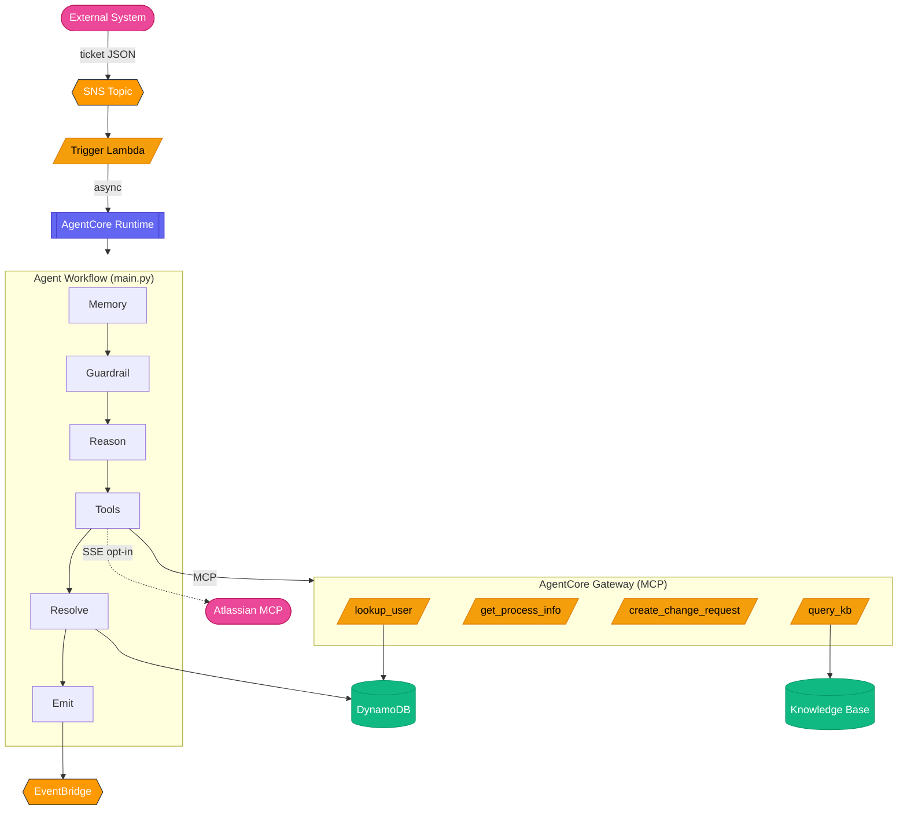

# IT Incident Response Agent on Amazon Bedrock AgentCore

An event-driven IT assistant built with the **AgentCore CLI-first** workflow.
Publish a "ticket" to SNS — an AgentCore Runtime agent picks it up, diagnoses the
issue using a Knowledge Base and Lambda tools (all behind an AgentCore Gateway),
records an episode in AgentCore Memory, and writes a resolution back to the ticket
store.

> 📐 **New here? Read [docs/ARCHITECTURE.md](docs/ARCHITECTURE.md) first** — it's the
> guided tour of the pattern, the data flows, and where each piece of code lives.
> This README is the deploy-and-run guide.

| | |
| --------------------- | ------------------------------------------------------------------ |
| Use case type         | Event-driven, single agent                                         |
| Components            | Tools (MCP Gateway + Lambda), RAG (Knowledge Base), memory, observability, evaluation, guardrails, policy engine |
| Vertical              | IT operations / ITSM                                               |
| Complexity            | Advanced                                                          |
| SDKs                  | Bedrock AgentCore SDK + CLI, Strands Agents, AWS CDK, boto3        |

## Architecture



> The full detailed diagrams (managed-vs-yours, auth hops, memory flow) live in
> [docs/ARCHITECTURE.md](docs/ARCHITECTURE.md).

**AgentCore services demonstrated:**

| Service | How it's used |
| ------- | ------------- |
| **Runtime** | Strands agent in a container, 8-hour sessions, framework-agnostic |
| **Gateway + Policy** | MCP protocol, 4 Lambda targets, Cedar policy engine (LOG_ONLY) |
| **Memory** | SUMMARIZATION strategy — episodic recall across incidents per user |
| **Identity** | AWS_IAM default; CUSTOM_JWT toggle; Atlassian 3LO opt-in |
| **Observability** | OTEL auto-instrumentation → CloudWatch GenAI console |
| **Evaluation** | 4 built-in LLM-as-judge evaluators, continuous + declarative |

It also wires up production-leaning supporting infrastructure — Bedrock Guardrail
(PII anonymization + prompt-attack filtering), a DLQ with CloudWatch alarms,
idempotent DynamoDB writes, cost-based model routing, and an EventBridge
`TicketResolved` event for downstream consumers. See
[docs/design-decisions.md](docs/design-decisions.md) for the rationale behind each.

## Prerequisites

1. **AWS account** with CLI configured (`aws sts get-caller-identity` works).
2. **Bedrock model access** in your region for the agent model
   (default `us.anthropic.claude-sonnet-4-6`) and, if using the KB, the embedding
   model (`amazon.titan-embed-text-v2:0`).
   See [model access](https://docs.aws.amazon.com/bedrock/latest/userguide/model-access.html).
3. **Node.js 20+** and the AgentCore CLI: `npm install -g @aws/agentcore`
4. **Python 3.11+** and **uv** ([install](https://docs.astral.sh/uv/getting-started/installation/))
5. **Docker** running (for the agent container build).
6. **CDK bootstrapped**: `cdk bootstrap aws://ACCOUNT/REGION`

## Quickstart

From a fresh clone to a deployed agent:

```bash
# 1. Configure account/region (edit CDK_DEFAULT_ACCOUNT)
cp .env.example .env

# 2. Install CDK dependencies
( cd agentcore/cdk && npm install )

# 3. Deploy — sources .env, generates aws-targets.json, runs `agentcore deploy`
./scripts/deploy.sh
```

The deploy (~10–15 min: container build + provisioning) creates DynamoDB tables,
S3 buckets, the Lambda tools, SNS topic, and all AgentCore resources (Runtime,
Gateway, Memory, Policy Engine, Online Eval) in a single CloudFormation stack.

All settings are documented inline in [`.env.example`](.env.example); the only
required one is your 12-digit `CDK_DEFAULT_ACCOUNT`.

<details>
<summary>Manual deploy (without the wrapper script)</summary>

```bash
set -a && source .env && set +a
cp agentcore/aws-targets.json.template agentcore/aws-targets.json   # set account/region; name must be "dev"
agentcore validate
agentcore deploy -y --target dev
```

`agentcore deploy` alone does **not** source `.env` — that's the main thing the
wrapper script does for you.
</details>

> **CLI-first scaffolding:** the AgentCore resources in this repo were created with
> `agentcore create` / `add memory` / `add gateway` / `add gateway-target` /
> `add online-eval` / `add policy-engine`. The resulting config is already committed
> in `agentcore/agentcore.json`, so you don't re-run them — see
> [docs/commands-reference.md](docs/commands-reference.md) for the exact commands as a
> reference for building your own project.

### Key stack outputs (`agentcore status`)

| Output | Description |
| ------ | ----------- |
| `TicketsTopicArn` | SNS topic — publish JSON tickets here |
| `TicketsTableName` | DynamoDB table storing ticket state |
| `AgentRuntimeArn` | AgentCore Runtime ARN |
| `GatewayUrl` | MCP endpoint of the Gateway |
| `MemoryId` | AgentCore Memory resource ID |
| `DLQUrl` | Dead-letter queue for failed tickets |

## Run the demo


```bash
./scripts/publish_ticket.sh                       # publish the bundled sample ticket
agentcore logs --since 5m                         # watch the agent process it
./scripts/show_ticket.sh INC-20260604-001         # after ~30s, see status=Resolved
```

You should see the ticket with `status=Resolved` and a `resolution_comment`
written by the agent.

**Publish your own:**

```bash
cat > /tmp/my-ticket.json <<'JSON'
{
  "ticket_id": "INC-CUSTOM-001",
  "requester_id": "U-1002",
  "title": "Outlook search returns nothing",
  "description": "Search box shows empty results on macOS, Outlook 16.84.",
  "priority": "MEDIUM"
}
JSON
./scripts/publish_ticket.sh /tmp/my-ticket.json
```

**Ticket schema:**

| Field | Type | Notes |
| ----- | ---- | ----- |
| `ticket_id` | string | Unique. Used as the Memory `session_id`. |
| `requester_id` | string | Must exist in the Users table (see `seed-data/users.json`). |
| `title` | string | Brief summary. |
| `description` | string | Symptoms / detail. |
| `priority` | string | `LOW` / `MEDIUM` / `HIGH` / `CRITICAL` (default `MEDIUM`). |

### Inspect what the agent did

```bash
./scripts/show_ticket.sh INC-20260604-001                          # resolved ticket
aws dynamodb scan --table-name <ChangeRequestsTable> --region $AWS_REGION   # change requests
aws bedrock-agentcore list-events --memory-id <MemoryId> \
  --actor-id U-1003 --region $AWS_REGION                           # memory episodes
agentcore logs --since 10m                                          # runtime logs
```

## Local development

```bash
agentcore dev                                       # start with hot-reload
agentcore dev "What can you help me with?"          # simple prompt (no gateway needed)
agentcore dev "$(cat seed-data/sample_ticket.json)" # ticket payload (gateway must be deployed)
```

`agentcore dev` exposes the Web UI on **port 8081** and the runtime container on
**port 8082** (the container's internal 8080 maps to host 8082). To hit the runtime
directly with custom headers (e.g. CUSTOM_JWT auth needs a `User-Id` header):

```bash
curl -N http://localhost:8082/invocations \
  -H "Content-Type: application/json" \
  -H "X-Amzn-Bedrock-AgentCore-Runtime-User-Id: test-user" \
  -d '{"prompt": "What can you help me with?"}'
```

Runtime env vars for local dev go in `agentcore/.env.local` (gitignored). The three
config files and what reads them:

| File | Read by | Purpose |
| ---- | ------- | ------- |
| `.env` | `agentcore deploy` (CDK synthesis) | Account, region, deploy-time config |
| `agentcore/.env.local` | `agentcore dev` (container) | Runtime env vars for local dev |
| CDK `addPropertyOverride` | Deployed Runtime | Production env vars set at deploy |

> Memory is not available during `agentcore dev`. To test against deployed Memory,
> set `MEMORY_ID=<deployed-id>` in `agentcore/.env.local`.

## Observability & evaluation

The container ships with AWS Distro for OpenTelemetry; spans and logs flow to the
**CloudWatch GenAI Observability** console.

```bash
agentcore logs --since 5m          # runtime logs
agentcore traces list              # recent traces
python scripts/evaluate.py         # online-eval scores (last hour; --hours N, --raw)
```

This project also deploys **Online Evaluation** with 4 built-in LLM-as-judge
evaluators (Correctness, Helpfulness, ToolSelectionAccuracy, GoalSuccessRate),
configured declaratively in `agentcore.json` → `onlineEvalConfigs[]`. It requires
CloudWatch Transaction Search, which the stack **enables automatically**. First
results take ~10–15 min to appear.

See **[docs/online-evaluation.md](docs/online-evaluation.md)** for the full setup,
the required OTEL env vars, verification commands, and how to disable it.

## Customization

| Task | Where |
| ---- | ----- |
| Change the agent model | `AGENT_MODEL_ID` in `agentcore.json` → `runtimes[].envVars[]` (the deployed source of truth; `model/load.py` default is local-dev fallback) |
| Modify agent behavior | `SYSTEM_PROMPT` in `app/ITIncidentAgent/main.py` |
| Add a tool | New `lambdas/tools/*.py` + `tool-schemas/*.json`, register with `agentcore add gateway-target`, wire into `infra-construct.ts`, redeploy |
| Configure / disable memory | `memories[]` in `agentcore.json` (see [docs/commands-reference.md](docs/commands-reference.md) → Memory) |
| Bring your own KB | Set `KB_ID` in `.env`; or `SKIP_KB=true` to disable the KB tool |
| Enterprise auth (Auth0/OIDC) | Run `./scripts/enable-custom-jwt.sh` — see [docs/custom-jwt-auth-upgrade.md](docs/custom-jwt-auth-upgrade.md) |
| Jira integration | See below |

**Hardening for production:** set `DESTROY_ON_DELETE=false` to retain data, switch
the Policy Engine from `LOG_ONLY` to `ENFORCE`, lower the online-eval sampling rate,
add VPC networking (`networkMode: "VPC"`), wire SNS notifications onto the alarms,
and add a human-approval gate (e.g. Step Functions `waitForTaskToken`) for CRITICAL
tickets. The KB auto-creates with S3 Vectors and ingests `kb-docs/` on deploy.

### Jira integration (optional)

When the `JIRA_*` vars are set, the agent connects to the **Atlassian Remote MCP
server** (3LO OAuth via AgentCore Identity) and reads issues, adds comments, and
transitions status directly in Jira instead of using the DDB mock ticket store.

1. Create an OAuth 2.0 (3LO) app at
   [developer.atlassian.com](https://developer.atlassian.com/console/myapps/) with
   scopes `read:me`, `read:jira-user`, `read:jira-work`, `write:jira-work`,
   `offline_access`.
2. Set `JIRA_OAUTH_CLIENT_ID`, `JIRA_OAUTH_CLIENT_SECRET`, `JIRA_SITE_URL`,
   `JIRA_PROJECT_KEY` in `.env` and deploy.
3. Add the `JiraOauthCallbackUrl` stack output to the Atlassian app's callback URLs.
4. The first invocation logs a one-time consent URL — open it, authenticate as the
   Jira user the agent should act as, and approve. The refresh token is cached.

```bash
./scripts/publish_ticket.sh seed-data/sample_jira_event.json   # publish a Jira issue-key event
agentcore logs --since 5m
```

## Cleanup

```bash
./scripts/destroy.sh
```

## Troubleshooting

| Issue | Solution |
| ----- | -------- |
| `agentcore validate`: "Required file not found: aws-targets.json" | Fresh clone — `cp agentcore/aws-targets.json.template agentcore/aws-targets.json` and fill in account + region. |
| `agentcore validate`: target names not in aws-targets | The `name` in `aws-targets.json` must match `agentcore/.cli/deployed-state.json` (default `dev`). After teardown, reset that file to `{"targets": {}}`. |
| `agentcore deploy` fails on container build | Ensure Docker is running; check CodeBuild logs in the console. |
| `agentcore deploy`: "S3VectorsConfiguration: required key [IndexArn] not found" | CFN doesn't auto-create S3 Vectors resources. The CDK creates them explicitly; delete the `ROLLBACK_COMPLETE` stack and redeploy. |
| "The provided model identifier is invalid" (`agentcore dev`) | Set `AWS_REGION=us-west-2` and a full `AGENT_MODEL_ID` (with version) in `agentcore/.env.local`; confirm the model is enabled in Bedrock. |
| Web UI: "Workload access token has not been set" | The Web UI doesn't send the `User-Id` header that CUSTOM_JWT needs. Use `GATEWAY_AUTH_MODE=AWS_IAM` for local dev, or curl port 8082 with the header (see Local development). |
| Gateway returns 403 | Runtime IAM role needs `bedrock-agentcore:InvokeGateway` (configured) and a trust policy including `bedrock-agentcore.amazonaws.com`. |
| `publish_ticket.sh`: "Could not find TicketsTopicArn" | Stack not deployed, or region mismatch. The stack is in `us-west-2`; set `DEPLOY_REGION=us-west-2` if your `AWS_REGION` differs. Run `agentcore status`. |
| Online eval shows no results | Requires traces first + CloudWatch Transaction Search (auto-enabled; `/aws/spans` can take 10–15 min to provision). See [docs/online-evaluation.md](docs/online-evaluation.md). |
| Agent returns empty resolution | Check `agentcore logs --since 10m`; most common cause is model access not enabled in Bedrock. |
| Jira MCP returns 401 / "invalid_grant" | The callback URL on the Atlassian app must exactly match `JiraOauthCallbackUrl`. If consent was never granted, find the consent URL in the runtime logs. |

The full troubleshooting matrix (auth, KB, custom resources, CDK path quirks) is in
[docs/commands-reference.md](docs/commands-reference.md).

## Further reading

- **[docs/ARCHITECTURE.md](docs/ARCHITECTURE.md)** — the guided tour: pattern, data flows, file map, CDK workarounds
- **[docs/commands-reference.md](docs/commands-reference.md)** — CLI scaffolding, resource management, operations, troubleshooting
- **[docs/design-decisions.md](docs/design-decisions.md)** — why each architectural choice was made (10 ADRs)
- **[docs/authentication-guide.md](docs/authentication-guide.md)** — the three auth boundaries
- **[docs/custom-jwt-auth-upgrade.md](docs/custom-jwt-auth-upgrade.md)** — Auth0/Google/Okta enterprise auth
- **[docs/online-evaluation.md](docs/online-evaluation.md)** — continuous LLM-as-judge evaluation
- [Amazon Bedrock AgentCore docs](https://docs.aws.amazon.com/bedrock-agentcore/) ·
  [AgentCore CLI](https://github.com/aws/agentcore-cli) ·
  [Strands Agents](https://github.com/strands-agents/strands-agents-python) ·
  [AgentCore CDK constructs](https://github.com/aws/agentcore-l3-cdk-constructs)

## Contributing · Security · License

Contributions welcome — see the repo-level [CONTRIBUTING.md](../../../CONTRIBUTING.md).
Report security concerns via the
[AWS vulnerability reporting page](http://aws.amazon.com/security/vulnerability-reporting/),
**not** public GitHub issues. Licensed under **Apache 2.0** (see the repo
[LICENSE](../../../LICENSE)).

## Disclaimer

The examples in this repository are for experimental and educational purposes only.
They demonstrate concepts and techniques but are not intended for direct use in
production without your own review and hardening. Keep Amazon Bedrock Guardrails in
place to protect against
[prompt injection](https://docs.aws.amazon.com/bedrock/latest/userguide/prompt-injection.html).
