# Architecture Guide: IT Incident Response Agent

This document is the **guided tour** of the accelerator. Read it first.

---

## The Pattern: Trigger → Enrich → Reason → Act → Emit

Every event-driven agent follows this 5-step pattern. Here's how each step maps to code:

```
┌─────────────────────────────────────────────────────────────────────────────┐
│                                                                             │
│  ① TRIGGER        ② ENRICH           ③ REASON         ④ ACT     ⑤ EMIT   │
│                                                                             │
│  SNS message  →  lookup_user      →  LLM decides  →  create_    →  Event-   │
│  arrives         get_process_info     from runbook     change_      Bridge  │
│  (ticket or      query_kb                              request      event   │
│   issue_key)     Memory recall                        Jira comment          │
│                  [Jira: fetch issue]                   DDB update           │
│                                                                             │
│  ticket_event_   Gateway tools +     System prompt    Gateway     _emit_    │
│  handler.py      Jira MCP tools      in main.py       tool /      resolut-  │
│                  (multi-MCP)                          Jira MCP    ion_      │
│                                                                   event()   │
└─────────────────────────────────────────────────────────────────────────────┘
```

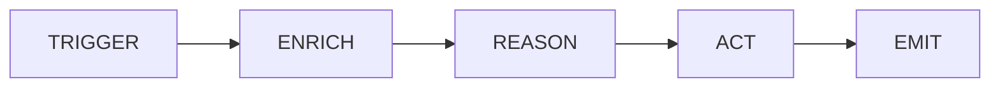

---

## Numbered Sequence (what happens when a ticket arrives)

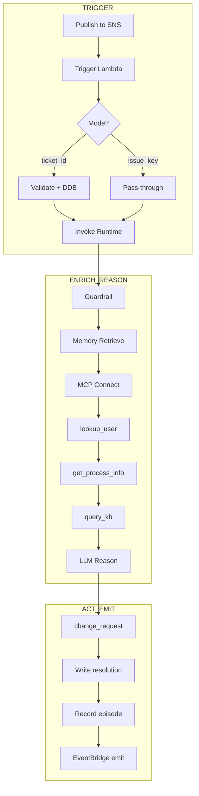


### 1. **External System** publishes event to SNS topic

Two formats supported:
- Full ticket: `{ticket_id, requester_id, title, description, priority}`
- Jira issue key: `{issue_key, requester_id}`

### 2. **SNS** delivers to Trigger Lambda
  
**File:** `lambdas/trigger/ticket_event_handler.py`

**Step:** TRIGGER

- Detects mode: `issue_key` vs `ticket_id`
- Full-ticket: validates schema, writes to DDB (idempotent via `attribute_not_exists`)
- Issue-key: thin pass-through (Jira is system of record)
- Calls `InvokeAgentRuntime` (async, fire-and-forget)

### 3. **AgentCore Runtime** receives payload, starts `main.py`

**File:** `app/ITIncidentAgent/main.py`

- Detects mode from payload (`issue_key` vs `ticket_id`)
- Retrieves past-incident summaries from **AgentCore Memory**
- Builds dynamic system prompt with memory context
- Connects to MCP servers (Gateway + optionally Jira)
- Creates **Strands Agent** with aggregated tools

### 3b. **Agent** applies Bedrock Guardrail (DDB mode only)

**File:** `app/ITIncidentAgent/main.py` → `_apply_guardrail()`

**Step:** GUARDRAIL

- Filters PII, profanity, injection attempts from event payload
- Conditional: only active when `GUARDRAIL_ID` is set
- Skipped in Jira mode (issue body fetched from Jira, not payload)

### 3c. **Agent** retrieves past-incident context from Memory

**File:** `app/ITIncidentAgent/memory/enrichment.py`

**Step:** MEMORY ENRICHMENT

- Calls `retrieve_memories` with requester's namespace (`incidents/{actor_id}`)
- Injects summaries into system prompt for recurrence detection

### 4. **Agent** (Jira mode) fetches issue via Atlassian MCP

**Tool:** `jira___getIssue`

**Step:** ENRICH

- Reads issue summary, description, status from Jira

### 5. **Agent** calls `lookup_user` via Gateway → Lambda

**File:** `lambdas/tools/lookup_user.py`

**Step:** ENRICH

- Returns user profile, quotas, and `recent_incident_count_30d`

### 6. **Agent** calls `get_process_info` via Gateway → Lambda

**File:** `lambdas/tools/get_process_info.py`

**Step:** ENRICH

- Returns service status, `owner_team`, `known_issues`

### 7. **Agent** calls `query_kb` via Gateway → Lambda

**File:** `lambdas/tools/query_kb.py`

**Step:** REASON (retrieval for reasoning)

- Searches Bedrock KB for runbook guidance (top_k results)

### 8. **Agent** LLM reasons about diagnosis

**Step:** REASON

- System prompt guides tool-calling order
- Past-incident context informs escalation decisions
- Decides whether corrective action is warranted by the runbook

### 9. **Agent** calls `create_change_request` via Gateway → Lambda

**File:** `lambdas/tools/create_change_request.py`

**Step:** ACT

- Records change in DynamoDB (`CHANGES_TABLE`)
- Stamps user record (`incident_count++`, `last_incident_at`)

### 10. **Agent** writes resolution

**Step:** ACT

- DDB mode: `_resolve_ticket()` → writes to Tickets table (`status=Resolved`)
- Jira mode: `jira___addComment` + `jira___transitionIssue` via MCP

### 11. **Agent** records episode in AgentCore Memory

**File:** `app/ITIncidentAgent/memory/session.py`

- The `AgentCoreMemorySessionManager` attached to the `Agent` persists the
  conversation turn automatically — no manual `create_event` call
- SUMMARIZATION strategy rolls events into episodes per user
- Future invocations retrieve these via step 3c

### 12. **Agent** emits `TicketResolved` event to EventBridge

**File:** `app/ITIncidentAgent/main.py` → `_emit_resolution_event()`

**Step:** EMIT

- Source: `it-incident-agent`
- DetailType: `TicketResolved`
- Downstream consumers subscribe via EventBridge rules

---

## Real-Time Progress Streaming

The entrypoint is an **async generator**, so AgentCore Runtime streams every
`yield` to the caller as a Server-Sent Event (`text/event-stream`). The agent
uses this to surface genuine per-phase progress instead of a single terminal
blob:

- At each phase boundary it yields a structured marker
  `{"type": "stage", "stage": <id>, "label": ..., "detail": ...}` —
  `guardrail` → `memory` → `tools` → `diagnose` → (one `tool` marker per real
  tool call) → `persist` → `emit`.
- The REASON/ACT loop runs via `agent.stream_async(...)` (not a blocking
  `agent(...)` call), so each real tool invocation (`lookup_user`,
  `get_process_info`, `query_kb`, `create_change_request`, Jira tools) is
  announced the moment the model decides to call it (deduped by `toolUseId`).
- The **final result** is still yielded last as
  `{"ticket_id", "status", "resolution", ...}`. Consumers that buffer the whole
  response and take the last JSON object (the trigger Lambda, tests) are
  unaffected; the stage markers carry `"type": "stage"` and are ignored by
  last-object-wins parsing.

> Note: the Runtime `json.dumps()` each yielded value, so a yielded
> `json.dumps({...})` string lands on the wire double-encoded
> (`data: "{...}"`). Streaming consumers decode each line twice (string → dict)
> to recover the marker — the dashboard's `_extract_resolution` already does
> this two-pass decode.

---

## File Map (where to find each piece)

### Configuration (source of truth)

| File | Role | When to Edit |
|------|------|--------------|
| `agentcore/agentcore.json` | Declares Runtime, Gateway (semantic search + DEBUG), Online Eval, Policy Engine, targets | Adding/removing AgentCore resources |
| `agentcore/aws-targets.json` | Deploy target (account + region) | Changing where you deploy |
| `.env.example` | Environment variable template | Adding new config |

### Agent Code (what runs inside the Runtime container)

| File | Role | Step |
|------|------|------|
| `app/ITIncidentAgent/main.py` | Entrypoint — orchestrates the full flow (dual-path) | All 5 steps |
| `app/ITIncidentAgent/mcp_client/client.py` | Connects to Gateway over MCP + multi-MCP aggregation | ENRICH |
| `app/ITIncidentAgent/mcp_client/jira.py` | Connects to Atlassian Remote MCP (opt-in, 3LO auth) | ENRICH + ACT |
| `app/ITIncidentAgent/memory/session.py` | AgentCore Memory session manager (persists turns) | Post-ACT |
| `app/ITIncidentAgent/memory/enrichment.py` | Memory retrieval of past incidents (cross-session) | Pre-REASON |
| `app/ITIncidentAgent/model/load.py` | Loads Bedrock model from env var + cost routing | REASON |
| `app/ITIncidentAgent/Dockerfile` | Container image definition | — |

### Tool Lambdas (what the Gateway invokes)

| File | Role | Step |
|------|------|------|
| `lambdas/tools/lookup_user.py` | User profile + recent incidents | ENRICH |
| `lambdas/tools/get_process_info.py` | Service/process asset catalog | ENRICH |
| `lambdas/tools/query_kb.py` | Knowledge Base retrieval | REASON |
| `lambdas/tools/create_change_request.py` | Record corrective action | ACT |

### Trigger Lambda (event ingress)

| File | Role | Step |
|------|------|------|
| `lambdas/trigger/ticket_event_handler.py` | SNS → detect mode → validate → (DDB or pass-through) → invoke Runtime | TRIGGER |

### Infrastructure Lambdas (custom resources)

| File | Role |
|------|------|
| `lambdas/infra/seeder.py` | Seeds DDB tables on deploy |
| `lambdas/infra/jira_oauth_provider.py` | Registers AtlassianOauth2 credential provider (opt-in) |

### Infrastructure (CDK)

| File | Role |
|------|------|
| `agentcore/cdk/lib/cdk-stack.ts` | Main stack: AgentCore (Runtime, Gateway, Memory, Online Eval, Policy Engine) + Infra + custom env vars |
| `agentcore/cdk/lib/infra-construct.ts` | Gap-fill: DDB, S3, Lambdas, SNS, EventBridge, Guardrail, KB, alarms |
| `agentcore/cdk/bin/cdk.ts` | CDK app entry: reads agentcore.json, creates stacks |

### Operational Scripts

| Script | Purpose |
|--------|---------|
| `scripts/deploy.sh` | Deploy everything |
| `scripts/destroy.sh` | Tear down all resources |
| `scripts/publish_ticket.sh` | Submit a test ticket to SNS |
| `scripts/show_ticket.sh` | Check ticket resolution in DDB |
| `scripts/evaluate.py` | Retrieve online evaluation results |
| `scripts/test-e2e.sh` | End-to-end test: publish → poll → assert Resolved (CI-friendly) |
| `scripts/enable-custom-jwt.sh` | Upgrade gateway to Auth0/OIDC auth |

---

## AgentCore Primitives (what's AgentCore vs what's yours)

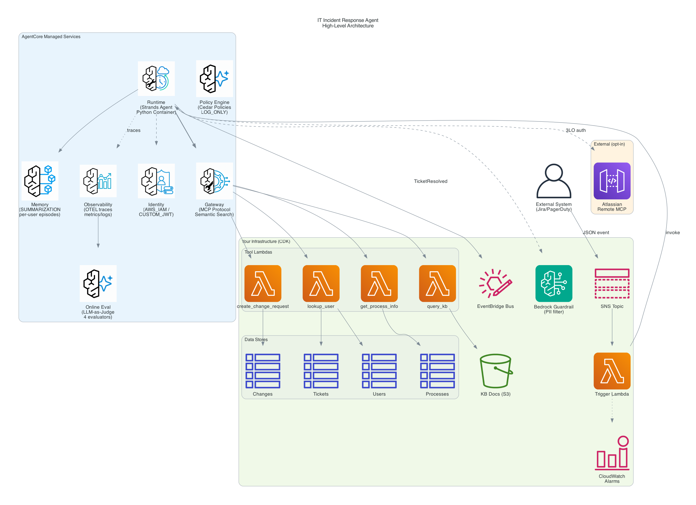

<details>
<summary>High Level ASCII Architecture Diagram (More details)</summary>

```text
┌──────────────────────────────────────────────────────────────────────────────┐
│                         AgentCore (managed services)                         │
│                                                                              │
│  ┌───────────────┐  ┌───────────────┐  ┌──────────────────────────────────┐  │
│  │    Runtime    │  │    Memory     │  │            Gateway               │  │
│  │               │  │               │  │                                  │  │
│  │  Strands      │  │ SUMMARIZATION │  │  Protocol: MCP (StreamableHTTP)  │  │
│  │  agent in     │  │ strategy      │  │  Auth: AWS_IAM / CUSTOM_JWT      │  │
│  │  container    │  │               │  │  Semantic Search: enabled        │  │
│  │  (Python 3.12)│  │  Episodes per │  │                                  │  │
│  │               │  │  user/incident│  │  ┌────────┐┌────────┐┌────────┐  │  │
│  │  Cost routing:│  │               │  │  │lookup- ││get-    ││create- │  │  │
│  │  Haiku (LOW)  │  │  Namespace:   │  │  │user    ││process-││change- │  │  │
│  │  Sonnet (MED+)│  │  incidents/   │  │  │        ││info    ││request │  │  │
│  │               │  │  {actor}/     │  │  └────────┘└────────┘└────────┘  │  │
│  │  Guardrail:   │  │  {session}    │  │  ┌────────┐                      │  │
│  │  PII filter   │  │               │  │  │query-  │ (if KB_ID set)       │  │
│  │  before model │  │               │  │  │kb      │                      │  │
│  └───────────────┘  └───────────────┘  │  └────────┘                      │  │
│                                        └──────────────────────────────────┘  │
│                                                                              │
│  ┌──────────────────┐  ┌──────────────────┐  ┌───────────────────────────┐   │
│  │   Identity       │  │  Policy Engine   │  │    Online Evaluation      │   │
│  │                  │  │                  │  │                           │   │
│  │  AWS_IAM default │  │  Cedar policies  │  │  4 LLM-as-judge evals     │   │
│  │  CUSTOM_JWT via  │  │  LOG_ONLY mode   │  │  • GoalSuccessRate        │   │
│  │  @requires_      │  │  (ENFORCE in     │  │  • Correctness            │   │
│  │  access_token    │  │   production)    │  │  • Helpfulness            │   │
│  │                  │  │                  │  │  • ToolSelectionAccuracy  │   │
│  │  + Atlassian 3LO │  │                  │  │                           │   │
│  │  (USER_FEDERATION│  │                  │  │                           │   │
│  │   opt-in)        │  │                  │  │                           │   │
│  └──────────────────┘  └──────────────────┘  └───────────────────────────┘   │
│                                                                              │
│  ┌────────────────────────────────────────────────────────────────────────┐  │
│  │                    Observability (OTEL auto-instrumentation)           │  │
│  │     Agent traces → CloudWatch GenAI console → metrics + dashboards     │  │
│  └────────────────────────────────────────────────────────────────────────┘  │
└──────────────────────────────────────────────────────────────────────────────┘

┌──────────────────────────────────────────────────────────────────────────────┐
│                    Your Infrastructure (InfraConstruct / CDK)                │
│                                                                              │
│  ┌──────────────────────────────────────────────┐  ┌───────────────────────┐ │
│  │         DynamoDB Tables (4)                  │  │    S3 Buckets (2)     │ │
│  │  ┌──────┐ ┌─────────┐ ┌───────┐ ┌─────────┐  │  │  ┌────┐  ┌────────┐   │ │
│  │  │Users │ │Processes│ │Tickets│ │ Changes │  │  │  │ KB │  │  Seed  │   │ │
│  │  └──────┘ └─────────┘ └───────┘ └─────────┘  │  │  │docs│  │  data  │   │ │
│  └──────────────────────────────────────────────┘  │  └────┘  └────────┘   │ │
│                                                    └───────────────────────┘ │
│  ┌──────────────────────────────────┐   ┌─────────────────────────────────┐  │
│  │  SNS → Trigger Lambda → DLQ      │   │       EventBridge Bus           │  │
│  │                                  │   │                                 │  │
│  │  ticket_event_handler.py:        │   │  it-incident-agent-events       │  │
│  │  • detect mode (ticket/issue_key)│   │  • TicketResolved events        │  │
│  │  • validate + DDB (ticket mode)  │   │  • downstream: dashboards,      │  │
│  │  • pass-through (Jira mode)      │   │    audit trails, notifications  │  │
│  │  • invoke Runtime (async)        │   │                                 │  │
│  │  • DLQ on failure (14-day TTL)   │   │                                 │  │
│  └──────────────────────────────────┘   └─────────────────────────────────┘  │
│                                                                              │
│  ┌──────────────────────────────────┐  ┌─────────────────────────────────┐   │
│  │   Bedrock Guardrail              │  │   CloudWatch Alarms             │   │
│  │                                  │  │                                 │   │
│  │  • EMAIL → ANONYMIZE             │  │  • DLQ depth > 0                │   │
│  │  • PHONE → ANONYMIZE             │  │  • Trigger Lambda errors        │   │
│  │  • SSN → BLOCK                   │  │                                 │   │
│  │  • Credit card → BLOCK           │  │                                 │   │
│  │  • Content: violence/hate/etc    │  │                                 │   │
│  │  • Prompt attack: HIGH filter    │  │                                 │   │
│  └──────────────────────────────────┘  └─────────────────────────────────┘   │
│                                                                              │
│  ┌────────────────────────────────────────────────────────────────────────┐  │
│  │            Lambda Functions (Gateway tool targets)                     │  │
│  │   lookup_user    get_process_info    create_change_request    query_kb │  │
│  │   (Users + Tickets tables)  (Processes table)  (Changes table)  (KB)   │  │
│  └────────────────────────────────────────────────────────────────────────┘  │
└──────────────────────────────────────────────────────────────────────────────┘

┌──────────────────────────────────────────────────────────────────────────────┐
│                    External (opt-in, when JIRA_MCP_URL set)                  │
│                                                                              │
│  ┌────────────────────────────────────────────────────────────────────────┐  │
│  │  Atlassian Remote MCP Server (mcp.atlassian.com/v1/sse)                │  │
│  │                                                                        │  │
│  │  Tools: jira___getIssue, jira___addComment, jira___transitionIssue     │  │
│  │  Auth:  AgentCore Identity (USER_FEDERATION / OAuth 3LO)               │  │
│  │  Transport: SSE (connected directly from agent, not via Gateway)       │  │
│  └────────────────────────────────────────────────────────────────────────┘  │
└──────────────────────────────────────────────────────────────────────────────┘
```
</details>

---

## Declarative vs Imperative (what's managed where)

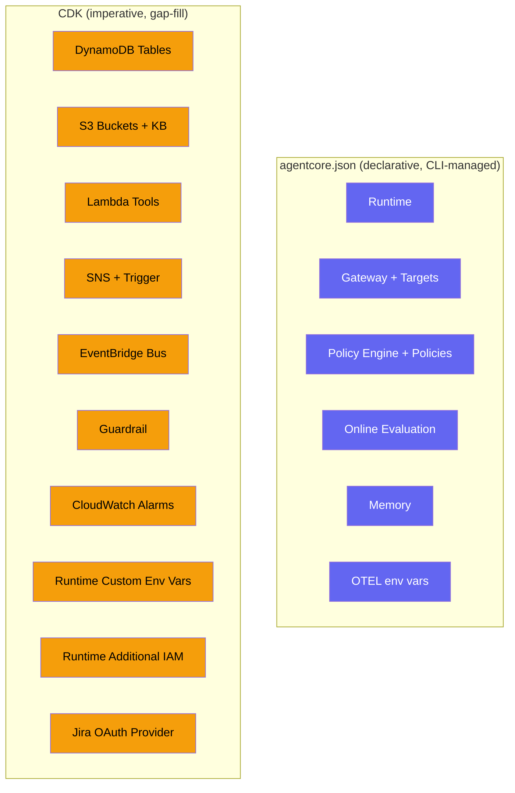

| Resource | Managed By | Configuration |
|----------|-----------|---------------|
| Runtime (container, OTEL) | `agentcore.json` → L3 | `runtimes[]` + `envVars[]` (incl. OTEL + model IDs); OTEL wrapping via Dockerfile CMD |
| Gateway + targets | `agentcore.json` → L3 | `agentCoreGateways[]` (ARNs patched at synth) |
| Policy Engine + Cedar policies | `agentcore.json` → L3 | `policyEngines[]` + `policyEngineConfiguration` on gateway |
| Online Evaluation | `agentcore.json` → L3 | `onlineEvalConfigs[]` (set to `[]` to disable) |
| Memory | `agentcore.json` → L3 | `memories[]` (SUMMARIZATION strategy) |
| DynamoDB, S3, Lambda, SNS, EventBridge, Guardrail, KB, Alarms | CDK `InfraConstruct` | Supplementary infra not managed by AgentCore |
| Runtime custom env vars | CDK `addPropertyOverride` | GUARDRAIL_ID, EVENT_BUS_NAME, TICKETS_TABLE, GATEWAY_URL, auth mode (model IDs are declarative in `envVars[]`) |
| Runtime additional IAM | CDK `iam.Policy` | DynamoDB, Guardrail, EventBridge, CloudWatch Logs Insights (X-Ray put-trace is granted by the L3, not here) |
| Jira OAuth provider | CDK custom resource | Conditional (when `JIRA_OAUTH_CLIENT_ID` set) |

---

## Data Flow Diagrams

### Authentication Flow (Inbound → Agent → Gateway)

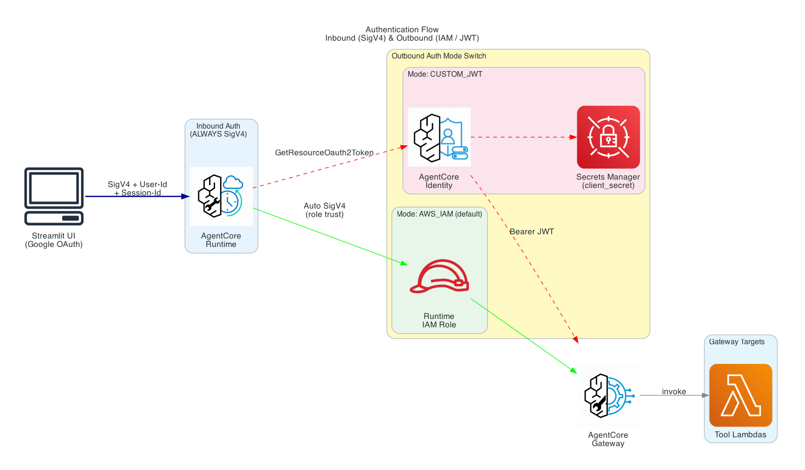

<details>
<summary>Sequence diagram + detailed ASCII diagram</summary>

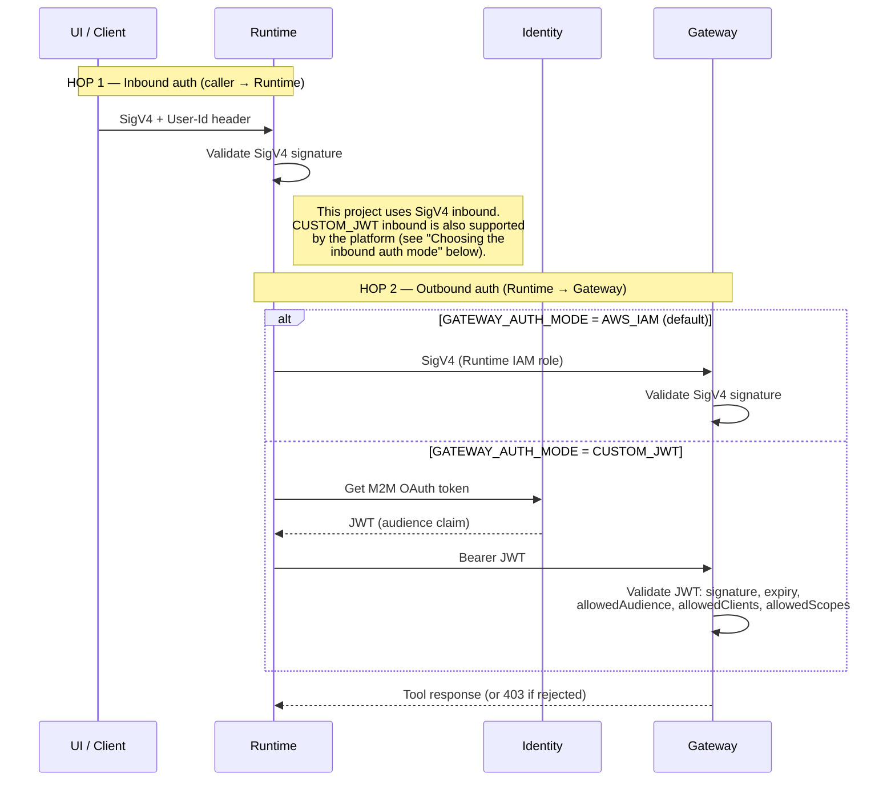

```
┌──────────────────────────────────────────────────────────────────────────────────┐
│                          Authentication Data Flow                                  │
│                                                                                    │
│  ── HOP 1: Inbound (caller → Runtime) — SigV4 in this project ───────────────────  │
│                                                                                    │
│  ┌────────────────┐                                ┌─────────────────────────┐     │
│  │  Caller        │   SigV4 (AWS_IAM)              │  AgentCore Runtime      │     │
│  │  (Trigger      │ ─────────────────────────────▶ │                         │     │
│  │   Lambda, or   │   Headers:                     │  Inbound authorizer:    │     │
│  │   UI direct    │   • Authorization (SigV4)      │  validate SigV4         │     │
│  │   invoke)      │   • X-Amzn-...-Session-Id      │  signature              │     │
│  │                │   • X-Amzn-...-User-Id         │                         │     │
│  │  (event-driven │                                │  (CUSTOM_JWT inbound    │     │
│  │   path: the    │                                │   also supported by the │     │
│  │   Lambda is    │                                │   platform — see        │     │
│  │   the caller)  │                                │   "Choosing the inbound │     │
│  │                │                                │   auth mode" below)     │     │
│  └────────────────┘                                └───────────┬─────────────┘     │
│                                                                │                   │
│                                                                │ HOP 2: Outbound   │
│                                                                │ (Runtime →        │
│                                                                │  Gateway)         │
│                                                    ┌───────────┴─────────────┐     │
│                                                    │  Auth Mode Switch       │     │
│                                                    │  (GATEWAY_AUTH_MODE)    │     │
│                                                    └───┬───────────────┬─────┘     │
│                                                        │               │           │
│                              AWS_IAM (default)         │               │ CUSTOM_JWT│
│                    ┌───────────────────────────────────┘               │           │
│                    │                                                    │           │
│                    ▼                                                    ▼           │
│  ┌─────────────────────────────┐          ┌──────────────────────────────────┐     │
│  │  SigV4 Auto-Sign            │          │  AgentCore Identity              │     │
│  │  (Runtime IAM role)         │          │                                  │     │
│  │                             │          │  @requires_access_token          │     │
│  │  httpx.Auth signs every     │          │  (provider: auth0-m2m, M2M)      │     │
│  │  request for service        │          │                                  │     │
│  │  bedrock-agentcore          │          │  1. GetResourceOauth2Token       │     │
│  │  (_create_sigv4_auth)       │          │  2. Secrets Manager lookup       │     │
│  └─────────────┬───────────────┘          │  3. client_credentials grant     │     │
│                │                          │     (IdP token endpoint)         │     │
│                │                          │  4. Returns JWT (agent never     │     │
│                │                          │     sees client_secret)          │     │
│                │                          └──────────────┬───────────────────┘     │
│                │                                         │                         │
│                │                                         │ Authorization:          │
│                │                                         │ Bearer <token>          │
│                ▼                                         ▼                         │
│  ┌──────────────────────────────────────────────────────────────────────────┐     │
│  │  AgentCore Gateway — validates per GATEWAY_AUTH_MODE                       │     │
│  │                                                                            │     │
│  │  AWS_IAM:     • SigV4 signature (Runtime IAM role)                         │     │
│  │                                                                            │     │
│  │  CUSTOM_JWT:  • JWT signature (OIDC discovery / JWKS)                      │     │
│  │               • expiry (exp)                                              │     │
│  │               • allowedAudience  → token 'aud' must match                 │     │
│  │               • allowedClients   → token 'client_id' must match          │     │
│  │               • allowedScopes    → token 'scope' must contain one         │     │
│  │                 (first failed check → 403, tools never run)               │     │
│  └──────────────────────────────────────────────────────────────────────────┘     │
└──────────────────────────────────────────────────────────────────────────────────┘
```

</details>

**Key distinction**: There are **two independent auth hops**, each with its own
mode:

- **HOP 1 — Inbound (caller → Runtime)**: This project uses **SigV4** (AWS_IAM).
  In the event-driven path the caller is the Trigger Lambda (a service), so SigV4
  is the right fit. Any direct caller (e.g. a `curl` against `/invocations`, as in
  the README's local-dev example) likewise signs with SigV4 and passes a caller
  identity in the `X-Amzn-Bedrock-AgentCore-Runtime-User-Id` header. AgentCore *does*
  support **CUSTOM_JWT inbound** as well, but this project does not configure it —
  see "Choosing the inbound auth mode" below for when it applies.
- **HOP 2 — Outbound (Runtime → Gateway)**: The `GATEWAY_AUTH_MODE` toggle
  controls how the **agent authenticates to the Gateway** (the agent→tools hop) —
  AWS_IAM (SigV4) or CUSTOM_JWT (M2M Bearer token). This is the toggle this
  project actually implements.

The two hops are configured independently.

#### Code-level walkthrough (agent → Gateway)

The dual-mode switch lives in `app/ITIncidentAgent/mcp_client/client.py`:

| `GATEWAY_AUTH_MODE` | Code path | What happens |
|---------------------|-----------|--------------|
| `AWS_IAM` (default) | `_create_sigv4_auth()` | An `httpx.Auth` flow signs **every** request for service `bedrock-agentcore` using the Runtime's IAM role credentials (fetched fresh each call, since they rotate). |
| `CUSTOM_JWT` | `_create_custom_jwt_client()` | `@requires_access_token(provider_name=OAUTH_PROVIDER_NAME, auth_flow="M2M", custom_parameters={"audience": GATEWAY_AUDIENCE})` fetches an M2M token from AgentCore Identity and passes it as `Authorization: Bearer <token>`. The agent never sees the client_secret. |

The CDK stack (`cdk-stack.ts` Step 5) injects `GATEWAY_AUTH_MODE`,
`OAUTH_PROVIDER_NAME`, and `GATEWAY_AUDIENCE` into the Runtime as env vars. The
Gateway's `authorizerType` in `agentcore.json` must match the mode.

#### Restricting calls by JWT claim (CUSTOM_JWT only)

When the Gateway uses `CUSTOM_JWT`, its `customJwtAuthorizer` block restricts
*which* valid tokens are accepted, based on claims:

```json
"customJwtAuthorizer": {
  "discoveryUrl": "https://TENANT.us.auth0.com/.well-known/openid-configuration",
  "allowedAudience": ["https://it-incident-response/api"],
  "allowedClients": ["m2mClientId"],
  "allowedScopes": ["resolve:tickets"]
}
```

| Filter | Token claim | Rule |
|--------|-------------|------|
| `allowedAudience` | `aud` | must match one listed value |
| `allowedClients` | `client_id` | must match one listed client |
| `allowedScopes` | `scope` | must contain at least one listed scope |

Validation order: signature → expiry → audience → clients → scopes. The first
failed check returns `403` before any tool executes. A token can be perfectly
valid (good signature, not expired) yet still rejected for the wrong audience,
client, or missing scope — this is how you scope agent access to specific
applications and permission levels. See `docs/custom-jwt-auth-upgrade.md`
("Restricting Access by Claim") for the full walkthrough.

> **Inbound JWT capability**: AgentCore Runtime endpoints can *also* be configured
> for CUSTOM_JWT inbound auth, using the **same** `CustomJWTAuthorizerConfiguration`
> as the Gateway (discovery URL + allowed audiences/clients/scopes). See the AWS
> guide [Configure inbound JWT authorizer](https://docs.aws.amazon.com/bedrock-agentcore/latest/devguide/inbound-jwt-authorizer.html).
> **This project does not configure inbound JWT** — it uses SigV4 inbound because
> the Runtime is invoked by the Trigger Lambda (a service). See "Choosing the
> inbound auth mode" below for when inbound JWT is the right choice.

#### Choosing the inbound auth mode

This project uses **IAM/SigV4 inbound** because the direct caller is a service
(Trigger Lambda), not a human. For the full decision framework on when to use
CUSTOM_JWT inbound vs SigV4, see **[authentication-guide.md](authentication-guide.md)**
→ "Boundary 1: Runtime Inbound Auth."

**Quick rule:**

| Caller of the Runtime | Inbound auth |
|-----------------------|--------------|
| A service (Lambda, EventBridge, Step Functions) | **IAM / SigV4** |
| A UI on behalf of a logged-in user (direct invoke) | **CUSTOM_JWT** |

### Data Flow: Event-Driven Path (SNS → Resolution)

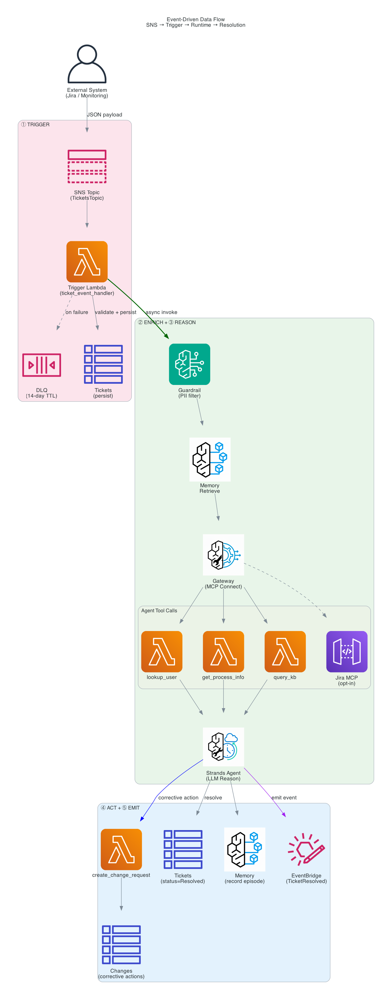

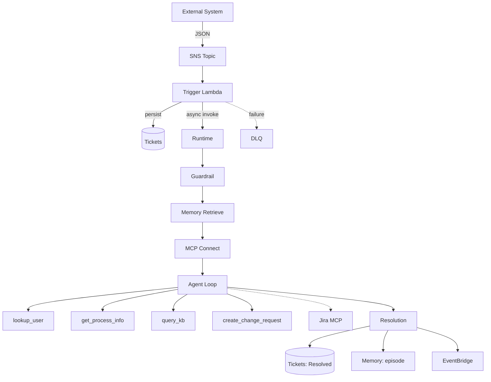

<details>
<summary>Event-Driven Data Flow Details (ASCII)</summary>

```text
┌────────────────────────────────────────────────────────────────────────────────┐
│                                                                                │
│  External System                                                               │
│  (Jira, PagerDuty,       JSON payload                                          │
│   monitoring alert)  ─────────────────▶  SNS Topic                             │
│                                          (TicketsTopic)                        │
│                                              │                                 │
│                                              ▼                                 │
│                                    ┌──────────────────┐                        │
│                                    │ Trigger Lambda   │                        │
│                                    │                  │                        │
│                                    │ • Validate       │──▶ DLQ (on failure)    │
│                                    │ • Detect mode    │                        │
│                                    │ • Write DDB      │                        │
│                                    │ • InvokeRuntime  │                        │
│                                    └────────┬─────────┘                        │
│                                             │ async                            │
│                                             ▼                                  │
│  ┌──────────────────────────────────────────────────────────────────────────┐  │
│  │                       AgentCore Runtime (main.py)                        │  │
│  │                                                                          │  │
│  │  ┌─────────────┐   ┌──────────────┐   ┌────────────┐   ┌─────────────┐   │  │
│  │  │  GUARDRAIL  │──▶│  MEMORY      │──▶│  MCP       │──▶│  AGENT      │   │  │
│  │  │  (PII       │   │  RETRIEVAL   │   │  CONNECT   │   │  LOOP       │   │  │
│  │  │   filter)   │   │  (past       │   │  (Gateway  │   │  (Strands)  │   │  │
│  │  │             │   │   episodes)  │   │   + Jira)  │   │             │   │  │
│  │  └─────────────┘   └──────────────┘   └────────────┘   └──────┬──────┘   │  │
│  │                                                               │          │  │
│  │       ┌───────────────────────────────────────────────────────┘          │  │
│  │       │  Agent calls tools via MCP:                                      │  │
│  │       │                                                                  │  │
│  │       │  ┌────────────┐  ┌────────────────┐  ┌─────────────────────┐     │  │
│  │       ├─▶│lookup_user │  │get_process_info│  │create_change_request│     │  │
│  │       │  │ (DDB)      │  │ (DDB)          │  │ (DDB)               │     │  │
│  │       │  └────────────┘  └────────────────┘  └─────────────────────┘     │  │
│  │       │  ┌────────────┐  ┌──────────────────────────────────────────┐    │  │
│  │       └─▶│query_kb    │  │ jira___getIssue / addComment (opt-in)    │    │  │
│  │          │ (Bedrock)  │  │ (Atlassian Remote MCP)                   │    │  │
│  │          └────────────┘  └──────────────────────────────────────────┘    │  │
│  │                                                                          │  │
│  │  ┌───────────────────────────────────────────────────────────────────┐   │  │
│  │  │  POST-PROCESSING                                                  │   │  │
│  │  │                                                                   │   │  │
│  │  │  1. Write resolution (DDB _resolve_ticket or Jira addComment)     │   │  │
│  │  │  2. Record Memory episode (summarization per user/incident)       │   │  │
│  │  │  3. Emit EventBridge event (TicketResolved)                       │   │  │
│  │  └───────────────────────────────────────────────────────────────────┘   │  │
│  └──────────────────────────────────────────────────────────────────────────┘  │
│                                                                                │
│  Outputs:                                                                      │
│  ┌──────────────┐  ┌──────────────────┐  ┌──────────────────────────────────┐  │
│  │ DDB: Tickets │  │ DDB: Changes     │  │ EventBridge: TicketResolved      │  │
│  │ status=      │  │ (corrective      │  │ (dashboards, audit, notify)      │  │
│  │ Resolved     │  │  actions log)    │  │                                  │  │
│  └──────────────┘  └──────────────────┘  └──────────────────────────────────┘  │
└────────────────────────────────────────────────────────────────────────────────┘
```
</details>

### Data Flow: Direct Invoke Path (synchronous request → response)

Besides the event-driven SNS path, the Runtime can be invoked **directly** — a
SigV4-signed `POST` to `/invocations` (this is what the README's local-dev `curl`
example does). The same entrypoint accepts two payload shapes:

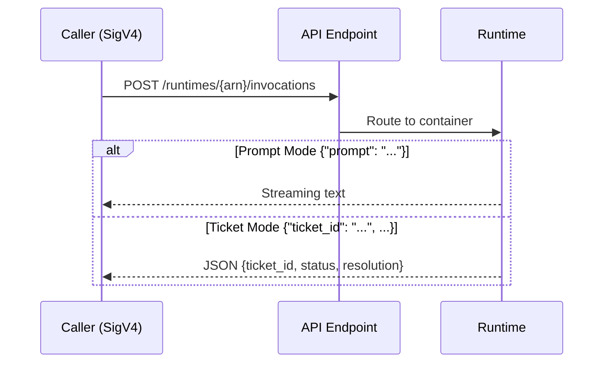

The caller signs the request with SigV4 and supplies
`X-Amzn-Bedrock-AgentCore-Runtime-Session-Id` and
`X-Amzn-Bedrock-AgentCore-Runtime-User-Id` headers. **Prompt mode**
(`{"prompt": "..."}`) runs the agent with MCP tools and streams text back;
**ticket mode** (`{"ticket_id": "...", ...}`) runs the full
TRIGGER→ENRICH→REASON→ACT→EMIT flow and returns a JSON resolution. The response is
delivered as `text/event-stream`.

### Memory Data Flow (Cross-Session Enrichment)

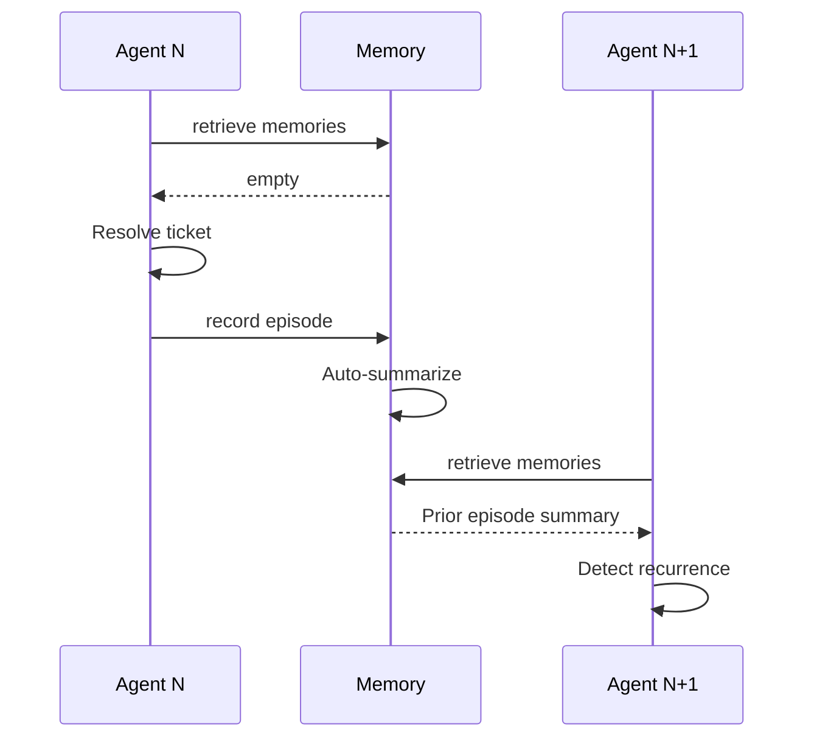

<details>
<summary>Memory Data Flow (Cross-Session Enrichment) [ASCII]</summary>

```text
┌────────────────────────────────────────────────────────────────────────────────┐
│                       AgentCore Memory (SUMMARIZATION)                         │
│                                                                                │
│  Invocation N (ticket INC-001, user U-1003):                                   │
│                                                                                │
│    ┌────────────────────────────────────────────┐                              │
│    │  retrieve_memories(                        │                              │
│    │    namespace="incidents/{U-1003}",         │                              │
│    │    query="prior incidents for U-1003"      │   ──▶  Returns: Episode      │
│    │  )                                         │        summaries from        │
│    └────────────────────────────────────────────┘        prior invocations     │
│                                                                                │
│    ... agent resolves ticket ...                                               │
│                                                                                │
│    ┌────────────────────────────────────────────┐                              │
│    │  Strands AgentCoreMemorySessionManager     │                              │
│    │  (attached to Agent) auto-persists the     │   ──▶  Creates: USER +       │
│    │  turn for session_id="INC-001",            │        ASSISTANT events      │
│    │  actor_id="U-1003"                         │        (auto-summarized)     │
│    │  — no manual create_event needed           │                              │
│    └────────────────────────────────────────────┘                              │
│                                                                                │
│  Invocation N+1 (ticket INC-005, same user U-1003):                            │
│                                                                                │
│    retrieve_memories ──▶ Returns summaries including INC-001 resolution        │
│    → System prompt includes: "User has 5 prior incidents (recurring signal)"   │
│    → Agent escalates based on recurrence pattern                               │
│                                                                                │
└────────────────────────────────────────────────────────────────────────────────┘
```
</details>

### Observability Data Flow

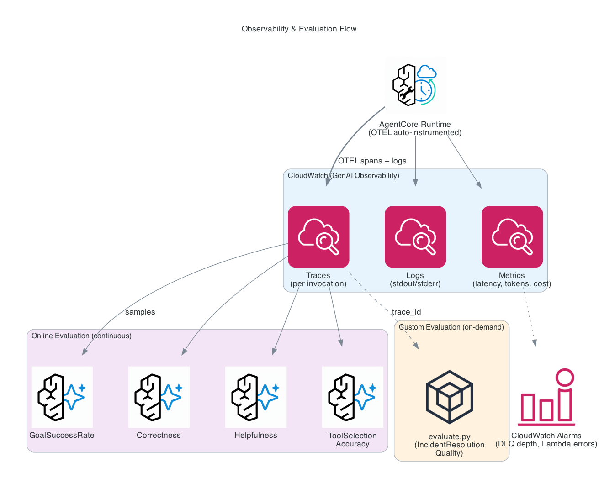

<details>
<summary>Observability & Evaluation Flow (ASCII - More Detailed)</summary>

```text
┌────────────────────────────────────────────────────────────────────────────────┐
│                                                                                │
│  AgentCore Runtime (OTEL auto-instrumentation)                                 │
│       │                                                                        │
│       │  Spans + Logs (automatic)                                              │
│       ▼                                                                        │
│  ┌──────────────────────────────────────┐                                      │
│  │  CloudWatch (GenAI Observability)    │                                      │
│  │                                      │                                      │
│  │  • Traces (per invocation)           │                                      │
│  │  • Logs (Runtime stdout/stderr)      │                                      │
│  │  • Metrics (latency, tokens, cost)   │                                      │
│  └──────────────────┬───────────────────┘                                      │
│                     │                                                           │
│                     ▼                                                           │
│  ┌──────────────────────────────────────┐                                      │
│  │  Online Evaluation (continuous)      │                                      │
│  │  (declarative: agentcore.json)       │                                      │
│  │                                      │                                      │
│  │  Evaluators (LLM-as-judge):          │                                      │
│  │  • GoalSuccessRate                   │                                      │
│  │  • Correctness                       │                                      │
│  │  • Helpfulness                       │                                      │
│  │  • ToolSelectionAccuracy             │                                      │
│  │                                      │                                      │
│  │  Prerequisite: CloudWatch            │                                      │
│  │  Transaction Search (auto-enabled    │                                      │
│  │  via transaction_search.py custom    │                                      │
│  │  resource when onlineEvalConfigs set)│                                      │
│  │                                      │                                      │
│  │  To disable: set onlineEvalConfigs   │                                      │
│  │  to [] in agentcore.json             │                                      │
│  └──────────────────────────────────────┘                                      │
│                                                                                │
│  Access:                                                                       │
│    agentcore logs --since 5m                                                   │
│    agentcore traces list                                                       │
│    python scripts/evaluate.py <trace_id>                                       │
│                                                                                │
└────────────────────────────────────────────────────────────────────────────────┘
```
</details>

---

## CDK Workarounds (why things are the way they are)

| Pattern | Why | Reference |
|---------|-----|-----------|
| CDK Provider for custom resources | Raw custom resources hang for 1 hour on import errors; Provider framework guarantees cfnresponse | `infra-construct.ts` (seeder), `cdk-stack.ts` (Jira OAuth) |
| `process.cwd()` instead of `__dirname` | Compiled TS changes `__dirname` relative path | `std.cdk.process-cwd-not-dirname` |
| `patchMcpSpecArns()` | Replaces placeholder ARNs with real Lambda ARNs at synth | `cdk-stack.ts` |
| Targets filtered when no KB_ID | Prevents CloudFormation validation error on placeholder | `cdk-stack.ts` |
| 3-min Lambda timeout on custom resources | Prevents hour-long hangs on API failures | `std.cdk.short-custom-resource-timeout` |
| `addPropertyOverride` for Runtime env vars | L3 construct doesn't expose custom env vars; use CDK escape hatch | `cdk-stack.ts` Step 5 |
| `GATEWAY_URL` alias in env vars | L3 sets `AGENTCORE_GATEWAY_{NAME}_URL`; agent code reads `GATEWAY_URL` — need both | `cdk-stack.ts` Step 5 |
| SigV4 httpx.Auth for MCP client | `streamablehttp_client` doesn't sign requests; AWS_IAM gateways need SigV4 for `bedrock-agentcore` | `mcp_client/client.py` |
| Runtime role filter: `includes('Runtime') && includes('ExecutionRole')` | Must target Runtime role specifically; `includes('Agent') && includes('Role')` matches Memory role first | `cdk-stack.ts` Step 5b |
| Seeder depends on SeedDataDeploy | Race condition: seeder Lambda runs before BucketDeployment finishes uploading seed data to S3 → `NoSuchKey` | `infra-construct.ts` |

---

## Build Your Own: Adapting This Accelerator

### Keep (framework)
- The 5-step pattern (Trigger → Enrich → Reason → Act → Emit)
- `agentcore.json` as source of truth
- InfraConstruct for gap-fill CDK resources
- CDK Provider for custom resources
- Online eval with dependency on Runtime
- DLQ + alarms for failed events

### Swap (domain-specific)
- **System prompt** (`main.py` → `SYSTEM_PROMPT`) — rewrite for your use case
- **Tool Lambdas** — replace with your domain tools (API calls, DB queries, etc.)
- **Tool schemas** (`tool-schemas/*.json`) — match your new tools
- **Seed data** — populate with your domain's reference data
- **KB docs** — replace with your runbooks/documentation

### Already Included (production-ready features)
- ✅ Bedrock Guardrails (PII anonymization + content filters before model invocation)
- ✅ Cost routing (Haiku for LOW priority, Sonnet for MEDIUM+)
- ✅ AgentCore Identity toggle (CUSTOM_JWT via `@requires_access_token`) — see `docs/custom-jwt-auth-upgrade.md`
- ✅ AgentCore Policy Engine (Cedar, LOG_ONLY — switch to ENFORCE for production)
- ✅ EventBridge bus for downstream consumers (TicketResolved events)
- ✅ DLQ + CloudWatch Alarms for operational visibility

### Add (for production hardening)
- Step Functions `waitForTaskToken` for human approval gates on CRITICAL tickets
- EventBridge rules on the output bus for notifications/dashboards/audit
- VPC networking (`networkMode: "VPC"` in agentcore.json)
- Schema Registry for event contract enforcement

### Remove (if not needed)
- KB tool + S3 docs bucket (if no knowledge base needed — set `SKIP_KB=true`)
- Memory (if incidents are independent, no episodic recall)
- Online eval (if you have external evaluation pipelines)

---

## Reading Order for New Developers

1. **This file** — understand the architecture, pattern, and data flows
2. **README.md** — deploy and run the demo
3. **[commands-reference.md](commands-reference.md)** — CLI commands, operations, and troubleshooting
4. **`app/ITIncidentAgent/main.py`** — the agent's brain (follow the STEP comments)
5. **`lambdas/tools/lookup_user.py`** — example of a gateway tool
6. **`agentcore/agentcore.json`** — the CLI configuration
7. **`agentcore/cdk/lib/cdk-stack.ts`** — how it all deploys
8. **`docs/custom-jwt-auth-upgrade.md`** — when you're ready for enterprise auth

---

> **Looking for commands?** CLI scaffolding, resource management (Memory, KB, tools,
> eval, auth), operational commands, troubleshooting, and the known-configuration
> notes now live in **[commands-reference.md](commands-reference.md)**.
