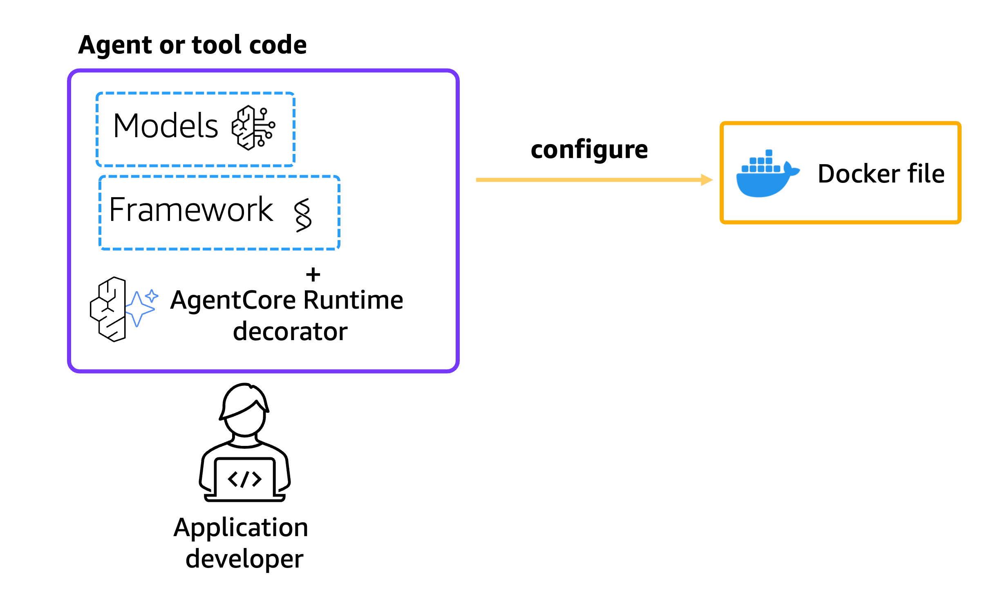
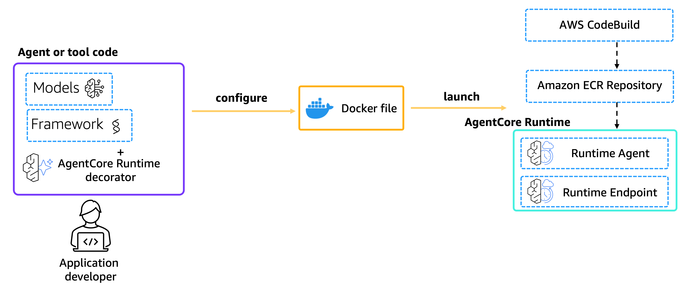
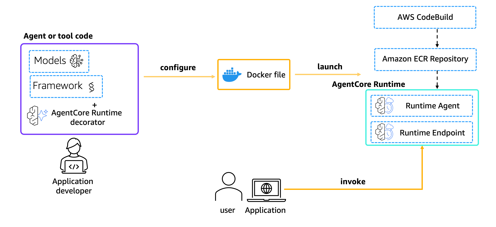

# Strands Agent with Langfuse Observability on Amazon Bedrock AgentCore runtime

| Information         | Details                                                                                   |
|:--------------------|:------------------------------------------------------------------------------------------|
| Tutorial type       | Runtime deploy + observability integration                                                |
| Agent type          | Travel agent with web search                                                              |
| Agentic Framework   | Strands Agents                                                                            |
| LLM model           | Anthropic Claude Haiku 4.5 (configurable)                                                 |
| Tutorial components | AgentCore runtime, Langfuse, OpenTelemetry (OTLP), StrandsTelemetry                      |
| Example complexity  | Intermediate                                                                              |

## Overview

This tutorial demonstrates deploying a Strands agent to Amazon Bedrock AgentCore runtime with
Langfuse observability integration. The implementation uses Amazon Bedrock Claude models and sends
telemetry data to Langfuse through OpenTelemetry (OTEL).

## Key Components

- **Strands Agents**: Python framework for building LLM-powered agents with built-in telemetry support
- **Amazon Bedrock AgentCore runtime**: Managed runtime service for hosting and scaling agents on AWS
- **Langfuse**: Open-source observability platform for LLM applications that receives traces via OTEL
- **OpenTelemetry**: Industry-standard protocol for collecting and exporting telemetry data

## Architecture

The agent is containerized and deployed to AgentCore runtime, which provides HTTP endpoints for
invocation. Telemetry data flows from the Strands agent through OTEL exporters to Langfuse for
monitoring and debugging. The implementation disables AgentCore's default observability to use
Langfuse instead.

```
AgentCore runtime → travel_agent.py
  └── StrandsTelemetry().setup_otlp_exporter()
        └── {LANGFUSE_HOST}/api/public/otel
              header: Authorization: Basic base64(public_key:secret_key)
                └── Langfuse → Traces
                      └── Agent invocations
                      └── Tool calls (web_search)
                      └── Model interactions (latency, token usage)
                      └── Request / response payloads
```

## Prerequisites

- Python 3.10+
- AWS credentials configured with Bedrock and AgentCore permissions
- [`uv`](https://docs.astral.sh/uv/) installed (used to build the arm64 deployment package)
- [Langfuse](https://langfuse.com/) account with API keys (public and secret keys)
- Access to Amazon Bedrock Claude models in your target region

## Configure AWS Credentials

Ensure your AWS credentials are configured:

```bash
aws configure
# or export AWS_ACCESS_KEY_ID, AWS_SECRET_ACCESS_KEY, AWS_DEFAULT_REGION
```

## Setup

```bash
pip install -r requirements.txt

# Copy the example env file and fill in your Langfuse keys
cp .env.example .env
```

Edit `.env`:

```bash
LANGFUSE_PUBLIC_KEY=your-langfuse-public-key
LANGFUSE_SECRET_KEY=your-langfuse-secret-key
LANGFUSE_HOST=https://us.cloud.langfuse.com   # US cloud (see Langfuse Hosts below)
```

## Agent Implementation

The agent file (`utils/travel_agent.py`) implements a travel agent with web search capabilities.
Key configuration includes:

- Initializing Strands telemetry with `StrandsTelemetry().setup_otlp_exporter()` — this reads
  the `OTEL_EXPORTER_OTLP_ENDPOINT` and `OTEL_EXPORTER_OTLP_HEADERS` env vars, which are
  derived from the Langfuse credentials at startup.
- Setting `DISABLE_ADOT_OBSERVABILITY=true` in the runtime environment so that AgentCore's
  default CloudWatch telemetry is bypassed and all traces go to Langfuse instead.
- A `web_search` tool powered by DuckDuckGo to retrieve real-time travel information.

## Deploy to AgentCore runtime

`deploy.py` creates the IAM execution role, builds and uploads the deployment package to S3,
creates the AgentCore runtime with the Langfuse environment variables, and polls until the
runtime is READY.



```bash
python deploy.py
```

Expected output:

```
Region:  us-east-1
Account: 123456789012
Agent:   langfuse_obs_12345

Created IAM role: arn:aws:iam::...
  Package uploaded to s3://agentcore-code-.../langfuse_obs_12345/code.zip
  Runtime created: <runtime-id>
    Status: CREATING
    Status: READY

Deployment complete! Runtime ARN: arn:aws:bedrock-agentcore:...
Next: python invoke.py  |  Open Langfuse → Traces
```



Deployment saves `runtime_config.json` with the runtime ARN, ID, region, role name, and S3
location — used by `invoke.py` and `cleanup.py`.

## Check Deployment Status

`deploy.py` polls for status automatically. Terminal statuses are:

| Status | Meaning |
|:-------|:--------|
| `READY` | Runtime is live — proceed to invoke |
| `CREATE_FAILED` | Deployment failed — check IAM permissions and logs |
| `UPDATE_FAILED` | Update failed |

## Invoking AgentCore runtime

`invoke.py` sends three travel-planning prompts and prints the responses.



```bash
python invoke.py
```

You can also invoke with the CLI:

```bash
agentcore invoke '{"prompt": "I am planning a weekend trip to Paris. What are the must-visit places and local food I should try?"}'
```

## View Traces in Langfuse

Once the agent has been invoked, traces appear in your Langfuse project within seconds.

To view the traces:
1. Go to your Langfuse dashboard at https://cloud.langfuse.com (or your self-hosted instance)
2. Navigate to your project
3. Click on **Traces** to view the telemetry data

The traces will include:
- Agent invocation details
- Tool calls (`web_search`)
- Model interactions with latency and token usage
- Request / response payloads

## Langfuse Hosts

| Deployment | LANGFUSE_HOST |
|:-----------|:--------------|
| US Cloud   | `https://us.cloud.langfuse.com` |
| EU Cloud   | `https://cloud.langfuse.com` |
| Self-hosted | `http://your-host:3000` |

## Files

| File | Description |
|:-----|:------------|
| `utils/travel_agent.py` | Agent with Langfuse OTLP setup via `StrandsTelemetry` |
| `deploy.py` | Creates IAM role, builds package, deploys to AgentCore runtime |
| `invoke.py` | Sends prompts to the deployed runtime |
| `cleanup.py` | Deletes all created AWS resources |
| `.env.example` | Template for Langfuse credentials |

## Sample Prompts

**Prompt**: `I'm planning a weekend trip to Kyoto in spring. What are the must-visit places?`
**Expected Behavior**: Agent uses `web_search` to find current information, returns curated recommendations

**Prompt**: `What are the best beaches in Thailand for a budget traveler?`
**Expected Behavior**: Agent searches and returns ranked beach options with practical tips

**Prompt**: `Suggest a 5-day itinerary for first-time visitors to Paris.`
**Expected Behavior**: Agent returns a structured day-by-day itinerary with local food suggestions

**Prompt**: `What's the weather like in Tokyo in November and what should I pack?`
**Expected Behavior**: Agent retrieves current climate information and provides a packing list

## Key Concepts

- **StrandsTelemetry**: Strands built-in telemetry helper. Calling `setup_otlp_exporter()` reads
  `OTEL_EXPORTER_OTLP_ENDPOINT` and `OTEL_EXPORTER_OTLP_HEADERS` and registers an OTLP HTTP
  exporter — no manual OpenTelemetry SDK setup needed.
- **DISABLE_ADOT_OBSERVABILITY**: Setting this env var to `true` tells AgentCore runtime to skip
  its default AWS Distro for OpenTelemetry (ADOT) agent, so traces go directly to Langfuse instead
  of CloudWatch.
- **OTLP HTTP**: Langfuse exposes a standard OTLP HTTP endpoint at
  `{LANGFUSE_HOST}/api/public/otel`. Authentication uses HTTP Basic auth with the Langfuse public
  and secret keys encoded as `base64(public_key:secret_key)`.

## Troubleshooting

### No traces appear in Langfuse

**Issue**: Traces are not visible after invoking the agent.
**Solution**: Verify `LANGFUSE_PUBLIC_KEY` and `LANGFUSE_SECRET_KEY` are set correctly in `.env`.
Check that `LANGFUSE_HOST` matches your Langfuse region (US vs EU cloud). Confirm
`DISABLE_ADOT_OBSERVABILITY=true` is set in the runtime environment variables in `deploy.py`.

### `LANGFUSE_PUBLIC_KEY not set` error at deploy time

**Issue**: `deploy.py` exits immediately with a credentials error.
**Solution**: Copy `.env.example` to `.env` and fill in your Langfuse API keys from
[cloud.langfuse.com → Settings → API Keys](https://cloud.langfuse.com).

### Runtime stuck in `CREATING` status

**Issue**: `deploy.py` polls for several minutes without reaching READY.
**Solution**: Check CloudWatch Logs for the runtime. Common causes: IAM role permissions not yet
propagated (the script waits 10 s after role creation — increase if still failing), or the S3
deployment package was not uploaded correctly.

### `AccessDeniedException` on Bedrock `InvokeModel`

**Issue**: Agent fails to call the model at runtime.
**Solution**: Ensure the IAM execution role created by `deploy.py` has
`bedrock:InvokeModel` permissions and that the chosen model ID is enabled in your account's
Bedrock model access settings.

## Cleanup

```bash
python cleanup.py
```

This deletes the AgentCore runtime endpoint, the runtime itself, the IAM execution role, and the
S3 deployment package. The S3 bucket is retained.

## Running the Python Scripts

```bash
pip install -r requirements.txt

# 1. Deploy
cp .env.example .env   # fill in LANGFUSE_PUBLIC_KEY, LANGFUSE_SECRET_KEY
python deploy.py

# 2. Invoke
python invoke.py

# 3. View traces in Langfuse → Traces tab

# 4. Cleanup
python cleanup.py
```

## Summary

You have successfully deployed a Strands agent to Amazon Bedrock AgentCore runtime with Langfuse
observability. The implementation demonstrates:

- Integration of Strands agents with AgentCore runtime using the native `bedrock-agentcore` SDK
- Configuration of OpenTelemetry to send traces to Langfuse via OTLP HTTP
- Proper initialization order to ensure telemetry is configured before the first agent call
- Invocation through both the Python SDK and the AgentCore CLI
- Disabling AgentCore's default ADOT observability when routing traces to a third-party platform

The agent runs in a managed, scalable environment with full observability through Langfuse.

## Additional Resources

- [Langfuse Documentation](https://langfuse.com/docs)
- [Langfuse OTEL Integration](https://langfuse.com/docs/opentelemetry/introduction)
- [Strands Telemetry](https://strandsagents.com/latest/user-guide/observability/telemetry/)
- [AgentCore observability](https://docs.aws.amazon.com/bedrock-agentcore/latest/devguide/observability-configure.html)
- [AgentCore runtime documentation](https://docs.aws.amazon.com/bedrock-agentcore/latest/devguide/agents-tools-runtime.html)
