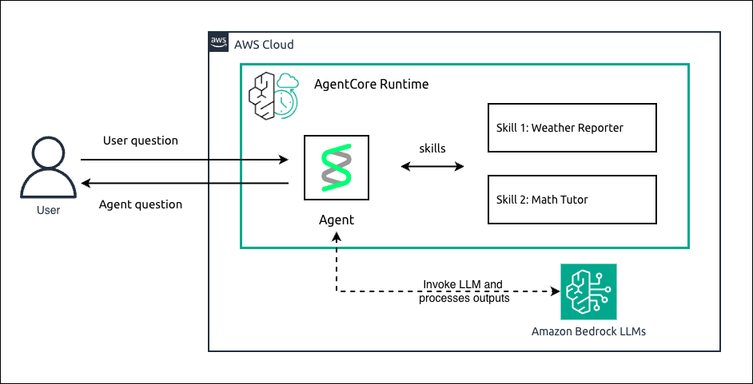

# Hosting Strands Agents with AgentSkills Plugin in Amazon Bedrock AgentCore Runtime

## Overview

In this tutorial we will learn how to host a Strands agent that uses the `AgentSkills` plugin for on-demand specialized instructions, using Amazon Bedrock AgentCore Runtime.

The `AgentSkills` plugin allows you to define reusable skills as markdown files (`SKILL.md`) with YAML frontmatter. Each skill declares its name, description, allowed tools, and behavioral instructions. The agent discovers available skills at runtime and activates the appropriate one based on the user's request.

We will walk through creating two example skills — a **weather-reporter** skill that formats weather data with emoji, temperature ranges, and recommendations, and a **math-tutor** skill that solves math problems step-by-step showing all work. We will first experiment locally, then deploy the agent to AgentCore Runtime.

For a basic Strands agent without skills check [here](../01-strands-with-bedrock-model).

### Tutorial Details

| Information         | Details                                                                                                          |
|:--------------------|:-----------------------------------------------------------------------------------------------------------------|
| Tutorial type       | Conversational                                                                                                   |
| Agent type          | Single                                                                                                           |
| Agentic Framework   | Strands Agents                                                                                                   |
| LLM model           | Anthropic Claude Haiku 4.5                                                                                       |
| Tutorial components | Hosting agent on AgentCore Runtime. Using Strands Agent with AgentSkills plugin for on-demand skill activation   |
| Tutorial vertical   | Cross-vertical                                                                                                   |
| Example complexity  | Intermediate                                                                                                     |
| SDK used            | Amazon BedrockAgentCore Python SDK and boto3                                                                     |

### Tutorial Architecture

In this tutorial we will describe how to deploy a skills-based agent to AgentCore Runtime.

For demonstration purposes, we will use a Strands Agent with the `AgentSkills` plugin, which loads skill definitions from a `skills/` directory. Each skill is a folder containing a `SKILL.md` file with YAML frontmatter (`name`, `description`, `allowed-tools`) and markdown instructions.

    

The agent uses two skills:
- **weather-reporter**: Paired with a custom `@tool` weather function, formats weather information with emoji and recommendations.
- **math-tutor**: Paired with the `calculator` tool from `strands-agents-tools`, solves math problems step-by-step.

The agent runs on Anthropic Claude Haiku 4.5 via Amazon Bedrock.

### Tutorial Key Features

* Hosting Agents on Amazon Bedrock AgentCore Runtime
* Using the Strands `AgentSkills` plugin for on-demand specialized instructions
* Defining skills with `SKILL.md` files using YAML frontmatter
* Pairing skills with custom `@tool` functions and existing tools
* Local agent experimentation before deployment
* Deploying a skills-based agent to AgentCore Runtime
