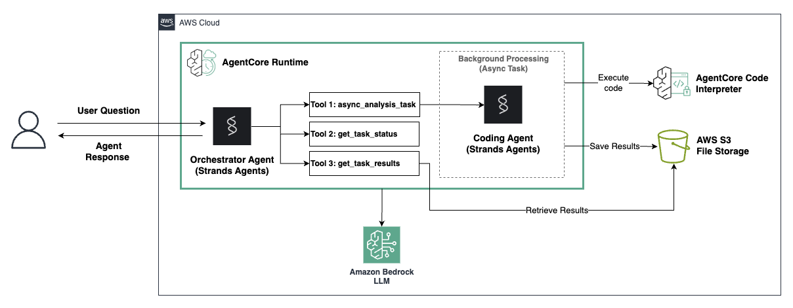

# Asynchronous Data Analysis Agent with Amazon Bedrock AgentCore

## Overview

In this tutorial we will learn how to build an asynchronous data analysis agent that can perform long-running analysis tasks in the background while maintaining a responsive conversation with the user. This demonstrates how to leverage Amazon Bedrock AgentCore's asynchronous capabilities with Strands to create agents that handle time-consuming operations gracefully.

In this example we'll create:

1. A primary agent that orchestrates user interactions and delegates analysis tasks
2. A coding agent that generates Python code for data analysis tasks
3. An async task system that executes code in Code Interpreter while keeping the agent responsive

Putting these components together you get an asynchronous agent configuration that can handle compute-intensive data analysis operations while maintaining a responsive conversation with users.

This tutorial leverages [**Amazon Bedrock AgentCore Runtime**](https://docs.aws.amazon.com/bedrock-agentcore/latest/devguide/agents-tools-runtime.html) for hosting and managing agents with built-in support for asynchronous operations, and [**Amazon Bedrock Code Interpreter**](https://docs.aws.amazon.com/bedrock-agentcore/latest/devguide/code-interpreter-tool.html) for secure execution of dynamically generated Python code in isolated environments. AgentCore Runtime provides scalable infrastructure for deploying conversational AI agents, while Code Interpreter enables agents to write and execute code safely for data analysis tasks. [Learn more about Amazon Bedrock AgentCore](https://docs.aws.amazon.com/bedrock/latest/userguide/agents-agentcore.html).

## Tutorial Details

| Information         | Details                                                               |
| :------------------ | :-------------------------------------------------------------------- |
| Tutorial type       | Conversational                                                        |
| Agent type          | Multi-Agent (Orchestrator Agent with Code Generation Agent as a tool) |
| Agentic Framework   | Strands Agents                                                        |
| LLM models          | Anthropic Claude Sonnet 4 (primary agent) & Haiku 4.5 (coding agent)  |
| Tutorial components | AgentCore Runtime, Async Tasks, Code Interpreter, S3 Integration      |
| Tutorial vertical   | Data Analytics                                                        |
| Example complexity  | Intermediate                                                          |
| SDK used            | Amazon BedrockAgentCore Python SDK and boto3                          |

## Tutorial Architecture

    

## Getting Started

Follow the instructions on this notebook [async_data_analysis_tutorial.ipynb](async_data_analysis_tutorial.ipynb)
