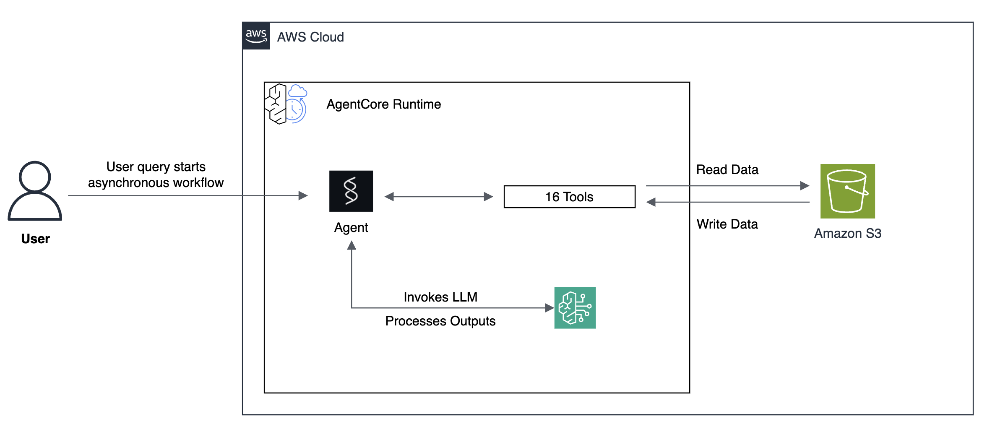

# Weekly Status Report Generator with Amazon Bedrock AgentCore Runtime

## Overview

In this tutorial we will learn how to build and deploy an automated weekly status report generator using Amazon Bedrock AgentCore Runtime. The agent collects data from multiple sources (team updates, meeting notes, metrics, bug trackers), performs analysis, generates visualizations, and uploads comprehensive reports to S3.

### Tutorial Details

| Information         | Details                                                                          |
|:--------------------|:---------------------------------------------------------------------------------|
| Tutorial type       | Data Analysis & Reporting                                                        |
| Agent type          | Single                                                                           |
| Agentic Framework   | Strands Agents                                                                   |
| LLM model           | Anthropic Claude Sonnet 4                                                        |
| Tutorial components | Multi-tool agent, data analysis, visualization, S3 integration, AgentCore Runtime|
| Tutorial vertical   | Business Operations & Reporting                                                  |
| Example complexity  | Intermediate                                                                     |
| SDK used            | Amazon BedrockAgentCore Python SDK, boto3, matplotlib, scikit-learn              |

### Tutorial Architecture

This tutorial demonstrates how to deploy a reporting agent to AgentCore runtime. The agent uses multiple tools to:
- Read and analyze data from various sources (CSV, JSON, Markdown files)
- Perform sentiment analysis and risk scoring
- Generate data visualizations (charts and graphs)
- Build forecasting models using machine learning
- Upload reports and visualizations to S3

The agent orchestrates 16 different tools to create comprehensive weekly status reports automatically.



### Tutorial Key Features

* Hosting an asynchronous multi-tool agent on Amazon Bedrock AgentCore Runtime
* Using Amazon Bedrock models (Claude Sonnet 4)
* Using Strands Agents framework


## Prerequisites

- AWS Account with access to Amazon Bedrock AgentCore
- Python 3.12+
- AWS CLI configured with appropriate credentials
- S3 bucket for storing demo data and reports

## Project Structure

```
├── README.md                              # This file
└── 01_weekly_report_generator_async/     # Agent code and data
    ├── weekly_update_agentcore_deploy.ipynb  # Deployment notebook
    ├── images/                            # Architecture diagrams
    ├── agent/                             # Agent implementation
    │   ├── agent.py                     # Main agent definition
    │   ├── tools.py                     # All tool functions (16 tools)
    │   ├── requirements.txt             # Python dependencies
    │   └── .dockerignore                # Docker ignore patterns
    ├── demo_data/                       # Sample data directory
    │   ├── team_updates/                # Team member updates (Markdown)
    │   ├── meeting_notes/               # Meeting notes (Markdown)
    │   ├── metrics/                     # KPI metrics (CSV)
    │   ├── issues/                      # Bug tracker data (JSON)
    │   └── project_status/              # Project status (CSV)
    └── update_demo_dates.py             # Demo data management script
```


## What the Agent Does

When invoked, the agent:

1. **Collects Data** from multiple sources:
   - Team member updates (5 team members)
   - Meeting notes (3 meetings)
   - KPI metrics (historical and current)
   - Bug tracker data
   - Project status information

2. **Analyzes Data**:
   - Validates data quality
   - Cross-references bugs mentioned in updates
   - Performs sentiment analysis on team updates
   - Calculates risk scores for projects

3. **Generates Visualizations**:
   - Bug severity pie chart
   - Metrics status bar charts
   - Project timeline chart
   - Team velocity chart
   - Metrics forecast chart (with ML predictions)

4. **Creates Report**:
   - Synthesizes all information into a comprehensive markdown report
   - Includes executive summary, team highlights, KPIs, risks, and action items

5. **Uploads to S3**:
   - Uploads the markdown report
   - Uploads all generated charts
   - Organizes by year and week: `s3://bucket/weekly_reports/2026/week_09_2026-02-23/`

