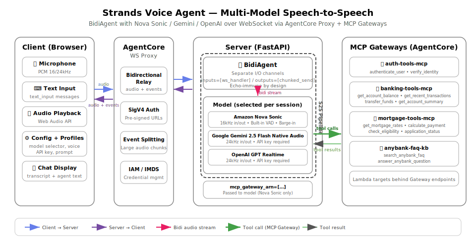

# Strands Voice Agent (Multi-Model Speech-to-Speech)

A bidirectional voice agent supporting three S2S models: **Amazon Nova Sonic**, **Google Gemini 2.5 Flash Native Audio**, and **OpenAI GPT Realtime**. Built with Strands `BidiAgent`, deployed on Amazon Bedrock AgentCore with MCP Gateway tool access.

## Deploy to AgentCore

```bash
# Navigate to the bidirectional streaming tutorial root
cd 06-workshops/01-AgentCore-runtime/06-bi-directional-streaming

# Create and activate a virtual environment
python3 -m venv .venv
source .venv/bin/activate        # macOS/Linux
# .venv\Scripts\activate         # Windows

# Install deployment dependencies
pip install -r utils/requirements.txt

# Set your AWS account ID
export ACCOUNT_ID=123456789012

# Set AWS credentials (Option A: environment variables)
export AWS_ACCESS_KEY_ID=your-access-key
export AWS_SECRET_ACCESS_KEY=your-secret-key
export AWS_REGION=us-east-1

# Set AWS credentials (Option B: named profile)
export AWS_PROFILE=your-profile
export AWS_REGION=us-east-1

# Deploy (creates 4 MCP Gateways + agent runtime)
python utils/deploy.py 02-strands-ws

# Start the web client
./utils/start_client.sh 02-strands-ws
```

### Configure Knowledge Base (Required for FAQ Tools)

The FAQ KB gateway requires a Bedrock Knowledge Base:

1. Go to AWS Bedrock Console → Knowledge Bases → Create
2. Upload `assets/anybank-faq.md` as the data source
3. Note the Knowledge Base ID

Then update the runtime environment variable:

```bash
AGENT_RUNTIME_ID=$(python -c "import json; print(json.load(open('02-strands-ws/setup_config.json'))['agent_arn'].split('/')[-1])")

aws bedrock-agentcore-control update-agent-runtime \
  --agent-runtime-id $AGENT_RUNTIME_ID \
  --environment-variables KNOWLEDGE_BASE_ID=your-kb-id-here \
  --region us-east-1
```

The FAQ tools (`search_anybank_faq`, `answer_anybank_question`) only work after this is configured. Other tools (auth, banking, mortgage) work without it.

### Cleanup

```bash
python utils/cleanup.py 02-strands-ws
```

## Local Testing

The Strands agent requires MCP Gateways for tool access. To run locally, you need deployed gateways and AWS credentials.

```bash
# 1. Install server dependencies
pip install -r 02-strands-ws/websocket/requirements.txt

# 2. Set AWS credentials
export AWS_ACCESS_KEY_ID=your-access-key
export AWS_SECRET_ACCESS_KEY=your-secret-key
export AWS_REGION=us-east-1

# 3. Set MCP Gateway config (from a prior `python utils/deploy.py 02-strands-ws` run)
export MCP_GATEWAY_ARNS='["arn:aws:bedrock-agentcore:us-east-1:123456789012:gateway/gw-1", ...]'
export MCP_GATEWAY_URLS='["https://gateway-1.endpoint.example.com", ...]'

# 4. Start the server (port 8080)
cd 02-strands-ws/websocket
python server.py

# 5. In another terminal, start the client (port 8000, opens browser)
cd 02-strands-ws/client
pip install -r requirements.txt
python client.py --ws-url ws://localhost:8080/ws
```

The client serves `strands-client.html` on `http://localhost:8000` and connects to the local WebSocket server directly (no SigV4 signing needed).

For Gemini or OpenAI models, also set the relevant API key:

```bash
export GOOGLE_API_KEY=your-google-api-key    # For Gemini
export OPENAI_API_KEY=your-openai-api-key    # For OpenAI
```

### Try It Out

- "Hello, my name is John" → "My account ID is 1234567890 and my birthday is January 15th, 1990"
- "What's my account balance?" / "Show me my recent transactions"
- "What are the current mortgage rates?"
- "How can I avoid monthly fees on my checking account?" (requires Knowledge Base)

## Architecture



The `BidiAgent` manages the bidirectional stream between the client and whichever model is selected per session. All three models process audio input and generate audio output natively — no separate STT/TTS pipeline.

## Supported Models

| Model | ID | API Key | MCP Gateways |
|-------|----|---------|--------------|
| Amazon Nova Sonic | `amazon.nova-2-sonic-v1:0` | No (AWS credentials) | Yes |
| Google Gemini 2.5 Flash | `gemini-2.5-flash-native-audio-preview-12-2025` | `GOOGLE_API_KEY` | Yes |
| OpenAI GPT Realtime | `gpt-realtime` | `OPENAI_API_KEY` | Yes |

The model is selected per session via the client's config modal. Sample rates are automatically configured based on the selected model.

## Key Components

| File | Purpose |
|------|---------|
| `websocket/server.py` | FastAPI server, IMDS credentials, WebSocket endpoint, large event splitting |
| `websocket/agent.py` | Session handler, multi-model BidiAgent setup (Nova Sonic / Gemini / OpenAI) |
| `client/client.py` | HTTP server that serves the HTML client |
| `client/strands-client.html` | Browser-based voice/text client with model selector and config modal |
| `client/profiles.json` | Pre-configured agent profiles (Finance, General, Tech Support) |
| `mcp/auth_mcp.py` | Authentication MCP server (authenticate_user, verify_identity) |
| `mcp/banking_mcp.py` | Banking MCP server (balance, transactions, transfers, summary) |
| `mcp/mortgage_mcp.py` | Mortgage MCP server (rates, calculator, eligibility, status) |
| `mcp/faq_kb_mcp.py` | FAQ knowledge base MCP server (search, answer with citations) |

## How BidiAgent Works

The core of the agent is the `BidiAgent` with separated I/O channels:

```python
model = _create_model(config, gateway_arns)  # Nova Sonic, Gemini, or OpenAI

agent = BidiAgent(
    model=model,
    tools=[],
    system_prompt=system_prompt,
)

await agent.run(inputs=[handle_websocket_input], outputs=[chunked_send_json])
```

- `inputs` — async functions that yield messages from the client (audio chunks, text input). The `handle_websocket_input` function filters out config events and routes text/audio appropriately.
- `outputs` — the `chunked_send_json` wrapper in `server.py` splits large audio events before sending over WebSocket.

This separation makes the agent naturally immune to AgentCore's WebSocket proxy echo.

## Multi-Model Setup

The `_create_model` function in `agent.py` creates the appropriate model based on the `model_id` from the client config:

```python
# Nova Sonic — uses AWS credentials, supports MCP gateways
BidiNovaSonicModel(region=..., model_id=..., provider_config={...}, mcp_gateway_arn=[...])

# Gemini — requires GOOGLE_API_KEY (from config or env var)
BidiGeminiLiveModel(model_id=..., provider_config={...}, client_config={"api_key": key})

# OpenAI — requires OPENAI_API_KEY (from config or env var)
BidiOpenAIRealtimeModel(model_id=..., provider_config={...}, client_config={"api_key": key})
```

API keys can be provided per-session from the client config modal or set as environment variables on the server.

### Dependencies

The Gemini and OpenAI models require additional packages beyond the base `strands-agents`:

```
google-genai>=1.32.0    # For Gemini Live
openai>=1.0.0           # For OpenAI Realtime
websockets>=14.0        # Required by OpenAI Realtime SDK
```

## Large Event Splitting

The `split_large_event` function in `server.py` handles oversized audio output events:

- Events >10KB are split by dividing the `audio` field into smaller chunks
- Splits are aligned to 4-character base64 boundaries to avoid decoding corruption
- Each chunk preserves the original event structure
- The `chunked_send_json` output wrapper applies this automatically to all outbound events

## Voice Activity Detection (VAD)

Nova Sonic handles VAD internally within the model — no custom silence detection needed. The model detects speech boundaries natively and supports barge-in.

Gemini and OpenAI also handle VAD internally within their respective realtime APIs.

## MCP Gateway Integration

Tools are accessed via AgentCore MCP Gateways. Four gateways are deployed:

| Gateway | MCP Server | Tools |
|---------|-----------|-------|
| auth-tools | auth-tools-mcp | `authenticate_user`, `verify_identity` |
| banking-tools | banking-tools-mcp | `get_account_balance`, `get_recent_transactions`, `transfer_funds`, `get_account_summary` |
| mortgage-tools | mortgage-tools-mcp | `get_mortgage_rates`, `calculate_mortgage_payment`, `check_mortgage_eligibility`, `get_mortgage_application_status` |
| faq-kb-tools | anybank-faq-kb | `search_anybank_faq`, `answer_anybank_question` |

Gateway ARNs are passed to the model via the `mcp_gateway_arn` parameter and are configured server-side via the `MCP_GATEWAY_ARNS` environment variable.

## WebSocket Messages (client ↔ server)

### Client → Server

| Type | Fields | Description |
|------|--------|-------------|
| `config` | `voice`, `model_id`, `region`, `input_sample_rate`, `output_sample_rate`, `system_prompt`, `api_key` | Initial session configuration (must be first message). |
| `text_input` | `text` | Text message to send to the agent |
| `bidi_audio_input` | `audio` (base64), `format`, `sample_rate`, `channels` | PCM audio chunk from the microphone |

### Server → Client

| Type | Fields | Description |
|------|--------|-------------|
| `bidi_audio_stream` | `audio` (base64) | Audio output from the model |
| `bidi_transcript_stream` | `text`, `role`, `delta` | Transcript of user speech or agent response |
| `bidi_interruption` | — | User interrupted the agent (barge-in) |
| `bidi_response_complete` | — | Agent finished responding |
| `bidi_usage` | `inputTokens`, `outputTokens`, `totalTokens` | Token usage stats |
| `tool_use_stream` | `current_tool_use` | Tool invocation in progress |
| `tool_result` | `tool_result` | Tool execution result |
| `system` | `message` | Status/info messages |

## Model Comparison

| Aspect | Nova Sonic | Gemini 2.5 Flash | OpenAI GPT Realtime |
|--------|-----------|------------------|---------------------|
| Audio rates | 16kHz in/out | 24kHz in/out | 24kHz in/out |
| Authentication | AWS credentials | Google API key | OpenAI API key |
| Voice selection | Yes (tiffany, matthew, etc.) | No | No |
| MCP Gateways | Native support | Via BidiAgent | Via BidiAgent |
| Barge-in | Native | Native | Native |
| Transcript handling | Immediate display | Buffered (grouped) | Buffered (grouped) |
