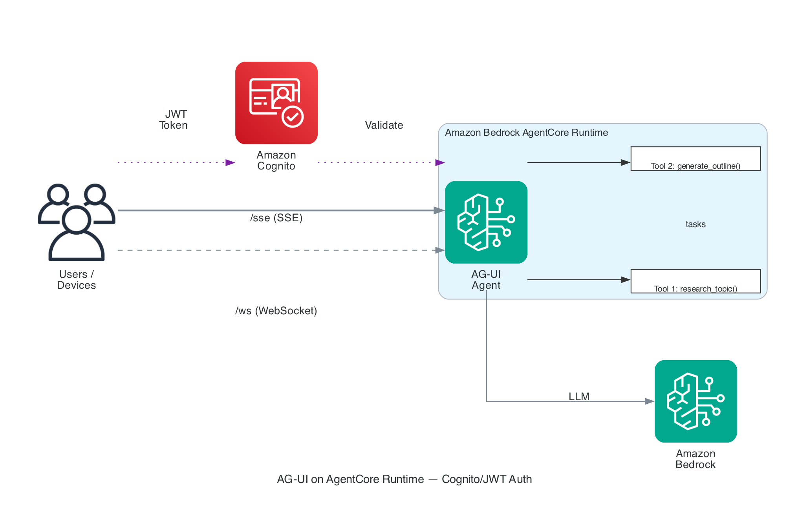
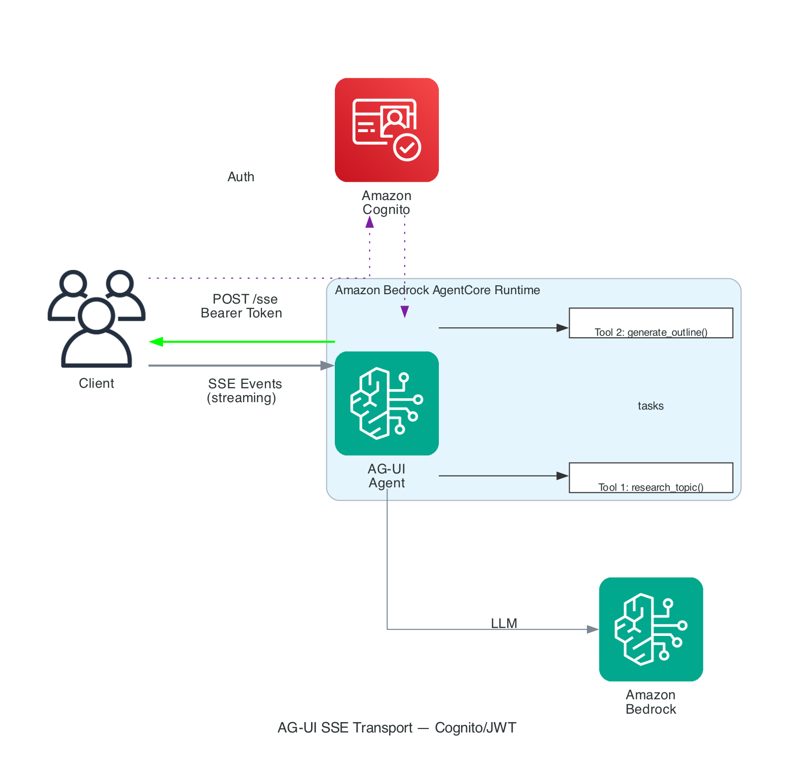
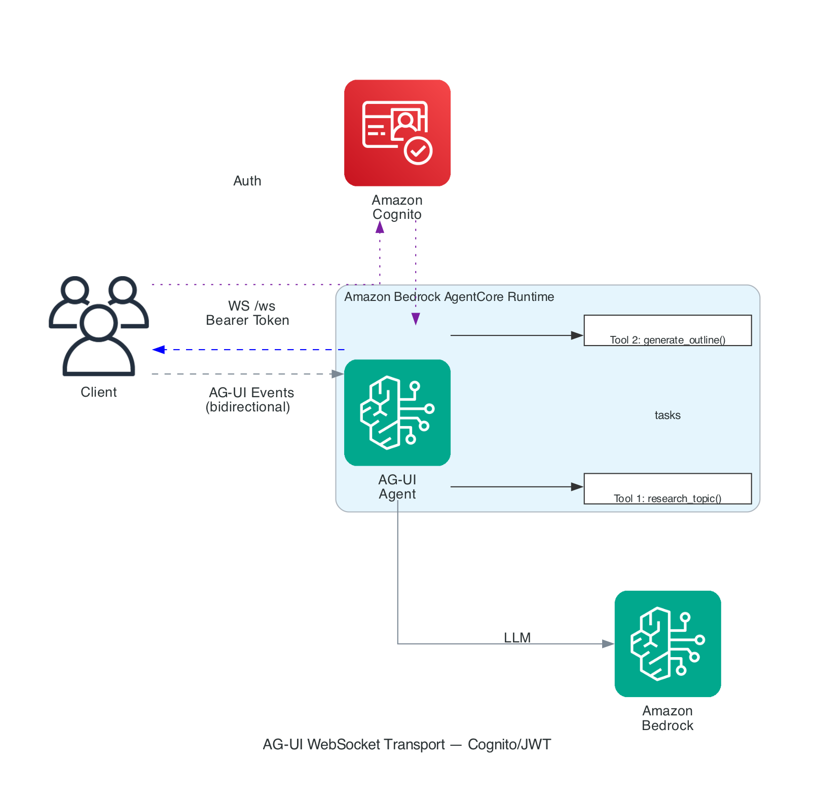

# AG-UI Examples on AgentCore Runtime

## Overview

[AG-UI (Agent-User Interface)](https://docs.ag-ui.com) is an open, event-based protocol for connecting AI agents to user-facing applications. Unlike request-response protocols, AG-UI streams events as the agent works — tool invocations, state changes, and text generation arrive incrementally so users can watch an agent's progress in real time.

This tutorial deploys a **Collaborative Document Generator** agent on Amazon Bedrock AgentCore Runtime using the AG-UI protocol. The agent co-authors documents with users through a conversational interface, demonstrating both **SSE** and **WebSocket** transports.

| Protocol | Purpose | Communication Pattern |
|:---------|:--------|:----------------------|
| **AG-UI** | Agent → User | Streaming events (SSE + WebSocket) |
| MCP | Agent → Tools | Bidirectional JSON-RPC |
| A2A | Agent → Agent | Task-based orchestration |

## Architecture

AG-UI is an open, event-based protocol that standardizes how AI agents connect to user-facing applications. AgentCore Runtime supports AG-UI natively with both SSE and WebSocket transports.

### AG-UI Event Flow

During agent execution, the backend emits a stream of typed events:

### SSE Transport

**Cognito/JWT:**

**IAM/SigV4:**

### WebSocket Transport

**Cognito/JWT:**

**IAM/SigV4:**

## AG-UI Event Reference

| Event | Purpose |
|:------|:--------|
| `RUN_STARTED` | Agent begins processing |
| `RUN_FINISHED` | Agent completed |
| `RUN_ERROR` | Error with code and message |
| `TEXT_MESSAGE_START` | Begin assistant message |
| `TEXT_MESSAGE_CONTENT` | Streaming text delta |
| `TEXT_MESSAGE_END` | Message complete |
| `TOOL_CALL_START` | Tool invoked (name + ID) |
| `TOOL_CALL_ARGS` | Tool arguments (streaming) |
| `TOOL_CALL_END` | Arguments complete |
| `TOOL_CALL_RESULT` | Tool output |
| `STATE_SNAPSHOT` | Full shared state update |

## Prerequisites

- Python 3.12+
- AWS credentials with Bedrock model access (`us.anthropic.claude-sonnet-4-20250514-v1:0`)
- `bedrock-agentcore-starter-toolkit` (installed by notebook)

## Quick Start (Cognito/JWT Auth)

1. Open `hosting_agui_agent_cognito.ipynb`
2. Run **Install** — installs Python deps and starter toolkit
3. Run **Cognito Setup** — creates User Pool, gets Bearer token
4. Run **Configure & Launch** — deploys agent with `protocol='AGUI'` and Cognito JWT authorizer
5. Run **SSE Demo** — sends a document creation request over SSE
6. Run **WebSocket Demo** — same request over WebSocket
7. Run **Interactive Demo** — 4-turn document co-authoring conversation
8. Run **Cleanup** when done

## Quick Start (IAM/SigV4 Auth)

1. Open `hosting_agui_agent_iam.ipynb`
2. Run **Install** — installs Python deps and starter toolkit
3. Run **Configure & Launch** — deploys agent with `protocol='AGUI'` (IAM is default)
4. Run **SSE Demo** — sends a document creation request with SigV4-signed headers
5. Run **WebSocket Demo** — connects via SigV4 pre-signed URL
6. Run **Interactive Demo** — 4-turn document co-authoring conversation
7. Run **Cleanup** when done

## Folder Structure

| File | Description |
|:-----|:------------|
| `agui_agent.py` | Document co-authoring AGUI agent (FastAPI + Strands) |
| `requirements.txt` | Python dependencies (includes `websockets`) |
| `hosting_agui_agent_cognito.ipynb` | Cognito/JWT auth notebook with SSE + WebSocket demos |
| `hosting_agui_agent_iam.ipynb` | IAM/SigV4 auth notebook with SSE + WebSocket demos |
| `images/` | Architecture diagrams (AG-UI overview, event flow, transports) |
| `README.md` | This file |

## Transports

### SSE (Server-Sent Events)

- Endpoint: `POST /invocations?qualifier=DEFAULT`
- Auth: `Authorization: Bearer <token>` (Cognito) or SigV4-signed headers (IAM)
- One-directional: client sends request, server streams events
- Primary transport for most use cases

### WebSocket

- Endpoint: `GET /ws?qualifier=DEFAULT` (upgrade to WebSocket)
- Auth: `Authorization: Bearer <token>` header (Cognito) or SigV4 pre-signed URL (IAM)
- Bidirectional: full-duplex streaming
- Useful for long-running sessions and real-time collaboration

Both transports stream the same AG-UI events. The agent code handles both via FastAPI's `/invocations` (SSE) and `/ws` (WebSocket) endpoints.

## Troubleshooting

| Issue | Solution |
|:------|:---------|
| `CREATE_FAILED` on launch | Verify IAM permissions; check CloudWatch logs |
| 401/403 on SSE | Refresh Bearer token (Cognito) or re-sign request (SigV4) |
| WebSocket connection refused | Ensure `protocol='AGUI'` was set during configure |
| Agent returns empty response | Check CloudWatch logs; verify Bedrock model access |
| Token expired during demo | Run `refresh_token()` (Cognito) or re-create SigV4 headers |
| Runtime init timeout (30s) | Agent uses lazy init — first request may take longer |

## Cleanup

Each notebook includes a cleanup cell that deletes:
- AgentCore Runtime
- Cognito User Pool (Cognito notebook only)
