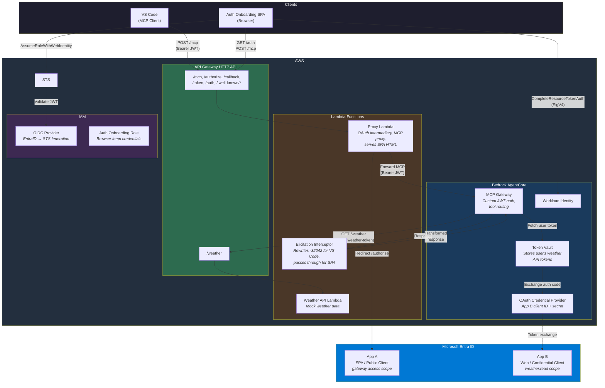
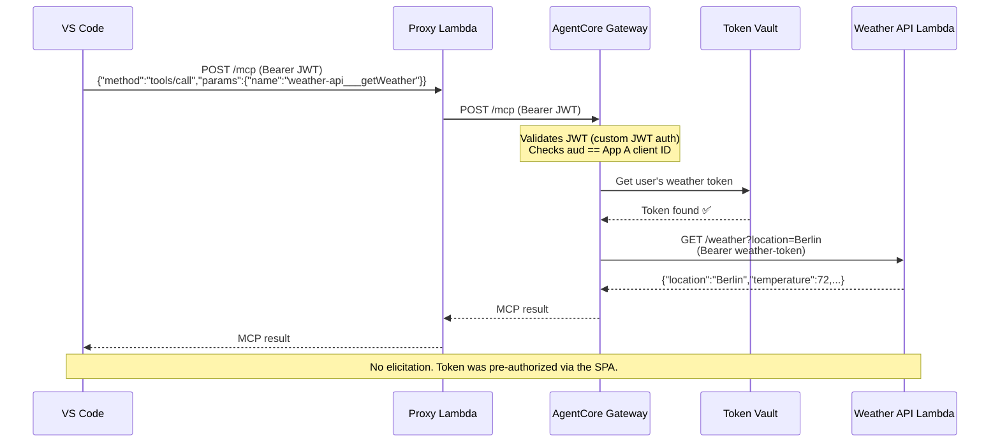
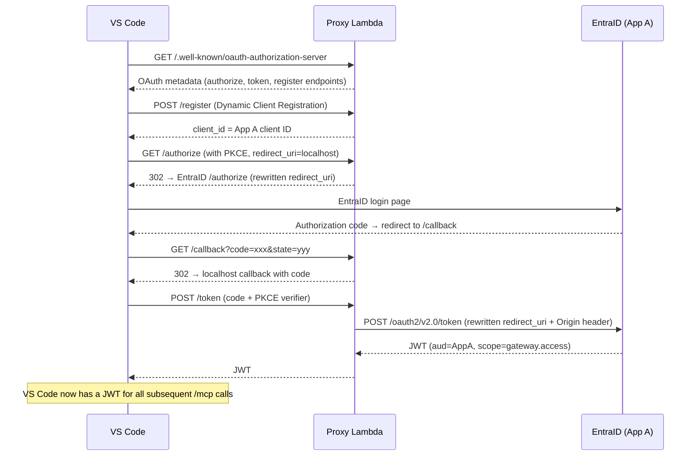

# End-to-End Flow: AgentCore Gateway with EntraID 3LO

This document describes the complete working flow for the AgentCore MCP Gateway with EntraID inbound authentication and outbound 3LO (three-legged OAuth) for user-delegated access to downstream APIs.

## System Overview

```
┌─────────────────────────────────────────────────────────────────────────┐
│                         COMPONENTS                                     │
├─────────────────────────────────────────────────────────────────────────┤
│                                                                        │
│  EntraID (CIAM tenant)                                                 │
│  ├── App A: agentcore-gateway-inbound (SPA, public client)             │
│  │   └── Shared identity for VS Code + Auth Onboarding SPA             │
│  └── App B: agentcore-weather-api (Web, confidential client)           │
│      └── Resource server exposing weather.read scope                   │
│                                                                        │
│  AWS                                                                   │
│  ├── API Gateway HTTP API (proxy endpoint)                             │
│  ├── Proxy Lambda (OAuth metadata, authorize/callback/token, MCP proxy)│
│  ├── Weather API Lambda (mock weather data)                            │
│  ├── AgentCore Gateway (MCP protocol, custom JWT auth)                 │
│  ├── AgentCore Token Vault (stores user's weather API tokens)          │
│  ├── OAuth Credential Provider (App B client ID + secret)              │
│  ├── IAM OIDC Provider (EntraID → STS federation)                      │
│  └── IAM Role: auth-onboarding-web-role (browser temp credentials)     │
│                                                                        │
│  Clients                                                               │
│  ├── VS Code (MCP client, uses proxy Lambda)                           │
│  └── Auth Onboarding SPA (browser-based, pre-authorizes 3LO)          │
│                                                                        │
└─────────────────────────────────────────────────────────────────────────┘
```

## AWS Architecture



## Two Flows, One Token Vault

There are two client flows that share the same user identity and token vault:

1. **Auth Onboarding SPA** — browser-based web app where users pre-authorize 3LO access
2. **VS Code MCP Client** — IDE-based MCP client that calls tools through the proxy

Both authenticate against the same EntraID App A, so the JWT `sub` claim is identical for the same user. A token authorized via the SPA is immediately usable by VS Code.

---

## Flow 1: Auth Onboarding (First-Time Authorization)

The user visits the auth onboarding web app to pre-authorize access to downstream APIs before using them from VS Code.

```mermaid
sequenceDiagram
    participant B as Browser (SPA)
    participant EA as EntraID (App A)
    participant STS as AWS STS
    participant PL as Proxy Lambda
    participant GW as AgentCore Gateway
    participant TV as Token Vault
    participant EB as EntraID (App B)
    participant AC as AgentCore Identity

    rect rgb(30, 40, 60)
    Note over B,AC: Phase 1 — User signs in
    B->>PL: GET /auth
    PL-->>B: SPA HTML page (static)
    B->>EA: MSAL.js loginRedirect (PKCE)<br/>scope: openid profile email + gateway.access
    EA-->>B: JWT (aud=AppA, sub=user)
    Note over B: JWT stored in browser sessionStorage
    end

    rect rgb(40, 30, 60)
    Note over B,AC: Phase 2 — Check authorization status
    B->>PL: POST /mcp (Bearer JWT)<br/>{"method":"tools/call","params":{"name":"weather-api___getWeather"}}
    PL->>GW: POST /mcp (Bearer JWT)
    GW->>TV: Get user's weather token
    TV-->>GW: Not found
    GW-->>PL: Error -32042 (elicitation)<br/>authorizationUrl + session_id
    PL-->>B: Error -32042 with authorizationUrl
    Note over B: Shows "Authorization needed" + Authorize button<br/>Saves JWT + roleArn to sessionStorage
    end

    rect rgb(60, 40, 30)
    Note over B,AC: Phase 3 — User consents
    Note over B: User clicks Authorize
    B->>AC: Follow authorizationUrl
    AC->>EB: Redirect to EntraID consent<br/>scope: weather.read
    Note over EB: User sees "Allow Weather API to read weather data?"
    EB-->>AC: Authorization code
    Note over AC: Exchanges code for weather token<br/>using App B client secret
    AC->>TV: Store user's weather token
    AC-->>B: Redirect to /auth/callback?session_id=xxx
    end

    rect rgb(30, 55, 35)
    Note over B,AC: Phase 4 — Complete authorization (browser-side SigV4)
    B->>PL: GET /auth/callback?session_id=xxx
    PL-->>B: Callback HTML page (static)
    Note over B: Reads JWT from sessionStorage<br/>Reads session_id from URL
    B->>STS: AssumeRoleWithWebIdentity(JWT)
    STS-->>B: Temporary AWS credentials (1h)
    B->>AC: CompleteResourceTokenAuth(sessionUri, userToken)<br/>[SigV4 signed with temp creds]
    Note over AC: Validates JWT matches the user who initiated the flow<br/>Binds the stored token to this user<br/>(accesses Secrets Manager via FAS internally)
    AC-->>B: Success
    Note over B: Shows "Authorization Successful"
    end
```



### What happens at each step

1. User visits `https://<endpoint>/auth` — proxy Lambda serves the SPA HTML
2. MSAL.js handles EntraID login via PKCE, gets a JWT with `gateway.access` scope
3. SPA calls `POST /mcp` with `tools/call getWeather` — same request VS Code would make
4. Gateway checks the token vault for the user's weather API token — not found
5. Gateway returns elicitation (-32042) with an `authorizationUrl`
6. SPA shows the Authorize button. User clicks it. JWT and role ARN are saved to sessionStorage.
7. Browser redirects to AgentCore's authorize URL → EntraID consent page
8. User consents. EntraID sends authorization code to AgentCore's callback
9. AgentCore exchanges the code for a weather token using App B's client secret (from Secrets Manager)
10. AgentCore stores the token in the token vault, redirects to `/auth/callback?session_id=xxx`
11. Callback page reads JWT from sessionStorage, calls STS `AssumeRoleWithWebIdentity` to get temp AWS credentials
12. Callback page calls `CompleteResourceTokenAuth` directly via SigV4 — no Lambda proxy involved
13. Done. Token is in the vault, bound to this user.

---

## Flow 2: VS Code MCP (Happy Path After Authorization)

After the user has authorized via the SPA, VS Code MCP calls work without any elicitation.



---

## Flow 3: VS Code Inbound OAuth (First Connection)

When VS Code first connects to the MCP server, it goes through the standard OAuth 2.1 flow for inbound authentication. This is separate from the 3LO outbound auth.



### Proxy Lambda's role in inbound auth

The proxy Lambda acts as an OAuth intermediary between VS Code and EntraID:

- `/authorize` — rewrites `redirect_uri` to the proxy's `/callback`, encodes the original redirect_uri in the state parameter, injects the `gateway.access` scope
- `/callback` — decodes the compound state, forwards the authorization code to VS Code's original redirect_uri
- `/token` — strips the `resource` parameter (EntraID v2.0 doesn't support it), adds `Origin` header (required for SPA/public client token redemption), rewrites `redirect_uri`
- `/register` — returns the pre-registered App A client_id (no dynamic registration needed)

---

## Key Design Decisions

### Why `tools/call` instead of `tools/list` for checking auth status

`tools/list` does NOT trigger outbound auth — it returns the list of available tools without needing the weather API token. Only `tools/call` (actually invoking a tool) forces the Gateway to fetch the weather token, which triggers elicitation if the token is missing.

### Why `CustomOauth2` vendor type for the credential provider

The EntraID tenant is a CIAM (External ID) tenant. CIAM tenants use `ciamlogin.com` for their token endpoints, not `login.microsoftonline.com`. The `MicrosoftOauth2` vendor type auto-generates the discovery URL as `login.microsoftonline.com`, which causes token exchange failures. `CustomOauth2` lets us specify the correct CIAM discovery URL explicitly.

### Why the browser calls `CompleteResourceTokenAuth` directly (no Lambda proxy)

The callback page calls `CompleteResourceTokenAuth` directly from the browser using SigV4 signing with temporary AWS credentials from STS `AssumeRoleWithWebIdentity`. This eliminates the Lambda proxy from the auth completion flow entirely.

The browser role has `secretsmanager:GetSecretValue` gated by `aws:CalledVia: bedrock-agentcore.amazonaws.com` — the browser cannot call GetSecretValue directly, but when AgentCore calls it internally during `CompleteResourceTokenAuth` via Forward Access Sessions (FAS), the condition passes. This pattern comes from the AWS-managed `BedrockAgentCoreFullAccess` policy.

The browser loads the AWS SDK v3 (`@aws-sdk/client-sts` and `@aws-sdk/client-bedrock-agentcore`) from jsDelivr ESM CDN. The flow is:
1. Read JWT from sessionStorage (saved before consent redirect)
2. STS `AssumeRoleWithWebIdentity(JWT)` → temp credentials
3. `CompleteResourceTokenAuth(sessionUri, userToken)` with SigV4

This means the JWT never leaves the browser — no DynamoDB, no Lambda proxy, no server-side storage.

### Why no `allowedClients` on the Gateway authorizer

EntraID v2.0 tokens use `azp` for the client ID, not `client_id`. AgentCore validates `allowedClients` against the `client_id` claim, which doesn't exist in EntraID v2.0 tokens. We rely on `allowedAudience` (validated against `aud`) instead.

### Why the proxy Lambda bundles its own boto3

The Lambda runtime's built-in boto3 may be too old and lack `complete_resource_token_auth`. The CDK bundling step installs the latest boto3 into the deployment package.

---

## Token Lifecycle

| Token | Issued by | Stored where | Lifetime | Used for |
|-------|-----------|-------------|----------|----------|
| EntraID JWT (gateway.access) | EntraID App A | Browser sessionStorage (MSAL.js) | ~1 hour | Inbound auth to Gateway, STS AssumeRoleWithWebIdentity, CompleteResourceTokenAuth |
| Temp AWS credentials | STS | Browser memory (JS variable) | 1 hour | SigV4 signing for CompleteResourceTokenAuth |
| Weather API token | EntraID App B | AgentCore Token Vault | Refresh token ~30 days | Gateway → Weather API calls |
| Refresh token | EntraID App B | AgentCore Token Vault | ~30 days | Auto-refresh of weather token |

---

## Error Scenarios

| Scenario | What happens | Resolution |
|----------|-------------|------------|
| User hasn't authorized yet | Gateway returns -32042 elicitation | Visit auth onboarding SPA, click Authorize |
| Weather token expired | Gateway auto-refreshes using refresh token in vault | Transparent to user |
| Refresh token expired | Gateway returns -32042 elicitation again | Re-authorize via SPA |
| Wrong discovery URL on credential provider | `authorizationCode must not be null` error during consent | Recreate credential provider with `CustomOauth2` and CIAM discovery URL |
| EntraID App B redirect URI mismatch | Consent flow fails at EntraID | Update redirect URI in Entra admin center to match credential provider callback URL |
| CompleteResourceTokenAuth access denied | FAS/CalledVia condition not met | Verify IAM role has `secretsmanager:GetSecretValue` with `aws:CalledVia` condition for `bedrock-agentcore.amazonaws.com` |
