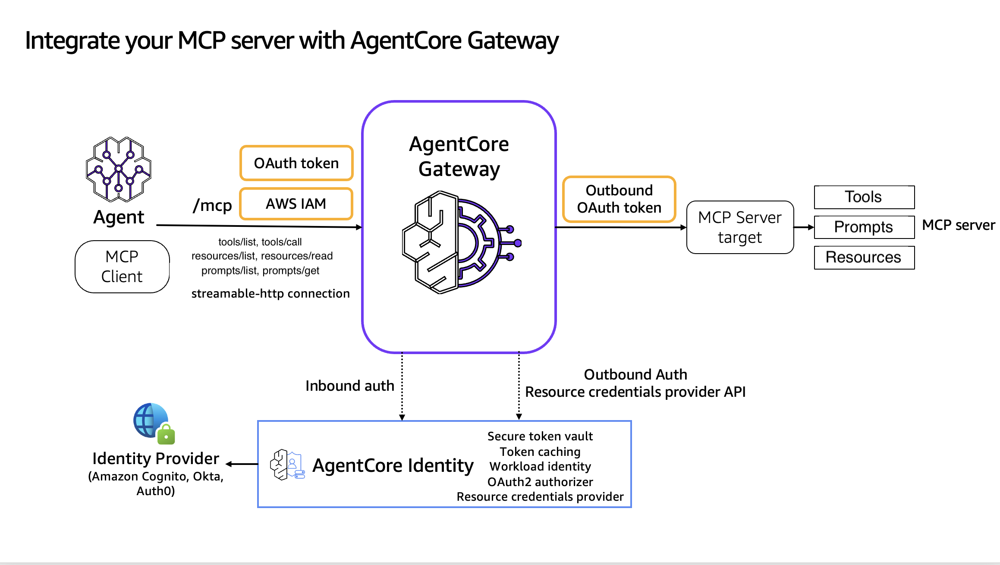
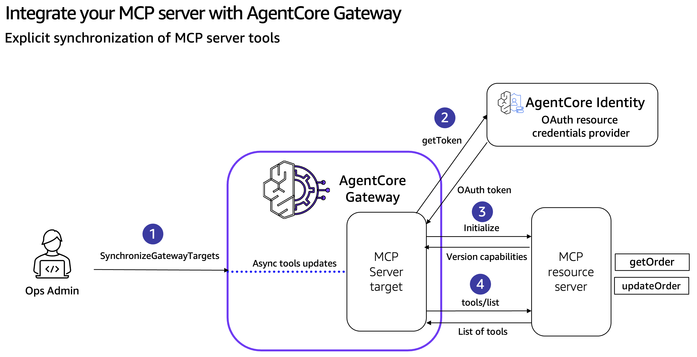
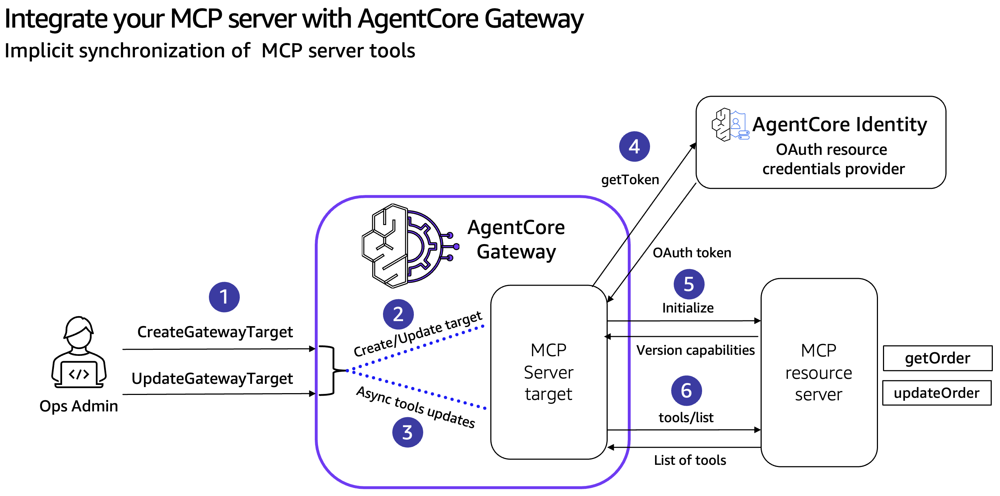

# Integrate your MCP Server with AgentCore Gateway

## Overview
Amazon Bedrock AgentCore Gateway supports MCP servers as native targets alongside REST APIs and AWS Lambda functions. This lets you integrate existing MCP server implementations through one unified interface — no per-server client code, no per-team gateway sprawl, and one place to centralize tool management, authentication, routing, and protocol upgrades.

The Gateway is a centralized management framework for tool/prompt/resource discovery, security, and routing — letting enterprises scale from dozens to hundreds of MCP servers behind a single endpoint without fragmenting their security and operational standards.

### MCP primitives forwarded by the Gateway
For each MCP server target, the Gateway forwards all three MCP primitive types:

- **Tools** — `tools/list` (cached or live, depending on the target's `listingMode`) and `tools/call` (always live).
- **Prompts** — `prompts/list` (cached or live) and `prompts/get` (always live). Prompt names are auto-prefixed `{targetName}___{promptName}` (triple underscore — same convention as tools).
- **Resources** — `resources/list`, `resources/templates/list` (cached or live) and `resources/read` (always live). Resource URIs are returned **as-is** (no prefix); cross-target URI collisions are resolved by `resourcePriority` (lower wins; default 1000).

> **Security warning for resources** (verbatim from the AWS docs): resource URIs are not validated or sanitized by the gateway. A malicious or compromised MCP server target could return URIs pointing to internal endpoints (SSRF) or local filesystem paths (e.g. `file:///etc/passwd`). Validate and sanitize URIs from untrusted targets before following them.

### Three ways to keep the catalog in sync
Tool, prompt, and resource definitions on an MCP server change over time. AgentCore Gateway has three mechanisms for keeping its catalog in sync with what each MCP server target actually exposes:

1. **Explicit synchronization** — call `SynchronizeGatewayTargets` on demand after the upstream MCP server changes.
2. **Implicit synchronization** — `CreateGatewayTarget` and `UpdateGatewayTarget` always re-read the upstream server's catalog as part of the operation.
3. **Dynamic listing** (`listingMode='DYNAMIC'`) — Gateway forwards every list request (`tools/list`, `prompts/list`, `resources/list`, `resources/templates/list`) live to the MCP server, so no synchronization is ever required.

(1) and (2) are **control-plane operations on `listingMode='DEFAULT'` targets** — they populate the Gateway's catalog *cache* that DEFAULT-mode list calls will be answered from. `CreateGatewayTarget` is the very first cache fill (implicit at create time); `UpdateGatewayTarget` refills it as a side effect of every update; `SynchronizeGatewayTargets` is the on-demand refill in between. DYNAMIC-mode targets skip this cache entirely — the gateway proxies each list call straight through to the server, so no `Synchronize`/`Update` call ever needs to run on them.

> **DYNAMIC compatibility caveats:** `listingMode='DYNAMIC'` is rejected on gateways with `searchType='SEMANTIC'` and is incompatible with outbound three-legged OAuth (3LO). Notebook 02 stands up its own gateway with `searchType='NONE'` for the dynamic-listing demo for this reason.

#### Explicit sync (control plane → cache fill)

#### Implicit sync (during Create/UpdateGatewayTarget)

### Tutorial Details

| Information          | Details                                                                                  |
|:---------------------|:-----------------------------------------------------------------------------------------|
| Tutorial type        | Interactive                                                                              |
| AgentCore components | AgentCore Gateway, AgentCore Identity, AgentCore Runtime                                 |
| Agentic Framework    | Strands Agents                                                                           |
| Gateway Target type  | MCP server                                                                               |
| MCP primitives       | Tools, Prompts, Resources (static and templated)                                         |
| Inbound Auth IdP     | Amazon Cognito, but can use others                                                       |
| Outbound Auth        | Amazon Cognito, but can use others                                                       |
| LLM model            | Anthropic Claude Haiku 4.5                                                               |
| Tutorial components  | Tools/prompts/resources via Gateway, `resourcePriority`, explicit/implicit/dynamic sync  |
| Tutorial vertical    | Cross-vertical                                                                           |
| Example complexity   | Easy                                                                                     |
| SDK used             | boto3                                                                                    |

## Tutorial Architecture

### Tutorial Key Features

* Integrate an MCP Server with AgentCore Gateway
* Use **tools**, **prompts**, and **resources** (static + templated) through the Gateway
* Combine multiple MCP server targets on one gateway, with `resourcePriority` for resource-URI conflict resolution (demoed against the public **Exa MCP server**)
* Refresh the Gateway's tool/prompt/resource catalog via **explicit** sync (`SynchronizeGatewayTargets`), **implicit** sync (`UpdateGatewayTarget`), or skip caching entirely with **`listingMode='DYNAMIC'`**

## Repository contents

- `01-mcp-server-target.ipynb` — main workshop. Creates the gateway, deploys a FastMCP server (with all four MCP primitive types), wires it in as a target, then walks through tools, prompts, resources, and a `resourcePriority` shadow demo against the public Exa MCP server (`https://mcp.exa.ai/mcp`).
- `02-mcp-target-synchronization.ipynb` — standalone follow-up workshop demonstrating all three catalog-sync mechanisms (explicit `SynchronizeGatewayTargets`, implicit `UpdateGatewayTarget`, and `listingMode='DYNAMIC'`) including the per-target cursor pagination behavior across DEFAULT and DYNAMIC targets.
- `gateway_mcp_client.py` — small `GatewayMCPClient` helper used by both notebooks. Wraps bearer-token auth, the `MCP-Protocol-Version` header, JSON-RPC envelope, and per-target pagination (`list_all_tools()`, `list_all_prompts()`, `list_all_resources()`, `list_all_resource_templates()` follow `nextCursor` until exhausted).
- `runtime_deploy.py` — `deploy_mcp_server(...)` helper wrapping the AgentCore Runtime configure + launch + URL-derivation boilerplate into one call, returning a `DeployedRuntime` dataclass.

## Tutorials Overview

In these tutorials we will cover the following functionality:

- [Integrate the MCP Server with AgentCore Gateway — tools, prompts, resources, `resourcePriority`](01-mcp-server-target.ipynb)
- [Refresh the Gateway's catalog: explicit sync, implicit sync, and dynamic listing](02-mcp-target-synchronization.ipynb)
