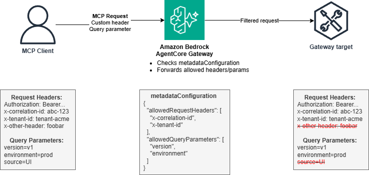

# Custom Header and Query Parameter Propagation with AgentCore Gateway

## Overview
Modern enterprise agent systems require passing contextual information through API calls for distributed tracing, multi-tenant isolation, API versioning, and rate limiting. AgentCore Gateway provides native support for propagating custom HTTP headers and query parameters from clients to targets through the `metadataConfiguration` feature, enabling these enterprise patterns without requiring custom interceptor code.

This tutorial demonstrates how to configure header and query parameter propagation at the target level, allowing the gateway to automatically forward specific headers (like correlation IDs and tenant identifiers) and query parameters (like API versions and environment flags) to downstream Lambda functions or MCP servers.



### Header Propagation vs Interceptor Approach

AgentCore Gateway provides two approaches for header handling:

**Header Propagation** (this tutorial): Configure `metadataConfiguration` to automatically forward specific headers and query parameters. Best for custom headers like correlation IDs, tenant IDs, and API versions where no transformation is needed.

**Interceptor Lambda** (tutorial 14-token-exchange-at-request-interceptor): Use an interceptor Lambda for security-sensitive scenarios like Authorization header token exchange, custom authentication logic, or dynamic header transformation.

### How Header Propagation Works

When creating a gateway target, you specify which headers and query parameters to propagate through the `metadataConfiguration`:

```python
"metadataConfiguration": {
    "allowedRequestHeaders": ["x-correlation-id", "x-tenant-id"],
    "allowedResponseHeaders": ["x-rate-limit-remaining"],
    "allowedQueryParameters": ["version", "environment"]
}
```

The gateway automatically:
1. Extracts specified headers and query parameters from client requests
2. Forwards them to the target Lambda in the proper event structure
3. Returns specified response headers to the client

### Key Use Cases

* **Distributed Tracing**: Correlation IDs track requests across microservices
* **Multi-Tenancy**: Tenant identifiers ensure proper data isolation
* **API Versioning**: Version parameters route to appropriate implementations
* **Environment Routing**: Environment flags control staging vs production behavior
* **Rate Limiting**: Response headers communicate quota information

### Tutorial Details


| Information          | Details                                                   |
|:---------------------|:----------------------------------------------------------|
| Tutorial type        | Interactive                                               |
| AgentCore components | AgentCore Gateway                                         |
| Agentic Framework    | Strands Agents                                            |
| Gateway Target type  | AWS Lambda                                                |
| Inbound Auth IdP     | Amazon Cognito, but can use others                        |
| Outbound Auth        | AWS IAM                                                   |
| LLM model            | Anthropic Claude Haiku 4.5, Amazon Nova Pro              |
| Tutorial components  | Creating AgentCore Gateway and Invoking AgentCore Gateway |
| Tutorial vertical    | Cross-vertical                                            |
| Example complexity   | Easy                                                      |
| SDK used             | boto3                                                     |

## Tutorial Architecture

### Tutorial Key Features

* Configure custom header propagation using metadataConfiguration
* Forward correlation IDs and tenant identifiers to Lambda targets
* Propagate query parameters for API versioning and environment routing
* Return custom response headers for rate limiting information

## Tutorials Overview

In this tutorial we will cover the following functionality:

- [Custom Header and Query Parameter Propagation with AgentCore Gateway](gateway-interceptor-header-propagation.ipynb)

## Resources

* [Header propagation with Gateway - AWS Documentation](https://docs.aws.amazon.com/bedrock-agentcore/latest/devguide/gateway-headers.html)
* [MetadataConfiguration API Reference](https://docs.aws.amazon.com/bedrock-agentcore-control/latest/APIReference/API_MetadataConfiguration.html)


