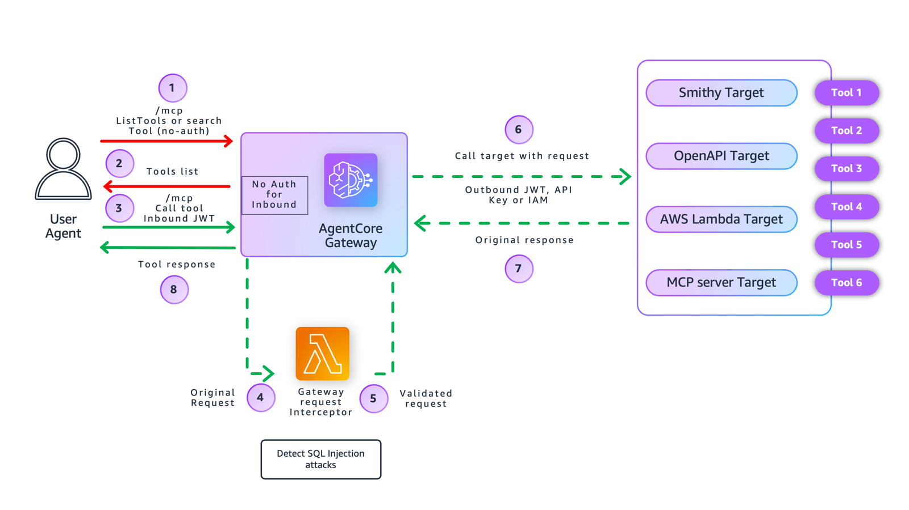

# Preventing SQL Injection Attacks with Amazon Bedrock AgentCore Gateway Interceptors

> [!CAUTION]
> The examples provided in this repository are for experimental and educational purposes only. They demonstrate concepts and techniques but are not intended for direct use in production environments. Make sure to have Amazon Bedrock Guardrails in place to protect against [prompt injection](https://docs.aws.amazon.com/bedrock/latest/userguide/prompt-injection.html).

## Overview

Modern AI agent systems often interact with databases to retrieve, update, or analyze data. When agents dynamically generate queries or accept user inputs that influence database operations, SQL injection vulnerabilities become a critical security concern. Traditional SQL injection risks are amplified in AI systems because agents may dynamically construct SQL statements, prompt manipulation can influence tool arguments, and tool contracts may allow flexible or free-form inputs that bypass traditional input validation.

Amazon Bedrock AgentCore Gateway addresses this challenge through REQUEST interceptors, which are AWS Lambda functions that analyze and validate tool arguments before they reach backend database tools. This provides deterministic, tool-level enforcement at the execution boundary, ensuring that malicious SQL injection attempts are blocked before any database query executes.

### Tool-Level SQL Injection Protection

The Gateway interceptor provides tool-level protection by analyzing tool arguments before database execution, detecting common SQL injection patterns through pattern matching, and blocking malicious requests with fail-closed behavior. When SQL injection is detected, the AWS Lambda function blocks requests before they reach the database tool and returns generic security warnings without exposing attack details. This ensures deterministic enforcement at the tool boundary without relying on model judgment.

### Agent-Level vs Tool-Level Protection

Amazon Bedrock Guardrails protect against prompt injection attacks on the agent itself. However, once the agent decides to call a tool, the prompt has already passed through the agent layer. The Gateway REQUEST interceptor provides a second line of defense by analyzing the actual tool arguments (query parameters) before they reach the database. This separation ensures that even if an agent is manipulated to call a database tool, the tool arguments are validated independently at the Gateway layer.

This comprehensive approach to database security delivers several key benefits, including deterministic tool-level enforcement, defense-in-depth for AI agent systems, fast pattern-based detection without external API calls, centralized security policy across all database tools, and detailed audit logging for security analysis. The implementation ensures that SQL injection attempts are blocked before database execution while maintaining a secure and scalable enterprise environment.

### Tutorial Details

## Tutorial Details

| Information              | Details                                                                      |
|:-------------------------|:-----------------------------------------------------------------------------|
| Tutorial type            | Interactive                                                                  |
| AgentCore components     | Amazon Bedrock AgentCore Gateway, Gateway Interceptors                      |
| Gateway Target type      | MCP Server (Lambda-based database tool)                                     |
| Interceptor types        | AWS Lambda (REQUEST)                                                        |
| Inbound Auth IdP         | Amazon Cognito (CUSTOM_JWT authorizer)                                      |
| Security Pattern         | SQL injection detection using pattern matching                              |
| Tutorial components      | Amazon Bedrock AgentCore Gateway, AWS Lambda Interceptor, Amazon Cognito, MCP tools |
| Tutorial vertical        | Cross-vertical (applicable to any AI agent with database access)            |
| Example complexity       | Intermediate                                                                 |
| SDK used                 | boto3                                                                        |

## Tutorial Key Features

* SQL injection prevention with Amazon Bedrock AgentCore Gateway REQUEST interceptors using pattern matching for demonstration purposes.

> **Note:** This implementation uses built-in pattern matching for demonstration. AWS Lambda interceptors can integrate with any 3rd party security tools, external APIs, or AWS services (such as Amazon Bedrock Guardrails, AWS WAF, threat intelligence feeds, or ML-based detection). Production systems should use parameterized queries and structured query templates to eliminate raw SQL entirely.

## Tutorial Overview

In this tutorial we will cover the following functionality:

- [Preventing SQL Injection with Gateway Interceptor](01-prevent-sql-injection-with-interceptor.ipynb)

