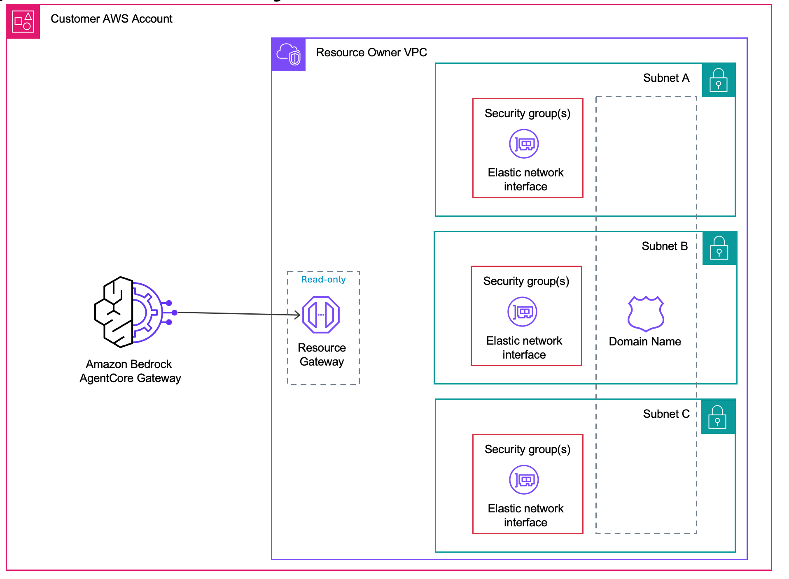

<!-- Copyright Amazon.com, Inc. or its affiliates. All Rights Reserved. -->
<!-- SPDX-License-Identifier: Apache-2.0 -->

# Managed VPC Resource

> AgentCore Gateway-managed mode for VPC egress. Uses Amazon VPC Lattice under the hood; you don't manage the Lattice resources directly.

Amazon Bedrock AgentCore Gateway creates and manages the VPC Lattice resource gateway and resource configuration on your behalf. You provide your VPC, subnets, and optional security groups — AgentCore handles the rest.



## How it works

When you call `CreateGatewayTarget` with `privateEndpoint.managedVpcResource`, AgentCore:

1. **Creates a Resource Gateway** in your VPC — provisions one ENI per subnet you specify. These ENIs are the entry point for AgentCore traffic into your VPC.
2. **Creates a Resource Configuration** scoped to your target endpoint — this defines what AgentCore is allowed to reach through the Resource Gateway.
3. **Associates the Resource Configuration** with the AgentCore service network — this enables end-to-end connectivity.
4. **Resolves the target endpoint via Private DNS** — at invocation time, the Resource Gateway uses your VPC's DNS resolver (including any associated Route 53 private hosted zones) to look up the endpoint domain. See [Private DNS](#private-dns) below.

If a Resource Gateway already exists in your account with the same VPC, subnet, and security group IDs, AgentCore reuses it rather than creating a new one.

AgentCore uses the `AWSServiceRoleForBedrockAgentCoreGatewayNetwork` service-linked role to manage these resources. This role is created automatically the first time you create a gateway target with a managed private endpoint. You do not need VPC Lattice permissions in your own IAM policies.

- Make sure you have correct IAM permissions for [AgentCore Gateway managed VPC resource](https://docs.aws.amazon.com/bedrock-agentcore/latest/devguide/vpc-egress-private-endpoints.html#lattice-vpc-egress-managed-lattice)
- Learn about Amazon Bedrock AgentCore Gateway - [Service Linked role](https://docs.aws.amazon.com/bedrock-agentcore/latest/devguide/vpc-egress-private-endpoints.html#lattice-vpc-egress-slr).


## What you need to provide

```json
{
  "privateEndpoint": {
    "managedVpcResource": {
      "vpcIdentifier": "vpc-0abc123def456",
      "subnetIds": ["subnet-0abc123", "subnet-0def456"],
      "endpointIpAddressType": "IPV4",
      "securityGroupIds": ["sg-0abc123def"]
    }
  }
}
```

### Parameters

| Parameter | Required | Description |
|-----------|----------|-------------|
| `vpcIdentifier` | Yes | The ID of the VPC that contains your private resource. |
| `subnetIds` | Yes | Subnet IDs where the Resource Gateway ENIs will be placed. |
| `endpointIpAddressType` | Yes | IP address type. Valid values: `IPV4`, `IPV6`. |
| `securityGroupIds` | No | Security groups for the Resource Gateway ENIs. See [Security groups](#security-groups). |
| `routingDomain` | No | Fallback for VPCs that do not have DNS enabled. Publicly resolvable domain used for VPC Lattice routing. See [Routing domain](#routing-domain). |
| `tags` | No | Tags for the managed Resource Gateway. `BedrockAgentCoreGatewayManaged` is reserved. |

## Security groups

The security group controls what **outbound traffic** the Resource Gateway ENIs can send to resources inside your VPC.

**If you do not pass `securityGroupIds`**, AgentCore uses the VPC's default security group. The default SG typically only allows traffic from itself, meaning the ENIs cannot reach your resource — the target creation will fail with a timeout error.

**Always pass a security group** that allows outbound traffic on the port your resource listens on (e.g., port 443 for HTTPS). The simplest approach is to pass the same security group used by your load balancer or VPC endpoint.

Example from the [Getting Started lab](./01-getting-started.ipynb):
```python
"securityGroupIds": [VPCE_SG_ID]  # VPCE SG allows inbound 443 from VPC CIDR
```

## Private DNS

With **Private DNS** (the default for VPCs with DNS support enabled), the Resource Gateway resolves the target endpoint domain using your VPC's DNS resolver. If your VPC is associated with a Route 53 private hosted zone for the domain, the resolver returns that record — so a target like `https://internal.example.com/api` reaches your private resource without any extra configuration.

### Requirements

- **VPC DNS support** — `enableDnsSupport` and `enableDnsHostnames` must both be `true` on the VPC (the default for new VPCs).
- **Hosted zone association** — the Route 53 private hosted zone must be associated with the VPC where the Resource Gateway ENIs live.
- **Publicly trusted TLS certificate** — AgentCore Gateway validates certificates against public root CAs. The endpoint must present a cert (typically on a load balancer) covering the target FQDN.

### What you do not need

- A public DNS record for the target domain
- A `routingDomain` parameter
- A custom TLS SNI workaround

## Routing domain (fallback)

> **Use `routingDomain` only when DNS is not enabled in your VPC.** If your VPC has DNS enabled (the default), Private DNS handles resolution automatically — no `routingDomain` needed.

If your target endpoint uses a domain that is not publicly resolvable (e.g., a Route 53 private hosted zone) **and** your VPC does not have DNS support enabled, set `routingDomain` to an intermediate publicly resolvable domain (typically the load balancer's DNS name).

When `routingDomain` is set, AgentCore routes traffic through the routing domain but sends requests with the actual endpoint domain as the TLS SNI hostname, so your resource receives requests addressed to its actual domain.

## Labs

| Notebook | Description |
|----------|-------------|
| [01-getting-started.ipynb](./01-getting-started.ipynb) | Deploy a private API Gateway with mock integrations and connect it to AgentCore Gateway. No domain or certificate needed — uses the API-VPCE DNS format. |
| [02-peering.ipynb](./02-peering.ipynb) | Connect to a Private API Gateway in a peered VPC (cross-region) using managed VPC resource and VPC peering. |

## License

This project is licensed under the Apache License 2.0. See the [LICENSE](../LICENSE.txt) file for details.
