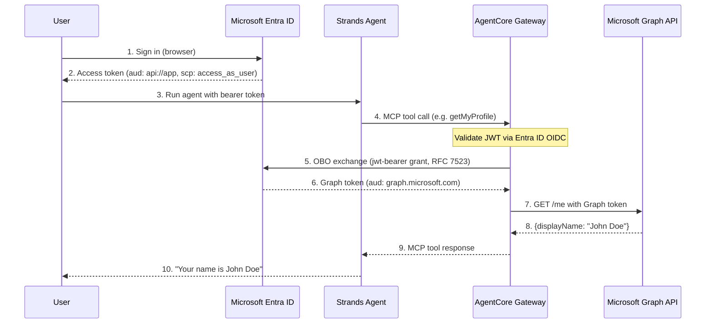

# OBO Token Exchange with AgentCore Gateway + Microsoft Graph API

## Overview

This tutorial demonstrates how to use **Amazon Bedrock AgentCore Gateway** with **On-Behalf-Of (OBO) token exchange** to expose Microsoft Graph API endpoints as MCP tools. The agent code contains zero token handling logic — the Gateway handles the OBO exchange transparently at the infrastructure level.

OBO token exchange enables agents to access protected resources on behalf of authenticated users without triggering additional consent flows. The Gateway exchanges the inbound user's access token for a new, scoped access token that targets a downstream resource server (Microsoft Graph), using the JWT Authorization Grant (RFC 7523).

### How It Works

1. User authenticates directly with **Microsoft Entra ID** and gets an access token scoped to the app (`api://<client-id>/access_as_user`)
2. User passes that Entra ID token to the **AgentCore Gateway** as the bearer
3. Gateway validates the token using Entra ID's OIDC discovery URL (inbound auth)
4. Gateway performs **OBO token exchange** — swaps the app-scoped Entra ID token for a Microsoft Graph token using JWT Authorization Grant (RFC 7523)
5. A **Strands agent** connects to the Gateway MCP URL, discovers tools, and invokes them

### Architecture

### Key Concepts

**Why `CustomOauth2` (not `MicrosoftOAuth2`)?** The `onBehalfOfTokenExchangeConfig` parameter is only available inside `customOauth2ProviderConfig`, not the built-in Microsoft provider.

**Why `requested_token_use: on_behalf_of` in customParameters?** Entra ID's token endpoint requires this parameter to perform the OBO exchange. Without it, the exchange fails silently.

**Why v1.0 discovery URL?** Entra ID issues v1.0 access tokens by default (issuer: `sts.windows.net`). The Gateway's inbound auth discovery URL must match the token version.

### Tutorial Details

| Information          | Details                                                                  |
|:---------------------|:-------------------------------------------------------------------------|
| Tutorial type        | Interactive                                                              |
| AgentCore components | AgentCore Gateway, AgentCore Identity                                    |
| Agentic Framework    | Strands Agents                                                           |
| LLM model            | Anthropic Claude Haiku 4.5                                               |
| Tutorial components  | AgentCore Gateway with OBO Token Exchange, Microsoft Graph API           |
| Tutorial vertical    | Cross-vertical                                                           |
| Example complexity   | Medium                                                                   |
| SDK used             | boto3, strands-agents, mcp                                               |
| Credential Provider  | CustomOauth2 with JWT_AUTHORIZATION_GRANT OBO config                     |
| Inbound Auth         | Entra ID OIDC (CUSTOM_JWT)                                               |
| Gateway Target       | OpenAPI Schema (Microsoft Graph API)                                     |

## Prerequisites

- Python 3.10+
- AWS credentials configured
- A Microsoft 365 **work or school account** with access to Microsoft Entra ID

> ⚠️ **Personal Microsoft accounts** (`@outlook.com`, `@hotmail.com`, `@live.com`) will not work for the calendar/email endpoints. The OBO exchange itself works, but Microsoft Graph calendar and mail endpoints require an Exchange Online mailbox (work/school accounts only). The `/me` profile endpoint works with all account types.

## Tutorial

- [OBO Token Exchange with AgentCore Gateway + Microsoft Graph API](obo_token_exchange_microsoft.ipynb)

## Reference Documentation

- [OBO Token Exchange](https://docs.aws.amazon.com/bedrock-agentcore/latest/devguide/on-behalf-of-token-exchange.html)
- [Gateway Outbound Auth](https://docs.aws.amazon.com/bedrock-agentcore/latest/devguide/gateway-outbound-auth.html)
- [Microsoft Entra ID OBO Flow](https://learn.microsoft.com/en-us/entra/identity-platform/v2-oauth2-on-behalf-of-flow)
