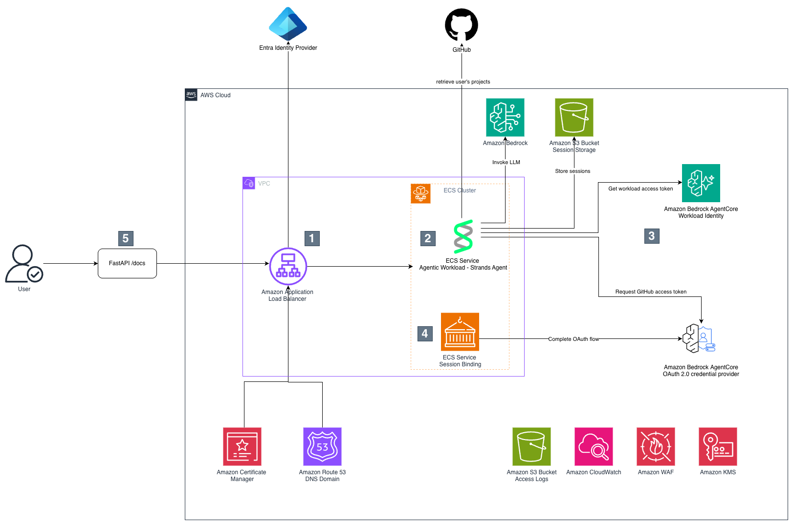
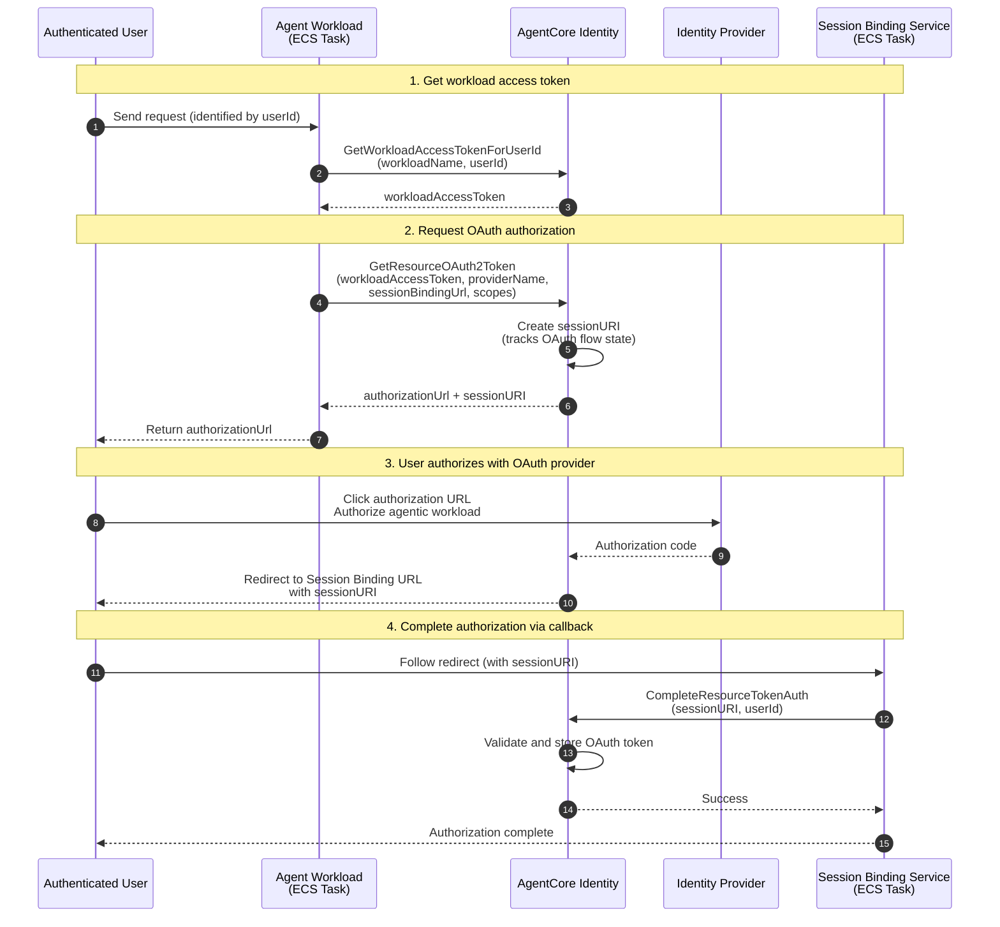

# Amazon ECS with AgentCore Identity and 3LO

This sample demonstrates how to build an AI agent on Amazon ECS Fargate that uses **[Amazon Bedrock AgentCore Identity](https://docs.aws.amazon.com/bedrock-agentcore/latest/devguide/identity-getting-started.html)** for the **Authorization Code Grant (3-legged OAuth) Flow**. The agent can securely access external services (like GitHub) on behalf of authenticated users.

## Architecture




1. The requests arrive at the Amazon Application Load Balancer, which authenticates the user using the [ALB OIDC authentication flow](https://docs.aws.amazon.com/elasticloadbalancing/latest/application/listener-authenticate-users.html) with [Microsoft Entra ID](https://learn.microsoft.com/en-gb/entra/fundamentals/what-is-entra) as the Identity Provider, though any OIDC-compliant Identity Provider is supported. The traffic is encrypted using HTTPS, which requires a public hosted zone on Amazon Route 53 and a certificate from Amazon Certificate Manager. An A record (alias) in the hosted zone routes the traffic to the load balancer. The load balancer fronts the ECS cluster with two services: the Agentic Workload and the Session Binding Service. The load balancer passes the `x-amzn-oidc-data` header, which contains the user claims in JSON Web Token (JWT) format, allowing the unique identification of the user through the `sub` field.
2. The Agentic Workload is a [FastAPI](https://fastapi.tiangolo.com/) server with the `/invocations` method, which takes a `sessionId` and `message` as input and passes them to an agent implemented using Strands Agents, though any agent SDK such as LangChain or LangGraph can be used, as the request intake is handled by the FastAPI server independently of the agent SDK. The agent invokes the LLM on Amazon Bedrock, stores the session in an Amazon S3 bucket using the user's `sub` claim as a key prefix to ensure session isolation between users, and has tools to perform actions on the user's behalf on GitHub, which requires the user's access token.
3. Amazon Bedrock AgentCore Identity (AC Identity) provides a workload identity for the agentic workload and the OAuth provider configuration for GitHub, which includes the well-known configuration of GitHub and the credentials for the registered app on GitHub. This allows the agent to retrieve the access token from the AC Identity Token Vault. If the access token is not available, has expired, or has been revoked, AC Identity returns an authorization URL for the user to authorize access with the Authorization Server, along with a session URI to identify the flow.
4. The session binding service processes the callback URL once the authorization by the user has been granted in GitHub. It takes the session id from the callback URL and the `sub` from the `x-amzn-oidc-data` header to complete OAuth flow.
5. The end user invokes the agentic workload through the `/docs` endpoint, which renders the OpenAPI spec as HTML, serving as a minimal UI sufficient for demo purposes.

Logs are captured in Amazon CloudWatch, and access logs for both the load balancer and the S3 bucket are stored in a dedicated S3 bucket. The container images for the ECS services are stored in and pulled from Amazon ECR. A set of basic AWS WAF rules is attached to the load balancer to provide baseline protection against common web exploits. All data is encrypted using an Amazon KMS customer managed key (CMK), except for the access logs bucket, which uses Amazon S3 managed encryption (SSE-S3) as required by the service


### Authorization Code Grant Flow

When the agent needs to access an external service on behalf of a user, see [OAuth 2.0 authorization URL session binding](https://docs.aws.amazon.com/bedrock-agentcore/latest/devguide/oauth2-authorization-url-session-binding.html):

1. Agent requests an access token from AgentCore Identity
2. If no valid token exists, AgentCore returns an authorization URL
3. User clicks the URL and authenticates with the external service (e.g., GitHub)
4. External service redirects to the Session Binding Service endpoint
5. Session Binding Service completes the flow by calling `complete_resource_token_auth()` to bind the token to the user
6. Subsequent agent requests automatically receive the user's access token

## Key Concepts

- **Workload Access Token**: A token (workloadIdentityToken) used for authentication that represents the workload identity and the user
- **Session URI**: Tracks the authorization flow state across multiple requests and responses during the OAuth2 authentication process
- **Token Vault**: Secure storage where OAuth tokens are stored
- **Session Binding Service**: Confirms the user authentication session for obtaining OAuth2.0 tokens for a resource

## Flow Phases

1. **Get workload access token**: The workload obtains a token from AgentCore Identity that represents both the workload and the user
2. **Request OAuth authorization**: The workload requests an OAuth token, receiving an authorization URL
3. **User authorizes with OAuth provider**: The user grants permission for the workload to access their resources on the 3rd party tool
4. **Complete authorization via session binding**: The session binding service confirms the user authentication session and completes the token binding



For more detailed flow diagrams, see:
- [Inbound Authentication Flow](docs/inbound.md) - ALB OIDC authentication with Entra ID
- [Outbound Authorization Flow](docs/outbound.md) - GitHub OAuth with AgentCore Identity

## Prerequisites

Before deploying this sample, ensure you have:

- [AWS CLI](https://docs.aws.amazon.com/cli/latest/userguide/getting-started-install.html) v2.27+ configured with appropriate credentials
- [AWS CDK](https://docs.aws.amazon.com/cdk/v2/guide/getting-started.html) v2 installed (`npm install -g aws-cdk`)
- [uv](https://docs.astral.sh/uv/)
- [Python 3.12+](https://www.python.org/downloads/)
- [Docker](https://docs.docker.com/get-docker/) for building container images
- An [Amazon Route 53](https://docs.aws.amazon.com/Route53/latest/DeveloperGuide/Welcome.html) hosted zone for your domain
- Access to [Amazon Bedrock](https://docs.aws.amazon.com/bedrock/latest/userguide/getting-started.html) with the Claude model enabled
- An OIDC-compliant Identity Provider (IdP) for user authentication

### OIDC Identity Provider

This sample requires OIDC credentials to work correctly.

#### Optional: Create an Entra ID OAuth Application if you don't have a OIDC Identity Provider at hand

Create an OAuth application in your Entra ID (Azure AD) tenant:

1. **Open Entra ID**: Go to [portal.azure.com](https://portal.azure.com) and search for "Microsoft Entra ID"
2. **App Registrations**: On the left sidebar, click Manage > App registrations
3. **New Registration**: Click on New registration
4. **Configure the registration**:
   - **Name**: `AWS-ALB-SingleTenant` (or your preferred name)
   - **Supported Account Types**: Select "Single tenant only"
   - **Redirect URI**:
     - Select "Web" from the dropdown
     - Enter: `https://agent-3lo.<your-domain>/oauth2/idpresponse`
5. **Register**: Click the Register button at the bottom

6. After registration, go to Certificates & secrets
7. Click on New client secret
8. Add a description and set expiration
9. Click Add and copy the secret value immediately (you won't be able to see it again)

At the end, you should have a TENANT_ID, a CLIENT_ID, and a CLIENT_SECRET.

Note that the OIDC Identity Provider endpoints depend on your Tenant ID. The exact pattern is provided by the [Well Known Configuration of Entra ID](https://login.microsoftonline.com/common/v2.0/.well-known/openid-configuration). For more details follow the guide [Find your app's OpenID configuration document URI](https://learn.microsoft.com/en-us/entra/identity-platform/v2-protocols-oidc#find-your-apps-openid-configuration-document-uri)

You may use this in configuration step below.

##### Store OIDC Client Credentials

Store the client secret and id from the previous step in AWS Secrets Manager:

```shell
aws secretsmanager create-secret --name "agent-oauth/credentials" \
--secret-string '{"client_id":"<your-client-id>","client_secret":"<your-client-secret>"}' \
--region <your-deployment-region>
```

### GitHub OAuth App (for AgentCore Identity)

Create a GitHub OAuth App and register it with AgentCore Identity by following the [GitHub identity provider setup guide](https://docs.aws.amazon.com/bedrock-agentcore/latest/devguide/identity-idp-github.html).

## Configuration

Some defaults are set in `config.py`. The DNS and OIDC credentials are configured via the `.env` file as explained below.

`config.py` key settings:

| Parameter | Description | Default |
|-----------|-------------|---------|
| `aws_region` | Region for main stack (ECS, ALB) | `eu-west-1` |
| `identity_aws_region` | Region for AgentCore Identity | `eu-central-1` |
| `suffix` | Suffix for resource naming | `sample` |
| `inference_profile_id` | Bedrock inference profile | `eu.anthropic.claude-haiku-4-5-20251001-v1:0` |

### OIDC Configuration

Create a `.env` file in the project root with your IdP's endpoints. These values can be found in your IdP's `.well-known/openid-configuration` endpoint:

```shell
cat <<EOF > .env
OIDC_ISSUER=<issuer-url>
OIDC_AUTHORIZATION_ENDPOINT=<authorization-endpoint>
OIDC_TOKEN_ENDPOINT=<token-endpoint>
OIDC_USER_INFO_ENDPOINT=<userinfo-endpoint>
OIDC_SECRET_NAME=agent-oauth/credentials
OIDC_SCOPE=openid email profile
EOF
```

<details>
<summary>Example: Entra ID (Azure AD) configuration</summary>

Replace `<TENANT_ID>` with your Entra ID tenant ID:

```shell
cat <<EOF > .env
OIDC_ISSUER=https://login.microsoftonline.com/<TENANT_ID>/v2.0
OIDC_AUTHORIZATION_ENDPOINT=https://login.microsoftonline.com/<TENANT_ID>/oauth2/v2.0/authorize
OIDC_TOKEN_ENDPOINT=https://login.microsoftonline.com/<TENANT_ID>/oauth2/v2.0/token
OIDC_USER_INFO_ENDPOINT=https://graph.microsoft.com/oidc/userinfo
OIDC_SECRET_NAME=agent-oauth/credentials
OIDC_SCOPE=openid email profile
EOF
```

</details>

### Amazon Route 53 Hosted Zone

You need an [Amazon Route 53](https://docs.aws.amazon.com/Route53/latest/DeveloperGuide/Welcome.html) hosted zone for your domain. Add the following to your `.env` file:

```shell
cat <<EOF >> .env
DNS_DOMAIN_NAME=your-domain.example.com
DNS_HOSTED_ZONE_ID=YOUR-HOSTED-ZONE-ID
EOF
```


## Deployment

Use the deployment script which validates prerequisites and deploys the stacks:

```shell
# Install dependencies
uv sync --all-groups

# Run deployment script
./deploy_sample.sh
```

After deployment, access your agent at `https://agent-3lo.<your-domain>`

## Testing 

We provide a couple of tests in [tests](./tests/). Note that we use [Moto](https://docs.getmoto.org/en/latest/) to mock [boto3](https://docs.aws.amazon.com/boto3/latest/) API calls. Note that we patch certain API calls ourselves as they are not implemented in Moto yet, see `mock_bedrock_api_call` in the [conftest.py](./tests/conftest.py).

You can run the test with the command `uv run pytest tests`.

## Security

- All secrets are stored in AWS Secrets Manager with dynamic references
- HTTPS is enforced via ALB with ACM certificates
- OIDC IdP handles user authentication via ALB
- AgentCore Identity manages OAuth tokens securely per user
- AWS KMS encryption for Amazon CloudWatch Logs and sensitive data
- Amazon VPC with private subnets for Amazon ECS tasks

## Additional Security Considerations

See [Security Considerations](security_considerations.md)

## Cleanup

To remove all deployed resources:

```shell
uv run cdk destroy --all
```

**Note:** You may need to manually delete:

- Amazon S3 bucket contents (if not empty)
- Amazon CloudWatch log groups
- AWS Secrets Manager secrets

## License

This library is licensed under the MIT-0 License. See the [LICENSE](LICENSE) file.
