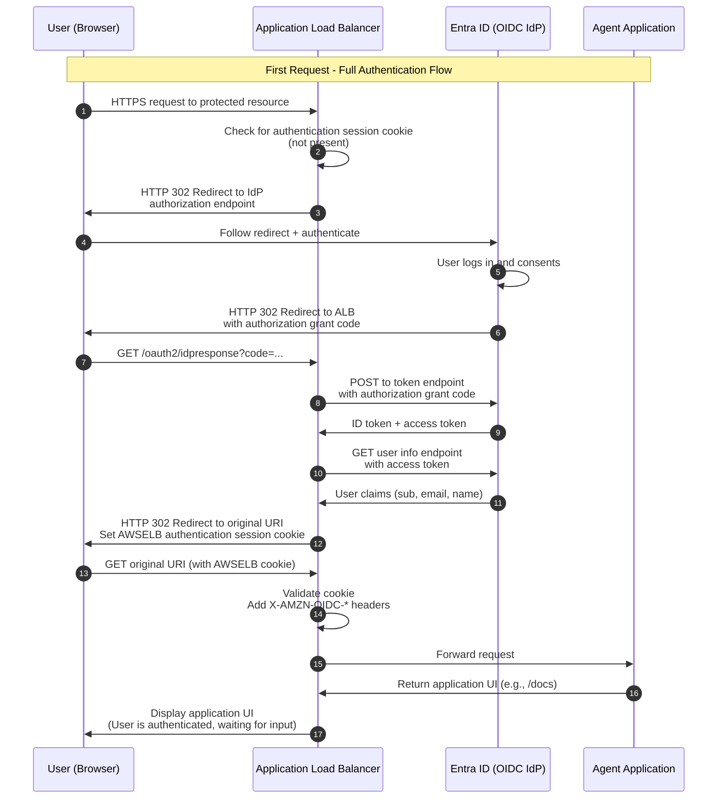

# Inbound Authentication Flow

### ALB OIDC authentication with Entra ID

```mermaid
sequenceDiagram
    autonumber
    participant User as User (Browser)
    participant ALB as Application Load Balancer
    participant IdP as Entra ID (OIDC IdP)
    participant App as Agent Application

    Note over User,App: First Request - Full Authentication Flow

    %% Step 1: User sends request, ALB checks cookie
    User->>ALB: HTTPS request to protected resource
    ALB->>ALB: Check for authentication session cookie<br/>(not present)
    
    %% Step 2: Redirect to IdP
    ALB->>User: HTTP 302 Redirect to IdP<br/>authorization endpoint
    
    %% Step 3: User authenticates
    User->>IdP: Follow redirect + authenticate
    IdP->>IdP: User logs in and consents
    
    %% Step 4: IdP redirects back with code
    IdP->>User: HTTP 302 Redirect to ALB<br/>with authorization grant code
    
    %% Step 5: User follows redirect
    User->>ALB: GET /oauth2/idpresponse?code=...
    
    %% Step 6: ALB exchanges code for tokens
    ALB->>IdP: POST to token endpoint<br/>with authorization grant code
    
    %% Step 7: IdP returns tokens
    IdP->>ALB: ID token + access token
    
    %% Step 8: ALB requests user claims
    ALB->>IdP: GET user info endpoint<br/>with access token
    
    %% Step 9: IdP returns user claims
    IdP->>ALB: User claims (sub, email, name)
    
    %% Step 10: ALB redirects with cookie
    ALB->>User: HTTP 302 Redirect to original URI<br/>Set AWSELB authentication session cookie
    
    %% Step 11: User follows redirect with cookie
    User->>ALB: GET original URI (with AWSELB cookie)
    ALB->>ALB: Validate cookie<br/>Add X-AMZN-OIDC-* headers
    ALB->>App: Forward request
    App->>ALB: Return application UI (e.g., /docs)
    ALB->>User: Display application UI<br/>(User is authenticated, waiting for input)
```
