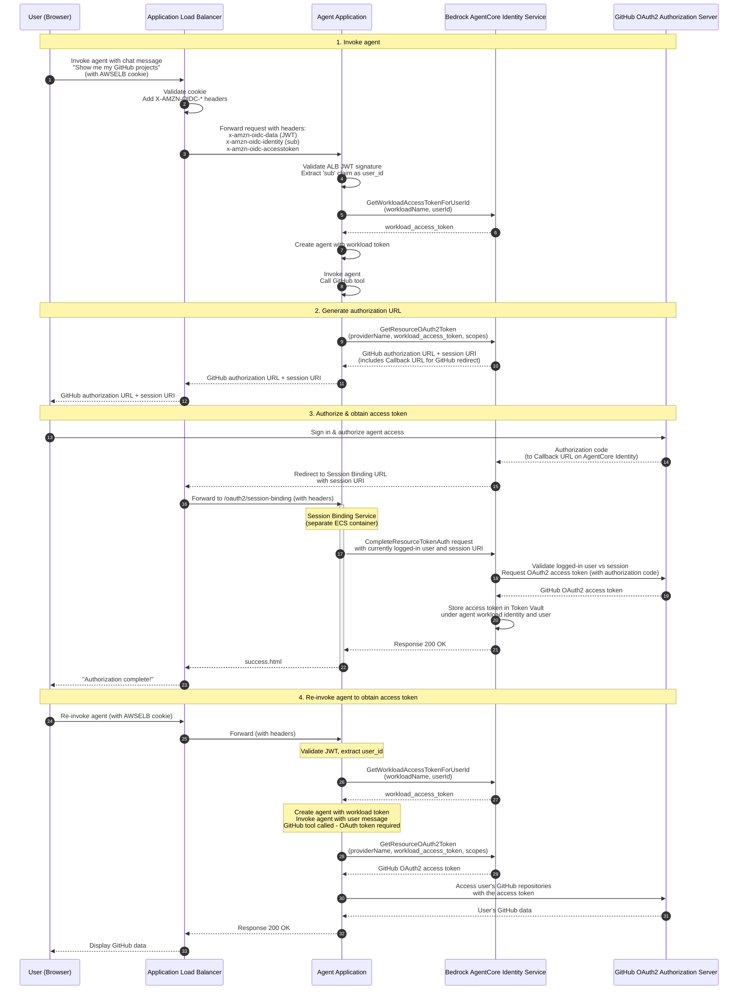

# Outbound Authorization Flow

### GitHub OAuth with AgentCore Identity

```mermaid
sequenceDiagram
    autonumber
    participant U as User (Browser)
    participant ALB as Application Load Balancer
    participant App as Agent Application
    participant ID as Bedrock AgentCore Identity Service
    participant OAuth as GitHub OAuth2 Authorization Server

    Note over U,OAuth: 1. Invoke agent

    %% 1. Invoke agent - Steps 1-3: ALB authentication
    U->>ALB: Invoke agent with chat message<br/>"Show me my GitHub projects"<br/>(with AWSELB cookie)
    ALB->>ALB: Validate cookie<br/>Add X-AMZN-OIDC-* headers
    ALB->>App: Forward request with headers:<br/>x-amzn-oidc-data (JWT)<br/>x-amzn-oidc-identity (sub)<br/>x-amzn-oidc-accesstoken
    App->>App: Validate ALB JWT signature<br/>Extract 'sub' claim as user_id
    
    App->>ID: GetWorkloadAccessTokenForUserId<br/>(workloadName, userId)
    ID-->>App: workload_access_token
    App->>App: Create agent with workload token
    App->>App: Invoke agent<br/>Call GitHub tool

    Note over U,OAuth: 2. Generate authorization URL

    %% 2. Generate authorization URL
    App->>ID: GetResourceOAuth2Token<br/>(providerName, workload_access_token, scopes)
    ID-->>App: GitHub authorization URL + session URI<br/>(includes Callback URL for GitHub redirect)
    App-->>ALB: GitHub authorization URL + session URI
    ALB-->>U: GitHub authorization URL + session URI

    Note over U,OAuth: 3. Authorize & obtain access token

    %% 3. Authorize & obtain access token
    U->>OAuth: Sign in & authorize agent access
    OAuth-->>ID: Authorization code<br/>(to Callback URL on AgentCore Identity)
    ID-->>ALB: Redirect to Session Binding URL<br/>with session URI
    ALB->>App: Forward to /oauth2/session-binding (with headers)
    activate App
    Note over App: Session Binding Service<br/>(separate ECS container)
    App->>ID: CompleteResourceTokenAuth request<br/>with currently logged-in user and session URI
    ID->>OAuth: Validate logged-in user vs session<br/>Request OAuth2 access token (with authorization code)
    OAuth-->>ID: GitHub OAuth2 access token
    ID->>ID: Store access token in Token Vault<br/>under agent workload identity and user
    ID-->>App: Response 200 OK
    App-->>ALB: success.html
    deactivate App
    ALB-->>U: "Authorization complete!"

    Note over U,OAuth: 4. Re-invoke agent to obtain access token

    %% 4. Re-invoke agent to obtain access token
    U->>ALB: Re-invoke agent (with AWSELB cookie)
    ALB->>App: Forward (with headers)
    Note over App: Validate JWT, extract user_id
    App->>ID: GetWorkloadAccessTokenForUserId<br/>(workloadName, userId)
    ID-->>App: workload_access_token
    Note over App: Create agent with workload token<br/>Invoke agent with user message<br/>GitHub tool called - OAuth token required
    App->>ID: GetResourceOAuth2Token<br/>(providerName, workload_access_token, scopes)
    ID-->>App: GitHub OAuth2 access token
    App->>OAuth: Access user's GitHub repositories<br/>with the access token
    OAuth-->>App: User's GitHub data
    App-->>ALB: Response 200 OK
    ALB-->>U: Display GitHub data
```
