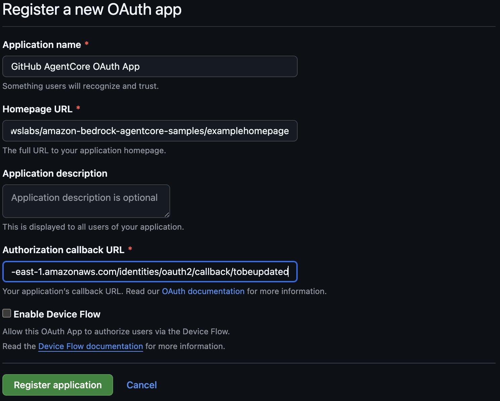

# AgentCore Identity: M2M and Auth Code Flows with Runtime (Cognito)

## Overview

This sample demonstrates two outbound OAuth2 flows in a single **AgentCore Runtime** agent:

| Flow | Grant Type | Use Case |
|:-----|:-----------|:---------|
| **M2M** (machine-to-machine) | `client_credentials` | Agent calls internal/downstream APIs as itself — no user interaction |
| **Auth Code** (3LO) | `authorization_code` | Agent accesses user-owned resources (Google Calendar) — requires one-time user consent |

**Inbound Auth**: The runtime endpoint is protected by a Cognito JWT. Both flows require the caller to present a valid bearer token.

### Architecture

```
Caller
  │  Authorization: Bearer <Cognito JWT>
  ▼
AgentCore Runtime  ──validates JWT──▶  Cognito User Pool
  │
  ├─── M2M Tool ──@requires_access_token(auth_flow="M2M")──▶
  │              AgentCore Identity (client credentials)    ──▶  Internal API
  │
  └─── 3LO Tool ──@requires_access_token(auth_flow="USER_FEDERATION")──▶
                 AgentCore Identity (auth code)             ──▶  Google Calendar API
                         │
                         │ (first call only: returns consent URL)
                         ▼
                     User's browser ──consents──▶ Google ──callback──▶ localhost:9090
```

### Tutorial Details

| Information         | Details                                                              |
|:--------------------|:---------------------------------------------------------------------|
| Tutorial type       | CLI walkthrough                                                      |
| Agent type          | Single                                                               |
| Agentic Framework   | Strands Agents                                                       |
| LLM model           | Anthropic Claude Haiku 4.5                                           |
| Inbound Auth        | Amazon Cognito (CUSTOM_JWT)                                          |
| Outbound Auth (M2M) | OAuth2 client credentials — `@requires_access_token(auth_flow="M2M")` |
| Outbound Auth (3LO) | OAuth2 auth code — `@requires_access_token(auth_flow="USER_FEDERATION")` |
| Example complexity  | Medium                                                               |
| CLI tool            | `agentcore` (npm: `@aws/agentcore`)                                  |

---

## Prerequisites

- **Node.js** 20.x or later
- **Python** 3.10+
- **uv** ([install](https://docs.astral.sh/uv/getting-started/installation/))
- **AWS credentials** configured
- **AgentCore CLI** installed:

```bash
npm install -g @aws/agentcore
```

- **Amazon Bedrock model access**: Enable `claude-haiku-4-5` in the Bedrock console
- **For M2M**: An OAuth2 authorization server that supports `client_credentials` grant
- **For 3LO**: A Google Cloud project with Calendar API enabled (see Step 4)

---

## Step 1: Install Dependencies

```bash
pip install -r requirements.txt
```

---

## Step 2: Set Up Cognito (Inbound Auth)

```bash
python setup_cognito.py
```

Creates a Cognito User Pool and test user. Saves `cognito_config.json`.

Note the values printed for Step 6:
```
--discovery-url    https://cognito-idp.<region>.amazonaws.com/<pool_id>/.well-known/openid-configuration
--allowed-clients  <client_id>
```

---

## Step 3: Create the AgentCore Project

```bash
agentcore create --name M2MAuthDemo --defaults --no-agent
cd M2MAuthDemo
```

Set your deployment target (the CLI creates an empty `aws-targets.json`):

```bash
cat > agentcore/aws-targets.json << 'EOF'
[{"name":"default","description":"Default deployment target","account":"YOUR_AWS_ACCOUNT_ID","region":"us-east-1"}]
EOF
```

> Replace `YOUR_AWS_ACCOUNT_ID` with your 12-digit AWS account ID. Find it with `aws sts get-caller-identity --query Account --output text`.

---

## Step 4: Set Up OAuth Credential Providers

### 4a. Create a GitHub OAuth App (for GitHub 3LO)

1. Go to [github.com](https://github.com) > **Settings** > **Developer settings** > **OAuth Apps**
2. Click **New OAuth App** and fill in:
   - **Application Name**: Any name (e.g. "AgentCore GitHub Demo")
   - **Homepage URL**: `https://github.com/awslabs/amazon-bedrock-agentcore-samples`
   - **Authorization callback URL**: `https://bedrock-agentcore.us-east-1.amazonaws.com/identities/oauth2/callback/placeholder` (you will update this after running the setup script)
3. Click **Register application**



4. Copy the **Client ID** and generate a **Client Secret** (save it — shown only once)

### 4b. Create a Google OAuth App (for Google 3LO)

1. Go to [Google Cloud Console](https://console.developers.google.com/) and create/select a project
2. Go to **APIs & Services > Library**, search for **Google Calendar API**, and click **Enable**
3. Go to **APIs & Services > OAuth consent screen**, click **Get started**:
   - Fill in App Name, Support Email
   - Select audience type (External for testing), click through to finish
4. Go to **APIs & Services > OAuth consent screen > Audience**, click **+ Add Users** and add your Gmail address
5. Go to **APIs & Services > Credentials**, click **Create Credentials > OAuth client ID**:
   - Application type: **Web application**
   - Name: Any name
   - Click **Create**, then copy the **Client ID** and **Client Secret**
6. Go to **APIs & Services > Credentials**, click your OAuth client, then **Data access** > **Add or remove scopes**:
   - Add `https://www.googleapis.com/auth/calendar.readonly` under "Manually add scopes"
   - Click **Update**, then **Save**

### 4c. Create the `.env` file and run the setup script

Create a `.env` file in the sample root directory with your credentials:

```bash
M2M_CLIENT_ID=YOUR_COGNITO_MACHINE_CLIENT_ID
M2M_CLIENT_SECRET=YOUR_COGNITO_MACHINE_CLIENT_SECRET
M2M_DISCOVERY_URL=https://cognito-idp.<region>.amazonaws.com/<pool_id>/.well-known/openid-configuration
GITHUB_CLIENT_ID=YOUR_GITHUB_CLIENT_ID
GITHUB_CLIENT_SECRET=YOUR_GITHUB_CLIENT_SECRET
GOOGLE_CLIENT_ID=YOUR_GOOGLE_CLIENT_ID
GOOGLE_CLIENT_SECRET=YOUR_GOOGLE_CLIENT_SECRET
```

> The M2M values come from `cognito_config.json` (Step 2). Use `machine_client_id` and `machine_client_secret`.

Then run:

```bash
cd ..
python setup_oauth_providers.py
cd M2MAuthDemo
```

The script prints callback URLs for each provider.

### 4d. Register callback URLs

**GitHub**: Go to your OAuth App settings > **Authorization callback URL** > paste the GitHub callback URL from the script output > click **Update application**.

**Google**: Go to Google Cloud Console > **APIs & Services > Credentials** > click your OAuth client > under **Authorised redirect URIs** > add the Google callback URL from the script output > click **Save**.

---

## Step 5: Add the Agent

```bash
agentcore add agent \
  --name MyAgent \
  --type byo \
  --code-location ../app/MyAgent \
  --entrypoint main.py \
  --language Python \
  --framework Strands \
  --model-provider Bedrock \
  --authorizer-type CUSTOM_JWT \
  --discovery-url YOUR_COGNITO_DISCOVERY_URL \
  --allowed-clients YOUR_COGNITO_CLIENT_ID
```

Replace `YOUR_COGNITO_DISCOVERY_URL` and `YOUR_COGNITO_CLIENT_ID` with the values printed by `setup_cognito.py` in Step 2.

---

## Step 6: Deploy

```bash
agentcore deploy -y
```

---

## Step 7: Post-Deploy Configuration

The CLI now applies JWT auth at deploy time. Run this post-deploy script to attach the required IAM permissions, KMS access for the token vault, and register callback URLs for 3LO flows:

```bash
cd ..
python configure_inbound_auth.py
```

Wait ~30 seconds for changes to propagate.

---

## Step 8: Test M2M Flow

The M2M tool calls the [OpenWeatherMap API](https://openweathermap.org/api) using a client credentials token plus an API key from AgentCore Identity.

If you already completed [Sample 10](../10-runtime-inbound-outbound-auth/), the `OutboundApiKey` credential already exists. Otherwise, get a free API key at [openweathermap.org](https://home.openweathermap.org/users/sign_up) and add it:

```bash
cd M2MAuthDemo
agentcore add credential --name OutboundApiKey --api-key YOUR_OPENWEATHERMAP_KEY
agentcore deploy -y
cd ..
```

Then test:

```bash
cd ..
python invoke.py --flow m2m
```

Expected output:

```
=== M2M Flow Test ===

Agent response:
The weather in Seattle is 47F, partly cloudy...
```

The M2M token is fetched silently using client credentials — no browser interaction required.

---

## Step 9: Test Auth Code (3LO) Flow

```bash
python invoke.py --flow authcode
```

**First invocation** — consent URL returned:

```
=== Auth Code (3LO) Flow Test ===
Starting OAuth2 callback server...

Agent response:
User authorization required. Please visit this URL and grant access:
https://accounts.google.com/o/oauth2/auth?...

After authorizing, invoke the agent again to retrieve your calendar events.

Waiting for you to complete the Google consent flow...
After authorizing in your browser, press Enter to re-invoke the agent.
```

1. Click the URL (or copy/paste into a browser)
2. Log in with Google and grant Calendar access
3. The callback server at `localhost:9090` handles the redirect and calls `CompleteResourceTokenAuth`
4. Press **Enter** to re-invoke

**Second invocation** — calendar events retrieved:

```
Agent response:
Calendar events for 2025-03-20:
  - 09:00: Standup
  - 14:00: Design Review
  - 16:30: 1:1 with Manager
```

---

## Streamlit UI (Optional)

For an interactive browser-based experience instead of the CLI:

```bash
pip install streamlit
cd ..
streamlit run streamlit_app.py
```

Log in, select a flow (M2M / GitHub 3LO / Google 3LO), then use the chat interface. For 3LO flows, the app handles the consent URL and callback server automatically.

---

## Step 10: Cleanup

```bash
cd M2MAuthDemo
agentcore remove agent --name MyAgent --force
agentcore remove credential --name M2MProvider --force
agentcore remove credential --name Google3LOProvider --force
```

Delete Cognito resources:

```python
import boto3, json

with open("../cognito_config.json") as f:
    config = json.load(f)

boto3.client("cognito-idp", region_name=config["region"]).delete_user_pool(
    UserPoolId=config["pool_id"]
)
print("Cognito User Pool deleted.")
```

---

## Key Concepts

| Concept | Details |
|:--------|:--------|
| **M2M (client credentials)** | `auth_flow="M2M"` — AgentCore Identity calls the token endpoint directly with client ID + secret. No user involved. Token is cached per agent instance. |
| **Auth Code / 3LO** | `auth_flow="USER_FEDERATION"` — First call returns a consent URL via `on_auth_url` callback. After consent, AgentCore Identity stores tokens and refreshes automatically. |
| **Session binding** | `oauth2_callback_server.py` verifies the OAuth callback came from the same user who invoked the agent, preventing CSRF/session fixation attacks. |
| **Token storage** | All tokens are stored in AgentCore Identity (backed by Secrets Manager). The agent code only receives tokens in-memory via decorators. |
