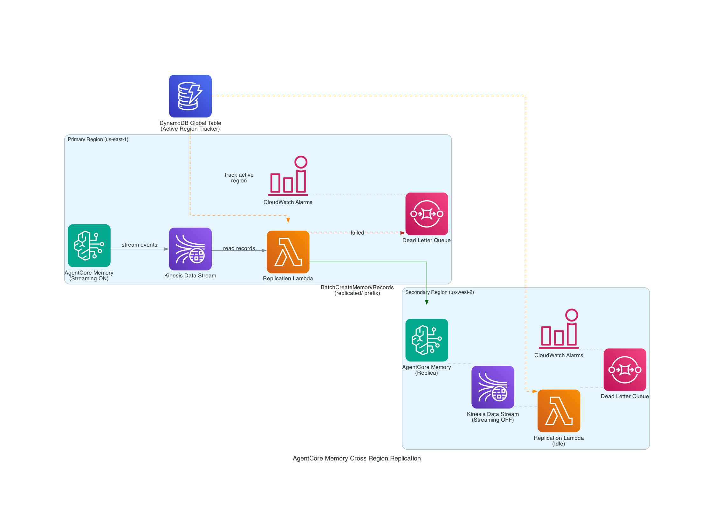

# AgentCore Memory Cross-Region Replication

Active-passive cross-region replication for [Amazon Bedrock AgentCore Memory](https://docs.aws.amazon.com/bedrock-agentcore/latest/devguide/memory.html) using the [memory record streaming](https://docs.aws.amazon.com/bedrock-agentcore/latest/devguide/memory-record-streaming.html) feature.

AgentCore Memory stores long-term knowledge for AI agents — user preferences, conversation history, extracted facts. This data is critical to agent quality. If the primary region goes down, agents lose access to all accumulated memory. This solution provides near real-time replication to a secondary region so you can fail over in seconds.

## Architecture



### How It Works

1. The primary AgentCore Memory has **streaming enabled** — every time a memory record is created or updated, an event is published to a Kinesis Data Stream
2. A **Lambda consumer** reads from Kinesis via an Event Source Mapping (ESM), decodes the event, and calls `BatchCreateMemoryRecords` on the secondary region's Memory
3. To prevent infinite loops (secondary streaming back to primary), replicated records use a **`replicated/` namespace prefix** — the Lambda skips any event with this prefix
4. The secondary region has all the same infrastructure pre-deployed (Kinesis, Lambda, IAM), but **streaming is OFF** — so the Lambda sits idle at zero cost
5. **Failover** is two API calls: enable streaming on secondary, disable on primary. Takes seconds.

### Key Metrics

| Metric | Value |
|:-------|:------|
| RPO (Recovery Point Objective) | 5–15 seconds |
| RTO (Recovery Time Objective) | 15–30 seconds |
| Failover mechanism | Toggle streaming via `update-memory` API |
| Loop prevention | `replicated/` namespace prefix |
| Conflict resolution | AgentCore Memory native consolidation |

## Prerequisites

- AWS CLI v2 configured with appropriate permissions
- Python 3.10+
- Access to Amazon Bedrock AgentCore in `us-east-1` and `us-west-2`
- Permissions for: CloudFormation, Kinesis, Lambda, IAM, SQS, DynamoDB, S3

## Quick Start

The notebook walks you through everything step by step:

```bash
jupyter notebook 06-memory-cross-region-replication.ipynb
```

Or deploy the infrastructure directly without the notebook:

```bash
bash scripts/deploy.sh us-east-1 us-west-2
```

## Project Structure

```
├── 06-memory-cross-region-replication.ipynb   # Main tutorial — run this
├── README.md
├── requirements.txt                           # boto3>=1.42.63
└── scripts/
    ├── deploy.sh                              # Deployment orchestration
    ├── toggle-streaming.sh                    # Failover toggle
    ├── handler.py                             # Lambda replication consumer
    ├── regional-stack.yaml                    # Per-region CloudFormation
    └── global-stack.yaml                      # DynamoDB Global Table
```

### What Each File Does

**`06-memory-cross-region-replication.ipynb`** — The self-contained tutorial notebook. It deploys infrastructure, creates memory records, verifies replication, tests failover/failback, and cleans up. This is what users should follow.

**`scripts/deploy.sh`** — Orchestrates the full first-time deployment:
1. Packages the Lambda function and uploads to S3 in both regions
2. Deploys a DynamoDB Global Table for active-region tracking
3. Deploys per-region CloudFormation stacks (Kinesis, Lambda, SQS DLQ, IAM roles, CloudWatch alarms)
4. Creates AgentCore Memory instances — primary with streaming ON, secondary without
5. Updates stacks with cross-region memory IDs so each Lambda knows where to replicate
6. Seeds the DynamoDB config table with the active region

**`scripts/toggle-streaming.sh`** — Enables or disables streaming on a Memory instance. This is the failover mechanism — enable on the new active region, disable on the old one. Under the hood it calls `update-memory --stream-delivery-resources`.

**`scripts/handler.py`** — The Lambda function that consumes Kinesis stream events and replicates them. Key behaviors:
- Skips `StreamingEnabled` and `MemoryRecordDeleted` events (not replicable)
- Checks for `replicated/` namespace prefix to prevent infinite loops
- Generates deterministic request IDs so retries don't create duplicates
- Sends non-retryable errors to SQS DLQ; raises retryable errors for ESM retry
- DLQ write failures are logged but never crash the Lambda

**`scripts/regional-stack.yaml`** — CloudFormation template deployed in each region. Creates:
- Kinesis Data Stream (1 shard, 24h retention)
- SQS Dead Letter Queue (14-day retention)
- IAM roles for Memory streaming and Lambda execution
- Lambda function with Kinesis ESM (bisect-on-error, max 3 retries)
- CloudWatch alarms for Lambda errors, DLQ depth, and replication lag

**`scripts/global-stack.yaml`** — CloudFormation template for the DynamoDB Global Table that tracks which region is currently active. Deployed once, replicated to both regions automatically.

## Failover

```bash
# Failover: primary → secondary
# Enable secondary FIRST to avoid any replication gap
bash scripts/toggle-streaming.sh enable us-west-2
bash scripts/toggle-streaming.sh disable us-east-1

# Failback: secondary → primary
bash scripts/toggle-streaming.sh enable us-east-1
bash scripts/toggle-streaming.sh disable us-west-2
```

The order matters — always enable the new path before disabling the old one. If both regions briefly have streaming on, the loop prevention handles it safely.

## Cost

### Fixed (always running)

| Resource | Cost | Notes |
|:---------|:-----|:------|
| Kinesis (1 shard × 2 regions) | ~$22/month | Shard-hour pricing |
| DynamoDB Global Table | ~$0.25/month | Single record, on-demand |
| CloudWatch Alarms (3 × 2 regions) | ~$0.60/month | Standard resolution |

### Variable (proportional to usage)

| Resource | Cost |
|:---------|:-----|
| Kinesis PutRecord | $0.014 per 1M records |
| Lambda invocations | $0.20 per 1M + duration |
| AgentCore Memory writes | Per-record pricing |

The secondary's Kinesis shard costs ~$11/month even when idle — this is the price of instant failover readiness.

## Known Limitations

- Deletes are not replicated (remote cleanup via AgentCore Memory consolidation)
- Updates are replicated as new Creates (consolidation handles deduplication)
- Single AWS account only (cross-account would require additional IAM roles)
- Manual failover (could be automated with Route 53 health checks + Step Functions)
- `deploy.sh` is for first-time deployment only — redeployment requires deleting Memory instances first
