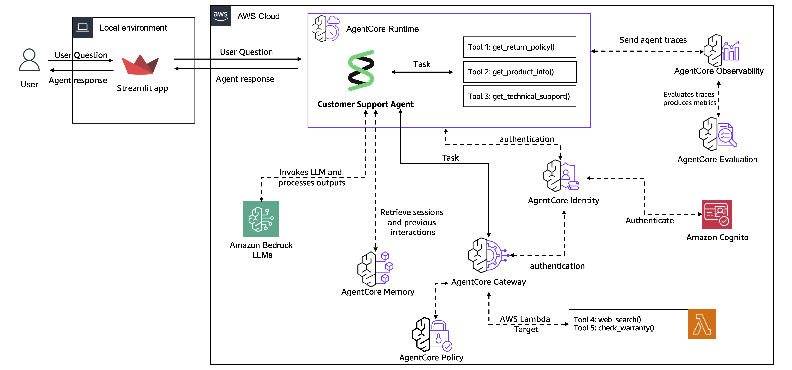

# End-to-End Customer Support Agent with AgentCore

Move a customer support agent from prototype to production using Amazon Bedrock AgentCore services. Across six labs, you'll build a complete system that handles real customer conversations with memory, shared tools, observability, and a web interface.

> [!IMPORTANT]
> This workshop is for educational purposes. It demonstrates how AgentCore services are used when migrating an agentic use case from prototype to production. It is not intended for direct use in production environments.

## Architecture Overview

By the end of the 6 labs, you will have built the following architecture:

<div style="text-align:left">
    
</div>

## Prerequisites

- You need an AWS account with access to Amazon Bedrock.
- Python 3.10+ must be installed locally.
- The AWS CLI must be configured with appropriate credentials.
- Amazon Nova 2 Lite must be enabled in your [Amazon Bedrock model access](https://docs.aws.amazon.com/bedrock/latest/userguide/model-access.html) settings.

## Getting Started

### If you are running this as a self-paced lab (not using an AWS Workshop account)

Before starting Lab 1, you need to provision the required infrastructure (Lambda functions, DynamoDB tables, IAM roles, Cognito user pool, and a Bedrock Knowledge Base). Follow these steps:

1. Verify your IAM role has the [required permissions](https://catalog.us-east-1.prod.workshops.aws/workshops/850fcd5c-fd1f-48d7-932c-ad9babede979/en-US/00-prerequisites/02-self-paced) for the workshop, including the [IAM policies, AWS managed policies, and trust relationships](https://catalog.us-east-1.prod.workshops.aws/workshops/850fcd5c-fd1f-48d7-932c-ad9babede979/en-US/00-prerequisites/02-self-paced#iam-policy-for-bedrock-agentcore-workshop) described in the workshop prerequisites.
2. Run the prerequisite script to deploy the CloudFormation stacks:

```bash
bash scripts/prereq.sh
```

This script creates an S3 bucket, packages and uploads the Lambda code, and deploys two CloudFormation stacks (infrastructure and Cognito) that provision all the backing resources used across the labs.

### Install dependencies and start Lab 1

```bash
pip install -r requirements.txt
```

Then open [Lab 1](lab-01-create-an-agent.ipynb) and follow along. Each lab builds on the previous one.

## Labs

| Lab | Title                                                                | Notebook                                   | Time    | What You'll Learn                                         |
| --- | -------------------------------------------------------------------- | ------------------------------------------ | ------- | --------------------------------------------------------- |
| 1   | [Create Agent Prototype](#lab-1-create-agent-prototype)              | [Notebook](lab-01-create-an-agent.ipynb)   | ~20 min | Agent creation with Strands Agents and tool integration   |
| 2   | [Add Memory](#lab-2-add-memory)                                      | [Notebook](lab-02-agentcore-memory.ipynb)  | ~20 min | AgentCore Memory for short-term and long-term persistence |
| 3   | [Scale with Gateway & Identity](#lab-3-scale-with-gateway--identity) | [Notebook](lab-03-agentcore-gateway.ipynb) | ~30 min | AgentCore Gateway and Identity for secure tool sharing    |
| 4   | [Deploy to Production](#lab-4-deploy-to-production)                  | [Notebook](lab-04-agentcore-runtime.ipynb) | ~30 min | AgentCore Runtime with production-grade Observability     |
| 5   | [Evaluate Agent Performance](#lab-5-evaluate-agent-performance)      | [Notebook](lab-05-agentcore-evals.ipynb)   | ~10 min | AgentCore Evaluations for quality monitoring              |
| 6   | [Build Customer Interface](#lab-6-build-customer-interface)          | [Notebook](lab-06-frontend.ipynb)          | ~20 min | Frontend integration with secure agent endpoints          |

### Lab 1: Create Agent Prototype

Build a customer support agent prototype using Strands Agents and Amazon Nova 2 Lite with four core tools:

- Look up return policies for different product categories.
- Search product information and specifications.
- Search the web for troubleshooting help.
- Query a Bedrock Knowledge Base for technical support documentation.

### Lab 2: Add Memory

Transform your "goldfish agent" into one that remembers customers across conversations using AgentCore Memory:

- Store conversation history persistently with short-term memory.
- Extract customer preferences and behavioral patterns with long-term memory.
- Maintain context awareness across multiple sessions so the agent can personalize responses.

### Lab 3: Scale with Gateway & Identity

Move from local tools to shared, enterprise-ready services using AgentCore Gateway and AgentCore Identity:

- Centralize tool management by exposing Lambda functions as MCP-compatible tools through AgentCore Gateway.
- Secure your gateway endpoint with JWT-based authentication using Amazon Cognito.
- Integrate existing AWS Lambda functions (warranty check, web search) without rewriting tool code.
- (Optional) Define fine-grained access control with Cedar policies using AgentCore Policy to restrict specific tool invocations.

### Lab 4: Deploy to Production

Deploy your agent to AgentCore Runtime to handle real traffic with full observability:

- Deploy your agent to a fully managed, serverless runtime with minimal code changes (only four lines added).
- Enable session continuity and session isolation so each customer gets a separate conversation context.
- Monitor agent behavior through CloudWatch GenAI Observability with automatic tracing and metrics.

### Lab 5: Evaluate Agent Performance

Set up continuous quality monitoring for your production agent using AgentCore Evaluations:

- Configure online evaluation with built-in evaluators for goal success rate, correctness, and tool selection accuracy.
- Generate test interactions and review evaluation results through AgentCore Observability dashboards.
- Use quality metrics to identify areas for improvement and maintain high agent performance.

### Lab 6: Build Customer Interface

Create a Streamlit web app that customers can use to interact with your deployed agent:

- Provide a chat interface with real-time response streaming powered by AgentCore Runtime.
- Implement secure user authentication through Amazon Cognito.
- Manage user sessions with persistent conversation history via AgentCore Memory.

## Optional Labs

- [Identity Deep Dive](Optional-lab-identity.ipynb) -- Integrate Google Calendar via AgentCore Identity using OAuth2 3LO flows, enabling your agent to create events and retrieve calendars on behalf of authenticated users.
- [Observability Deep Dive](Optional-lab-agentcore-observability.ipynb) -- Set up AgentCore Observability for agents running outside of AgentCore Runtime using AWS OpenTelemetry Python instrumentation and CloudWatch GenAI Observability.

## Cleanup

When you're done, run the [Cleanup notebook](lab-07-cleanup.ipynb) to tear down all resources created during the workshop.
