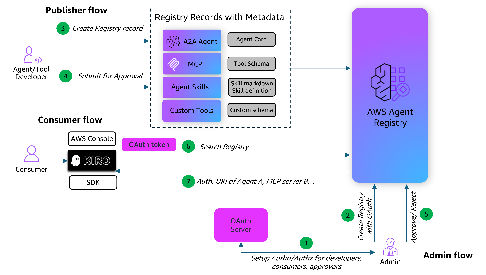

# AWS Agent Registry with OAuth Authentication

## Overview

AWS Agent Registry is a fully managed discovery service that provides a centralized catalog for organizing, curating, and discovering AI agents, MCP servers, agent skills, and custom resources across your organization. Publishers register their resources into a searchable registry, curators control what gets approved, and consumers discover the right tools and agents using semantic and keyword search.

As organizations scale their use of AI agents and tools, discovering the right resource becomes increasingly difficult. Teams build MCP servers, deploy agents, and create specialized tools — but without a central catalog, these resources remain siloed and hard to find. The Agent Registry solves this by providing centralized discovery, governance through approval workflows, flexible resource types, hybrid search (semantic + keyword), and flexible authorization.

### OAuth (JWT) Authorization for the Agent Registry

The Agent Registry supports two authorization types for search operations: **IAM-based** (using AWS SigV4 signing) and **JWT-based** (using tokens from an OAuth 2.0 identity provider). JWT authorization lets consumers search the registry using tokens from providers like Amazon Cognito, Okta, Microsoft Azure AD, Auth0, or any OAuth 2.0-compatible provider. This is useful when you want to make the registry accessible to a broad set of users through existing corporate credentials, without provisioning individual IAM access.

To configure JWT authorization, you provide:

- **Discovery URL** — The OpenID Connect (OIDC) discovery URL from your identity provider. The Agent Registry uses this to fetch login, token, and verification settings.
- **Allowed clients** — Permitted values for the `client_id` claim in the JWT token. Only tokens issued to allowed clients can access the registry.

The authorization type only affects search operations. All management operations (create, update, delete) always require IAM authorization, regardless of the registry's authorization setting.

This tutorial demonstrates how to set up an Agent Registry with OAuth authentication using **Amazon Cognito** as the identity provider. It walks through the full workflow across three personas:

- **Administrator**: Configure Cognito as the OAuth provider and create an Agent Registry with JWT-based authentication.
- **Publisher**: Register records in the Agent Registry and submit them for approval.
- **Consumer**: Authenticate via Cognito to obtain a JWT token, then perform semantic search against the Agent Registry using the token.

### Architecture Flow

### Tutorial Details

| Information          | Details                                                                                  |
|:---------------------|:-----------------------------------------------------------------------------------------|
| Tutorial type        | Interactive                                                                               |
| AgentCore components | AWS Agent Registry, Amazon Cognito                                                       |
| Auth type            | IAM SigV4 (management operations), OAuth JWT (search operations)                         |
| Identity provider    | Amazon Cognito                                                                           |
| Tutorial components  | Cognito setup, registry creation with OAuth, record registration, approval workflow, authenticated search, negative auth tests |
| Example complexity   | Intermediate                                                                             |
| SDK used             | boto3, requests                                                                          |

### What This Tutorial Covers

1. **Configure OAuth Provider** — Create a Cognito User Pool, App Client, and test user for JWT token issuance
2. **Create Registry with OAuth** — Create an Agent Registry with `CUSTOM_JWT` authorizer configuration, linking it to the Cognito discovery URL and allowed client IDs
3. **Register and Approve Records** — As a publisher, create an MCP record in the registry and walk through the approval workflow (DRAFT → PENDING_APPROVAL → APPROVED)
4. **Authenticate** — Obtain a JWT access token from Cognito using the `USER_PASSWORD_AUTH` flow
5. **Search with OAuth Token** — As a consumer, perform semantic search against the registry using the Bearer token
6. **Verify Auth Enforcement** — Negative tests to confirm the registry rejects requests without valid tokens
7. **Cleanup** — Delete registry records, the registry, and Cognito resources

## Tutorial

- [AWS Agent Registry with OAuth Authentication](registry-end-to-end-oauth.ipynb)
