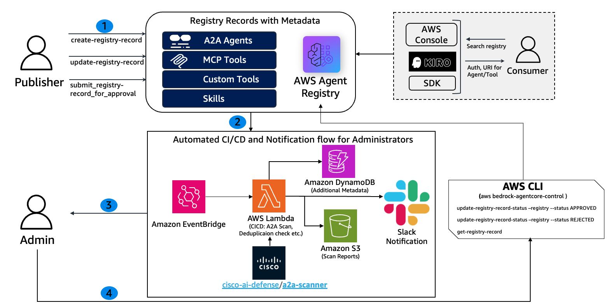
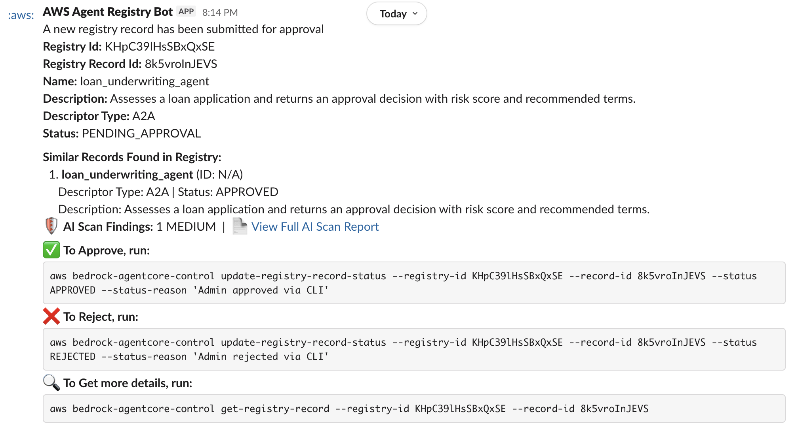

# Admin CI/CD and Approval Workflow for AWS Agent Registry

> [!CAUTION]
> The examples provided in this repository are for experimental and educational purposes only. They demonstrate concepts and techniques but are not intended for direct use in production environments.

## Overview

Enterprise AI agent platforms require governance controls to ensure that only vetted, secure agents and tools are deployed into production. When multiple teams publish A2A Agents, MCP servers, and custom skills to a shared registry, administrators need automated pipelines to review, scan, and approve or reject submissions before they become discoverable.

AWS Agent Registry supports a governance-first approval workflow where records transition through `DRAFT → PENDING_APPROVAL → APPROVED / REJECTED` states. This tutorial builds an automated CI/CD pipeline around that workflow using Amazon EventBridge, AWS Lambda, Amazon DynamoDB, Amazon S3, and Slack notifications, giving administrators a streamlined review and approval experience.

### How It Works

When a publisher submits a registry record for approval, an EventBridge rule triggers a CI/CD Lambda function that:

1. **Fetches the record details** from the Agent Registry control plane.
2. **Searches for duplicates** using the Agent Registry's semantic search API.
3. **Runs an AI security scan** on A2A agent cards using the Cisco AI Defense A2A Scanner, persists findings to DynamoDB, and uploads an HTML report to S3. (A2A records only — MCP and CUSTOM records skip this step since the scanner is purpose-built for A2A agent card analysis.)
4. **Sends a Slack notification** to administrators with record metadata, duplicate detection results, scan summary (if applicable), and CLI commands for Approve/Reject or Get more details.

As an Administrator, you can use the **AWS CLI** commands included in the notification to act on the record. Refer to the [documentation](https://docs.aws.amazon.com/cli/latest/userguide/cli-chap-getting-started.html) for detailed guidance on how to install and configure the AWS CLI. Alternatively you may use [AWS CloudShell](https://aws.amazon.com/cloudshell/) to run AWS CLI commands directly from the browser without having to install or configure anything.

### Sample Slack Notification

### Personas

| Persona       | Can Do                                                        | Cannot Do                                          |
|:--------------|:--------------------------------------------------------------|:---------------------------------------------------|
| Admin         | Create/delete registries, approve/reject records              | —                                                  |
| Publisher     | Create records, submit for approval, update DRAFT records     | Approve/reject records, create/delete registries   |

### Supported Record Types

| Type     | Description                                      | Descriptors              |
|:---------|:-------------------------------------------------|:-------------------------|
| MCP      | Model Context Protocol servers (tools)           | `server` + `tools`       |
| A2A      | Agent-to-Agent protocol agents                   | `agentCard`              |
| CUSTOM   | Skills, custom API resources, anything else      | `custom`                 |

## Tutorial Details

| Information              | Details                                                                                          |
|:-------------------------|:-------------------------------------------------------------------------------------------------|
| Tutorial type            | Interactive                                                                                      |
| AgentCore components     | AWS Agent Registry                                                                |
| Record types             | A2A, MCP, CUSTOM                                                                                 |
| Approval mode            | Manual (`autoApproval: false`)                                                                   |
| Tutorial components      | AWS Agent Registry, Amazon EventBridge, AWS Lambda, Amazon API Gateway, Amazon DynamoDB, Amazon S3, Slack Webhooks |
| Security scanning        | Cisco AI Defense A2A Scanner (for A2A records)                                                   |
| Tutorial vertical        | Cross-vertical (applicable to any enterprise agent governance workflow)                          |
| Example complexity       | Intermediate                                                                                     |
| SDK used                 | boto3                                                                                            |

## Tutorial Key Features

* Governance-first Agent registry with manual approval workflow (`DRAFT → PENDING_APPROVAL → APPROVED / REJECTED`).
* Automated CI/CD pipeline triggered by EventBridge on Agent registry record state changes.
* Duplicate detection using Agent Registry semantic search.
* AI security scanning of A2A agent cards with HTML report generation.
* Slack notifications with one-click approve/reject actions via API Gateway.
* Full infrastructure-as-code deployment using CloudFormation.

## Prerequisites

- IAM credentials with appropriate permissions (see [`IAM_PERMISSIONS.md`](./IAM_PERMISSIONS.md)). In addition to Agent Registry related operations, the following permissions are being used:

  | Service | Permissions |
  |:--------|:------------|
  | **Amazon S3** | `CreateBucket`, `HeadBucket`, `PutPublicAccessBlock`, `DeleteBucket`, `ListBucket`, `PutObject`, `GetObject`, `DeleteObject` |
  | **AWS CloudFormation** | `CreateStack`, `UpdateStack`, `DeleteStack`, `DescribeStacks`, `CreateChangeSet`, `ExecuteChangeSet`, `DescribeChangeSet`, `DeleteChangeSet` |
  | **AWS Lambda** | `CreateFunction`, `UpdateFunctionCode`, `UpdateFunctionConfiguration`, `GetFunction`, `DeleteFunction`, `PublishLayerVersion`, `DeleteLayerVersion`, `AddPermission`, `RemovePermission` |
  | **AWS IAM** | `CreateRole`, `GetRole`, `DeleteRole`, `PassRole`, `AttachRolePolicy`, `DetachRolePolicy`, `PutRolePolicy`, `DeleteRolePolicy` |
  | **AWS EventBridge** | `PutRule`, `DescribeRule`, `DeleteRule`, `PutTargets`, `RemoveTargets` |
  | **Amazon DynamoDB** | `CreateTable`, `DeleteTable`, `DescribeTable` |
  | **AWS CloudWatch Logs** | `CreateLogGroup`, `CreateLogStream`, `PutLogEvents`, `DeleteLogGroup` |

- Python 3.9+ with `boto3` installed
- [uv](https://docs.astral.sh/uv/getting-started/installation/) package manager (for installing python dependencies)
- A Slack workspace with an [incoming webhook](https://docs.slack.dev/messaging/sending-messages-using-incoming-webhooks/) configured. Note down the webhook URL and channel name.
- AWS CLI configured with a default region (`us-west-2`)

## AWS Resources Created

The CloudFormation stack (`cfn_eventbridge.yaml`) deploys the following resources:

| Resource                        | Type                              | Purpose                                                    |
|:--------------------------------|:----------------------------------|:-----------------------------------------------------------|
| CI/CD Lambda                    | `AWS::Lambda::Function`           | Processes Agent registry state changes, runs scans, sends Slack notifications |
| EventBridge Rule                | `AWS::Events::Rule`               | Triggers CI/CD Lambda on `PENDING_APPROVAL` state changes  |
| DynamoDB Table                  | `AWS::DynamoDB::Table`            | Stores AI scan results and metadata per record             |
| S3 Bucket                       | (auto-created by `deploy.sh`)     | Stores Lambda layer zip and AI scan HTML reports           |
| Lambda Layer                    | `AWS::Lambda::LayerVersion`       | Packages Cisco AI A2A Scanner dependency                   |
| IAM Roles                       | `AWS::IAM::Role`                  | Execution roles for the Lambda functions                  |

## Step by step instructions

Refer to the below notebook for step by step instructions:

- [Admin Approval Workflow with EventBridge](admin-approval-workflow-notebook.ipynb)
