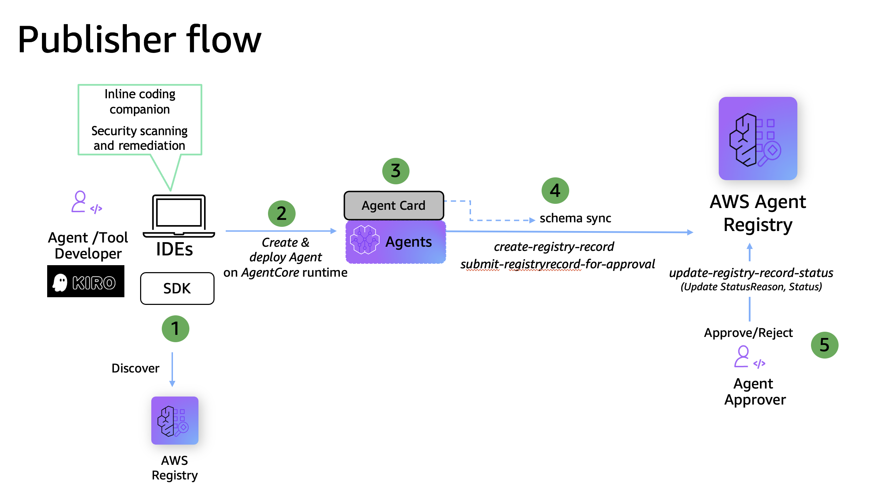
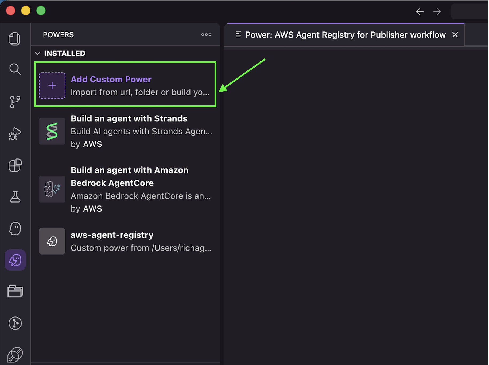
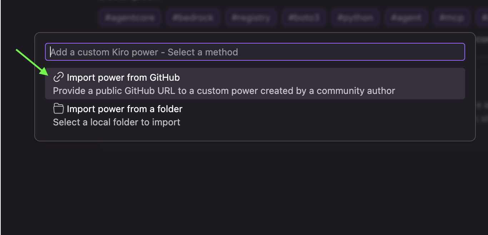
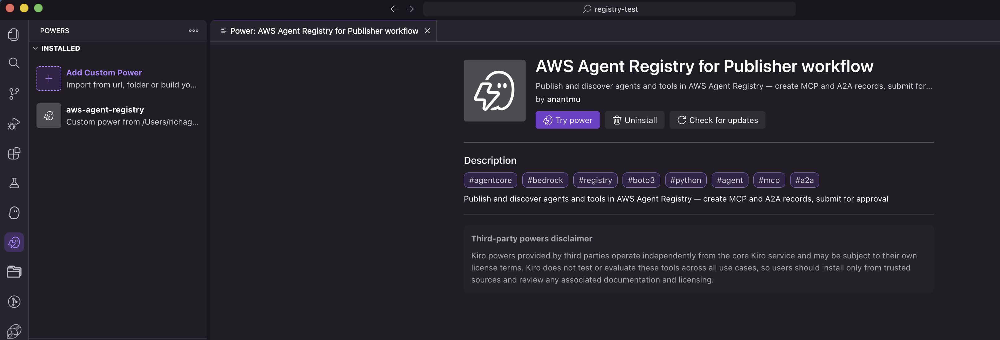

# AWS Agent Registry Kiro Power — Publisher Workflow

## Overview

Kiro Powers bundle MCP tools, steering files, and hooks into a single install, giving your agents specialized knowledge without overwhelming them with context. Learn more in the [Kiro Powers Documentation](https://kiro.dev/docs/powers/).

This Kiro Power enables the **publisher persona** to create, manage, and submit agent/MCP records to the AWS Agent Registry.

> Publisher workflow assumes a registry already exists (created by an admin).

### Tutorial Details

| Information         | Details                                                                 |
|:--------------------|:------------------------------------------------------------------------|
| Tutorial type       | Workflow                                                                |
| Persona             | Publisher                                                               |
| Power type          | Knowledge (steering only, no MCP tools)                                 |
| Components          | `POWER.md`, Steering file with workflow guidance and code snippets      |
| Registry operations | Create, List, Submit, Delete registry records (MCP and A2A)             |
| Example complexity  | Intermediate                                                            |
| SDK used            | boto3                                                                   |

### What a Power Includes

- `POWER.md`: The entry point steering file acts as an onboarding manual for the Kiro agent, defining available tools and usage context. It also defines the set of APIs available and includes troubleshooting guidelines.
- `Steering`: Automates tasks and workflow-specific guidance, along with reference documentation and example code snippets for the power to execute. This is a Knowledge power, so it only has instructions.

These two files are packaged together and loaded dynamically as per the user query.

### Publisher Workflow Architecture

<div style="text-align:left">
    
</div>

### Key Features

* Publisher persona operations for AWS Agent Registry
* Create and manage MCP server records
* Create and manage A2A agent card records
* Submit records for admin approval
* Workflow guidance via Kiro steering files

---

## Activate the Power

Install this power directly in Kiro using the GitHub URL below:

[Publisher Kiro Power for AWS Agent Registry on Github](https://github.com/awslabs/agentcore-samples/tree/main/06-workshops/10-Agent-Registry/01-advanced/kiro/kiro-power-publisher-workflow/aws-agent-registry)

In Kiro, open the Powers panel, select "Add Custom Power -> Import Power from Github", and paste the link above.

<div style="text-align:left">
    
</div>

<div style="text-align:left">
    
</div>

<div style="text-align:left">
    
</div>

---

## Prerequisites

### 1. AWS CLI installed

```bash
aws --version
# Expected: aws-cli/2.x.x ...
```

[Install AWS CLI](https://docs.aws.amazon.com/cli/latest/userguide/install-cliv2.html)

---

### 2. boto3 installed

```bash
pip install boto3
```

---

### 3. AWS Identity configured with publisher persona permissions

Your AWS identity needs permission to carry out registry operations. Use whichever method matches your setup:

Option A — named profile:
```bash
aws configure --profile <YOUR_PROFILE>
```

Option B — IAM user access keys (environment variables):
```bash
export AWS_ACCESS_KEY_ID=your_access_key
export AWS_SECRET_ACCESS_KEY=your_secret_key
export AWS_DEFAULT_REGION=your_region
```

Option C — IAM role — credentials are picked up automatically

Verify your identity resolves correctly:
```bash
aws sts get-caller-identity
# Expected: returns AccountId, Arn, UserId
```

---

### 4. Publisher persona policy

For carrying out AWS Agent Registry operations for publisher workflow, create an IAM role with the following policy:

```json
{
  "Version": "2012-10-17",
  "Statement": [
    {
      "Sid": "RegistryPublisherPermission",
      "Effect": "Allow",
      "Action": [
        "bedrock-agentcore:ListRegistries",
        "bedrock-agentcore:GetRegistry",
        "bedrock-agentcore:CreateRegistryRecord",
        "bedrock-agentcore:ListRegistryRecords",
        "bedrock-agentcore:GetRegistryRecord",
        "bedrock-agentcore:DeleteRegistryRecord",
        "bedrock-agentcore:UpdateRegistryRecord",
        "bedrock-agentcore:SubmitRegistryRecordForApproval"
      ],
      "Resource": ["*"]
    }
  ]
}
```

> Note: Publishers cannot `CreateRegistry`, `DeleteRegistry`, or approve/reject records — those are admin-only operations.

---

### 5. IAM trust policy to assume the publisher role

To assume the publisher IAM role, your IAM user must be granted `sts:AssumeRole` permission, and the target role's trust policy must allow your user as a principal. Refer to the AWS documentation on [how to configure trust policies](https://docs.aws.amazon.com/IAM/latest/UserGuide/id_roles_create_for-user.html) and [how to assume a role](https://docs.aws.amazon.com/IAM/latest/UserGuide/id_roles_use.html) for setup instructions.

---

## Next Steps

Once prerequisites are met, you are now ready to use **AWS Agent Registry** Kiro Power for the publisher workflow.

---

## Sample Prompts

> Tip: If you are in a single Kiro IDE session, you don't have to mention the registry name every time — Kiro remembers it from context.

1. "List all registries in my account in the us-west-2 region"
2. "Show me the list of records in registry `<REGISTRY-NAME>`"
3. "Create a new MCP server record in registry `<REGISTRY-NAME>` for my `<YOUR-TOOL>`"
4. "Create an A2A agent card record for my `<YOUR-AGENT>` in registry `<REGISTRY-NAME>`"
5. "Show all records in `PENDING_APPROVAL` state"
6. "Submit all records in `DRAFT` status for approval in registry `<REGISTRY-NAME>`"
7. "Show me the details of record `<RECORD-ID>`"
8. "Update the description of record `<RECORD-ID>` in registry `<REGISTRY-NAME>`"
9. "Delete all records in registry `<REGISTRY-NAME>`"
