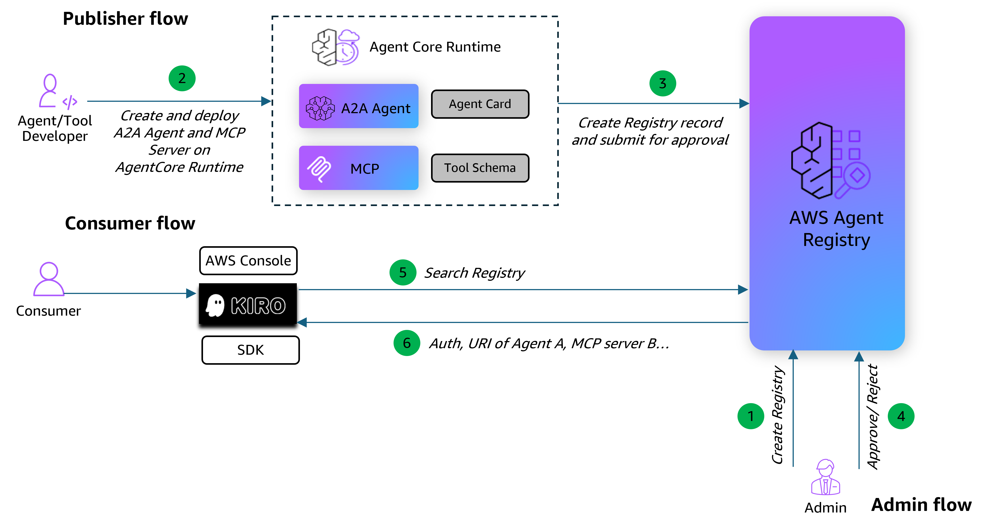

# Publishing AgentCore Tools in AWS Agent Registry

## Overview

When organizations operate dozens or hundreds of AI agents, MCP servers, and tools, keeping track of what exists, who owns it, and whether it's approved for use becomes a real problem. Teams end up rebuilding capabilities that already exist elsewhere, and resources get deployed without proper oversight. AWS Agent Registry, part of Amazon Bedrock AgentCore, gives platform teams a centralized catalog to organize, govern, and share AI agents, MCP servers, agent skills, and custom resources across the organization.

Each entry in the registry is a structured record that captures what the agent or tool does, which protocol it uses, how to invoke it, and who published it. The registry works natively with **MCP** (Model Context Protocol) and **A2A** (Agent-to-Agent), and also supports agent skills and custom resource types for anything that doesn't fit a standard protocol.

## Architecture Flow

This tutorial covers the end-to-end workflow across two personas using an Order Management use case:

- **Publisher**: Build an A2A agent and an MCP server for Order Management, deploy both to AgentCore Runtime, verify they are working, then register them in the Agent Registry with the correct descriptor structures and submit for approval.
- **Consumer**: Once records are approved, perform semantic search against the Agent Registry to discover the registered agents and tools using natural-language queries.

### How Discovery Works

The registry provides hybrid search that combines keyword and semantic matching. All queries use keyword matching, but longer, natural-language queries also use semantic understanding to surface conceptually related results. This means a search for "cancel an order" surfaces tools related to order management, even if they are named differently. Discovery becomes the path of least resistance — teams search the registry first, and if a vetted capability exists, they use it.

### How Governance Works

Every record follows an approval workflow: records start as **DRAFT**, move to **PENDING_APPROVAL**, and become discoverable to the broader organization once **APPROVED**. Admins use IAM policies to define who can register agents and who can discover them. Records are versioned to track changes over time, and organizations can deprecate records that are no longer in use.

### Registry Record Descriptor Types

| Descriptor Type | Protocol | What It Contains |
|:----------------|:---------|:-----------------|
| `MCP` | Model Context Protocol | `serverSchema` (server metadata, packages, transport) + `toolSchema` (individual function definitions with JSON Schema) |
| `A2A` | Agent-to-Agent | `agentCard` (agent identity, capabilities, and natural-language skill descriptions) |
| `AGENT_SKILLS` | Agent Skills | `skillMd` (SKILL.md instructions) + `skillDefinition` (repository, packages) |
| `CUSTOM` | Custom | `inlineContent` (free-form JSON for any resource type) |

### Tutorial Details

| Information          | Details                                                                                  |
|:---------------------|:-----------------------------------------------------------------------------------------|
| Tutorial type        | Interactive                                                                               |
| AgentCore components | AgentCore Runtime, AWS Agent Registry                                                    |
| Agentic Framework    | Strands Agents (A2A), FastMCP (MCP)                                                      |
| Protocols covered    | MCP (Model Context Protocol), A2A (Agent-to-Agent)                                       |
| Inbound Auth         | IAM SigV4                                                                                |
| LLM model            | Default Bedrock model (A2A agent only)                                                   |
| Tutorial components  | Build agents, deploy to runtime, create registry, register records, approval workflow, semantic search |
| Tutorial vertical    | Order Management                                                                         |
| Example complexity   | Intermediate                                                                             |
| SDK used             | boto3, bedrock-agentcore-starter-toolkit                                                 |

### What This Tutorial Covers

1. **Build** — Create an MCP server and an A2A agent for Order Management with tools for creating, updating, cancelling, and tracking orders
2. **Deploy** — Deploy both to AgentCore Runtime (MCP on port 8000, A2A on port 9000)
3. **Verify** — Confirm agents are working via MCP `tools/list` + `tools/call` and A2A agent card + `message/send`
4. **Register** — Create an Agent Registry, register both agents with the correct descriptor structures (`serverSchema` + `toolSchema` for MCP, `agentCard` for A2A)
5. **Approve** — Walk through the approval workflow (DRAFT → PENDING_APPROVAL → APPROVED)
6. **Discover** — As a consumer, perform semantic search to find the registered agents and tools by natural-language queries

## Tutorial

- [Publishing A2A Agent and MCP Server in AWS Agent Registry](publish-agentcore-a2a-mcp-in-registry.ipynb)
