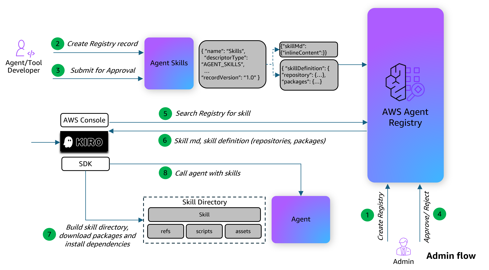

# Publishing and Discovering Agent Skills with AWS Agent Registry

## Overview

AWS Agent Registry is a fully managed discovery service that provides a centralized catalog for organizing, curating, and discovering AI agents, MCP servers, agent skills, and custom resources across your organization. Publishers register their resources into a searchable registry, curators control what gets approved, and consumers discover the right tools and agents using semantic and keyword search.

### What Are Agent Skills?

An [Agent Skill](https://agentskills.io/specification) is a reusable capability that can be shared across agents. Unlike MCP servers (which define callable tools) or A2A agents (which define autonomous agent-to-agent communication), skills package **instructions and context** that teach an agent how to accomplish a specific task — including documentation, scripts, references, and package dependencies.

A skill follows a folder structure where only `SKILL.md` is required:

```
my-skill/
├── SKILL.md          # Required: instructions + metadata (YAML frontmatter + markdown)
├── scripts/          # Optional: executable code
├── references/       # Optional: documentation, runbooks
└── assets/           # Optional: templates, configs, sample data
```

### How Skills Are Represented in the Agent Registry

An `AGENT_SKILLS` record in the Agent Registry contains two descriptors:

| Component | Description |
|---|---|
| `skillMd` | The full `SKILL.md` content (YAML frontmatter + markdown instructions). This is indexed for semantic search and returned in search results. |
| `skillDefinition` | Structured JSON metadata with a `repository` reference (e.g., GitHub URL for downloading supporting files) and `packages` list (runtime dependencies from PyPI, npm, etc.). Validated against the [Agent Skills schema](https://docs.aws.amazon.com/bedrock-agentcore/latest/devguide/registry-supported-record-types.html). |

### Architecture Flow



### Dynamic Skill Discovery

This tutorial demonstrates a pattern where an AI agent dynamically discovers and loads skills from the Agent Registry at runtime. The flow is:

1. A consumer agent receives a user task (e.g., "Create a PDF")
2. The agent searches the Agent Registry for a matching skill using semantic search
3. The agent reads the skill's name and description to decide if it's relevant
4. If the skill matches, the agent downloads the skill package (SKILL.md + supporting files from the repository), installs dependencies, and loads the instructions
5. The agent executes the task following the skill's instructions

This enables agents to acquire new capabilities on demand without being pre-configured with every possible skill.

### Tutorial Details

| Information          | Details                                                                                  |
|:---------------------|:-----------------------------------------------------------------------------------------|
| Tutorial type        | Interactive                                                                               |
| AgentCore components | AWS Agent Registry                                                                       |
| Agentic Framework    | Strands Agents                                                                           |
| Record type          | `AGENT_SKILLS`                                                                           |
| Auth type            | IAM SigV4                                                                                |
| LLM model            | Anthropic Claude Sonnet 4                                                                |
| Tutorial components  | Create registry, register skill, approval workflow, semantic search, dynamic skill loading and execution |
| Tutorial vertical    | PDF Processing                                                                           |
| Example complexity   | Intermediate                                                                             |
| SDK used             | boto3                                                                                    |

### What This Tutorial Covers

1. **Create an Agent Registry** — Set up a registry with manual approval to store skill records
2. **Register an Agent Skill** — Publish a PDF processing skill with `SKILL.md` instructions and a `skillDefinition` referencing the skill's GitHub repository and PyPI dependencies
3. **Approve the Skill Record** — Walk through the approval workflow (DRAFT → PENDING_APPROVAL → APPROVED) to make the skill searchable
4. **Dynamic Skill Discovery and Execution** — Build a Strands Agent with a custom `search_and_load_skill` tool that searches the Agent Registry, downloads the matching skill package, installs dependencies, and loads the instructions at runtime
5. **Execute a Task** — Send a natural-language request to the agent and watch it discover, load, and use the skill to complete the task
6. **Cleanup** — Delete the skill record and registry

## Tutorial

- [Agent Skills in AWS Agent Registry](registry-skills-dynamic-discovery.ipynb)
