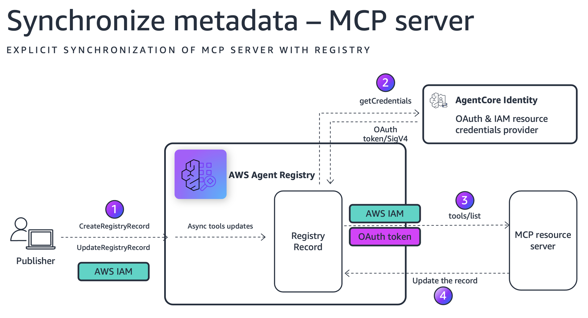

# Synchronize MCP Server Metadata to AWS Agent Registry

## Overview

This tutorial demonstrates how to use AWS Agent Registry's URL-based synchronization to automatically extract and register MCP server metadata (server schema, tools, descriptions, and versions) from both externally hosted and AgentCore Runtime-hosted MCP servers.

Instead of manually defining tool schemas, you provide the MCP server URL and the registry connects to the server, discovers its capabilities, and creates a registry record with the extracted metadata.

## Getting Started

To get started with this tutorial, open and follow the step-by-step guide in the Jupyter notebook:

**[📓 registry_synchronize_mcpserver.ipynb](registry_synchronize_mcpserver.ipynb)**

The notebook contains all the code examples, configurations, and detailed instructions needed to complete this tutorial.

## What You'll Learn

* How to list available registries and create a new registry with IAM authorization
* How to synchronize a **public unprotected** MCP server to the registry
* How to synchronize an **OAuth-protected** MCP server deployed on AgentCore Runtime
* How to synchronize an **IAM-protected** MCP server deployed on AgentCore Runtime
                             |
### Tutorial Architecture

The diagram below shows how AWS Agent Registry synchronizes metadata from OAuth-protected and IAM-protected MCP Servers.

After synchronization, the record will be created in CREATING status. After about ten seconds, the record transitions to DRAFT status and contains descriptors extracted from the MCP server, including server descriptor and tools descriptor. The registry also updates the record name, description, and version if those values are found when connecting to the MCP server.

### Tutorial Key Features

* URL-based synchronization (pull-based metadata extraction)
* Public MCP server synchronization
* OAuth-protected MCP server synchronization with Cognito
* IAM-protected MCP server synchronization with role-based access

## Prerequisites

- AWS account with IAM credentials that have permissions for AWS Agent Registry, AgentCore Runtime, Cognito, and IAM role management
- Python 3.10+ with boto3 >= 1.42.87 (with `bedrock-agentcore-control` service support)
- AWS CLI v2 configured with an appropriate profile
- `bedrock-agentcore-starter-toolkit` for deploying MCP servers to AgentCore Runtime

## Notebook Sections

| Section | What It Does |
|---------|--------------|
| Setup | Installs dependencies, initializes AWS session and clients, creates helper functions for waiting on async operations. |
| 1. List Registries | Lists all available registries in the account. |
| 2. Create Registry | Creates a new registry with IAM authorization and `autoApproval: False`. |
| 3. Synchronize from Public MCP Server | Synchronizes metadata from a public unprotected MCP server (e.g., AWS Knowledge MCP Server) using URL-based sync. |
| 4. Synchronize from OAuth-Protected MCP Server | Creates a Cognito user pool and OAuth provider, deploys an MCP server with JWT authorization to AgentCore Runtime, and synchronizes using OAuth credentials. |
| 5. Synchronize from IAM-Protected MCP Server | Deploys an MCP server with default IAM auth to AgentCore Runtime, creates an IAM role for registry-to-runtime invocation, and synchronizes using IAM credentials. |
| 6. List All Records | Lists all synchronized records in the registry. |
| 7. Cleanup | Deletes all created resources: registry records, registry, runtimes, OAuth providers, Cognito resources, IAM roles, and local files. |

## AWS Services Used

| Service | Purpose |
|---------|---------|
| **AWS Agent Registry** | Stores MCP server records with extracted tool schemas and metadata. |
| **AgentCore Runtime** | Hosts MCP servers with OAuth or IAM authentication. |
| **Amazon Cognito** | Provides OAuth2 authentication for MCP server access (client credentials flow). |
| **IAM** | Provides role-based access for registry-to-runtime invocation. |

## Cleanup

The notebook includes a cleanup section (Section 7) that removes all resources created during the tutorial:

- Registry records and registry
- AgentCore Runtime deployments
- OAuth2 credential providers
- Cognito user pools and domains
- IAM roles and policies
- Local files generated by `%%writefile`

Run the cleanup cell to avoid incurring ongoing charges.
