# Bring your VPC resources to your agents with AgentCore CLI and harness in AgentCore

In this example, you will create the harness with VPC configuration, using AgentCore CLI.

## Prerequisites

To get started, you will need:

- Node.js 20.x or later
- uv for Python agents ([install](https://docs.astral.sh/uv/getting-started/installation/))

Then, **install agentcore-cli**:

```Bash
npm i -g @aws/agentcore@preview

# Verify
agentcore --version
```

Have your Network setup configured, like private subnets and VPC endpoints. [AgentCore Documentation](https://docs.aws.amazon.com/bedrock-agentcore/latest/devguide/vpc.html).

## Create and Invoke an Agent using Bedrock model provider

In this step-by-step tutorial, we will use interactive mode for AgentCore CLI, to navigate you through VPC supported configuration, but you can directly create using the following command:

To create your project:

```bash
agentcore create --name HarnessBedrockVPC --memory "none" --model-provider bedrock --network-mode VPC --subnets <ids> --security-groups <ids>

```

### Start interactive mode

#### Configuring your harness

Run following command:

```bash
agentcore
```
<p align="left">
    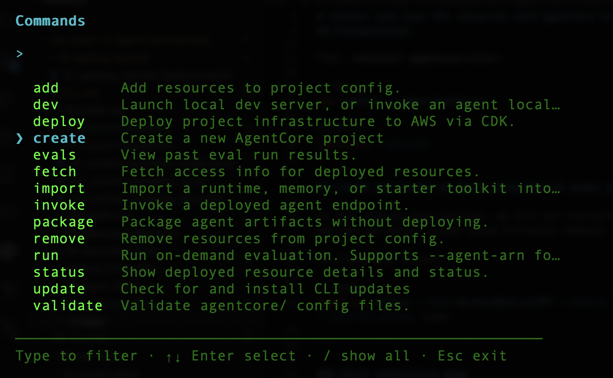
</p> 

Name your project and continue (return/enter):

<p align="left">
    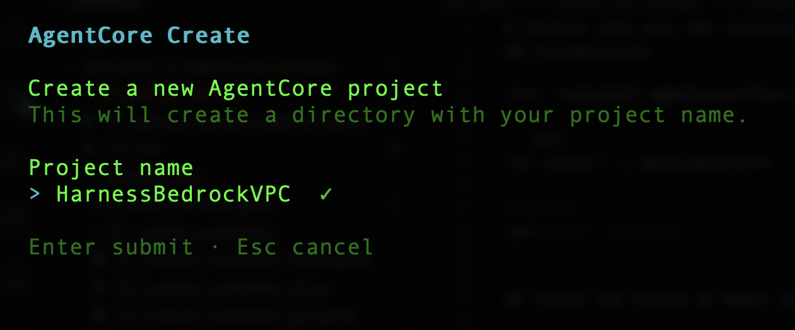
</p> 

Choose creation mode "Harness" (default) and continue:

<p align="left">
    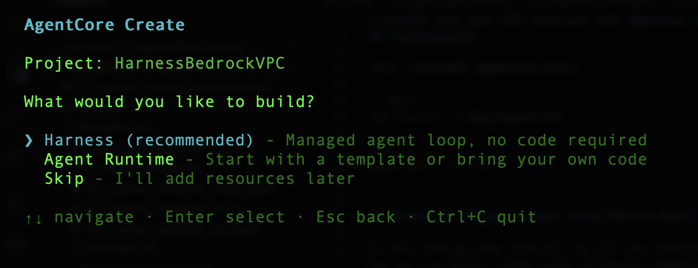
</p> 

Name your harness and continue (return/enter):

<p align="left">
    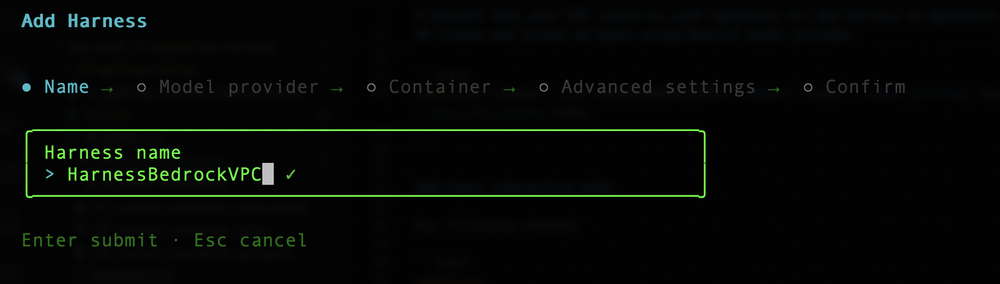
</p> 

Choose your model provider as "Bedrock":

<p align="left">
    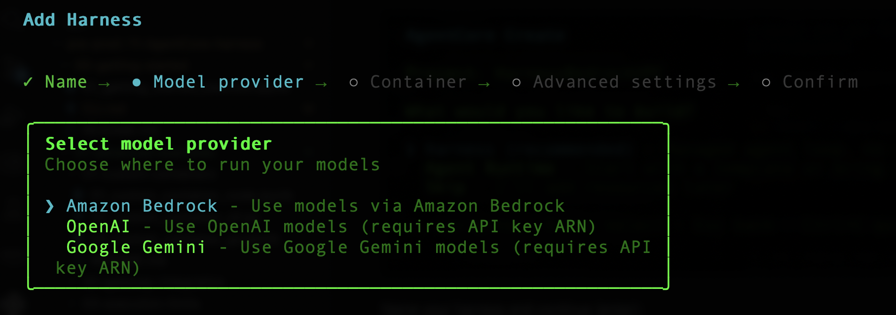
</p> 

Keep "None" as we are not going to customize the container:

<p align="left">
    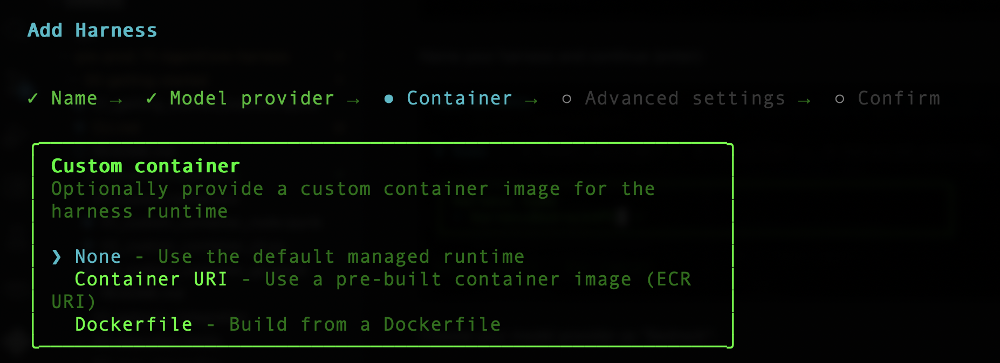
</p> 

Don't add memory configuration:

<p align="left">
    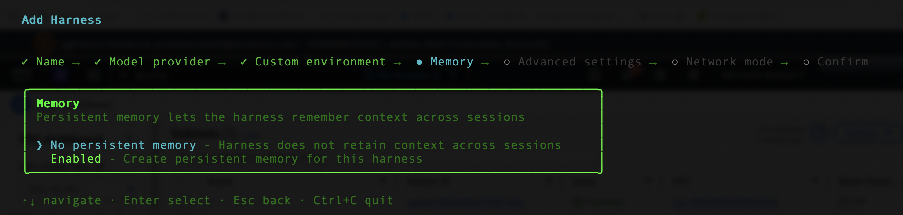
</p> 

Tick "Network" option (with space key) to add VPC configuration and continue:

<p align="left">
    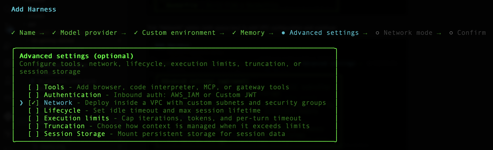
</p> 

Choose "VPC" mode:

<p align="left">
    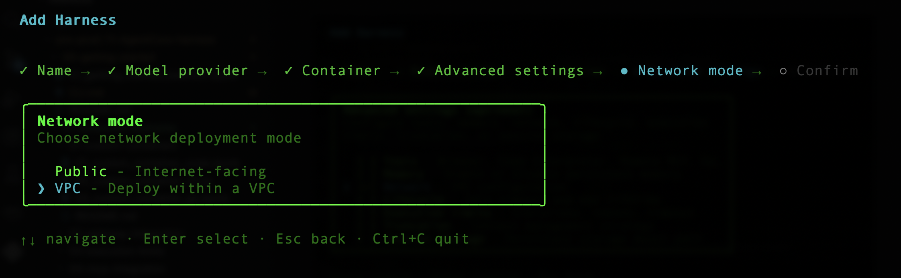
</p> 

Type your subnets, separated by commas, and continue. If need more information on available AZs, go to the [documentation](https://docs.aws.amazon.com/bedrock-agentcore/latest/devguide/agentcore-vpc.html#agentcore-supported-azs).

<p align="left">
    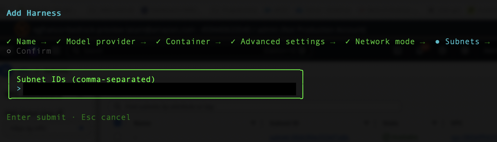
</p> 

Add your security group (if you want to add more than one, separated them with commas):

<p align="left">
    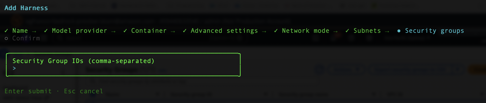
</p>

Finally, you will see summary of your harness, if it's OK, just continue (return/enter):

<p align="left">
    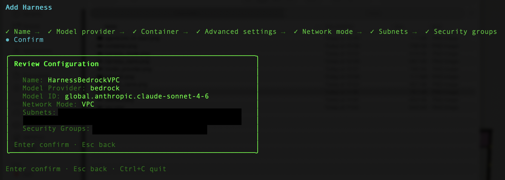
</p>

CLI will create your project and it will finish interactive mode after project creation:

<p align="left">
    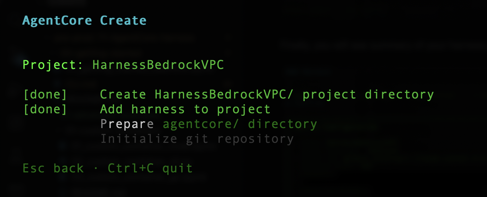
</p>

<p align="left">
    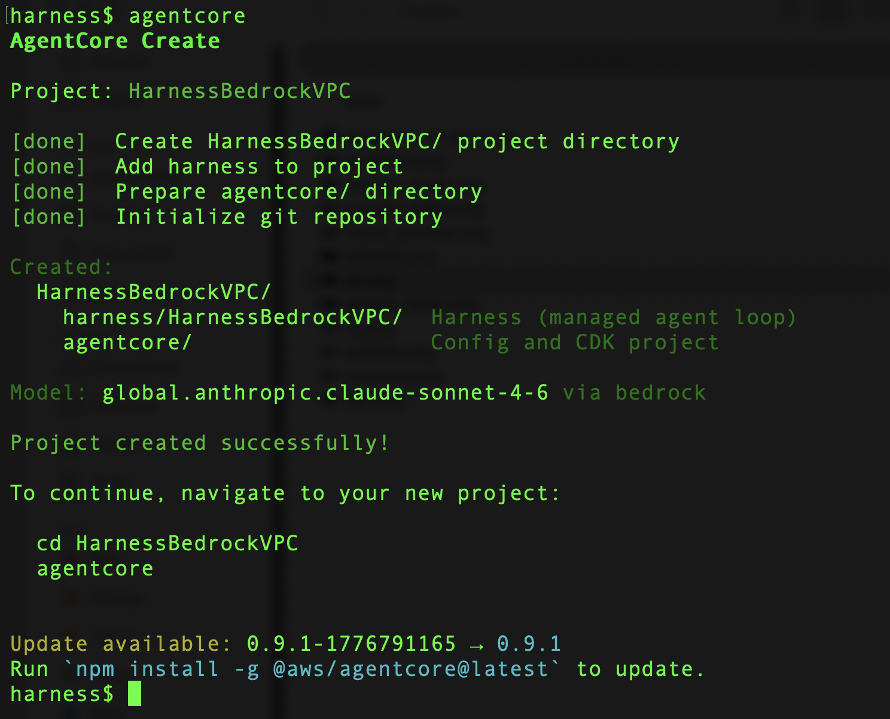
</p>

You can check your configuration file, by running following command:

```bash

cat HarnessBedrockVPC/app/HarnessBedrockVPC/harness.json
```

#### Deploying your harness

**Enter the brand new created folder, and run following command to deploy your harness agent**:

```bash
cd HarnessBedrockVPC

agentcore deploy

```

<p align="left">
    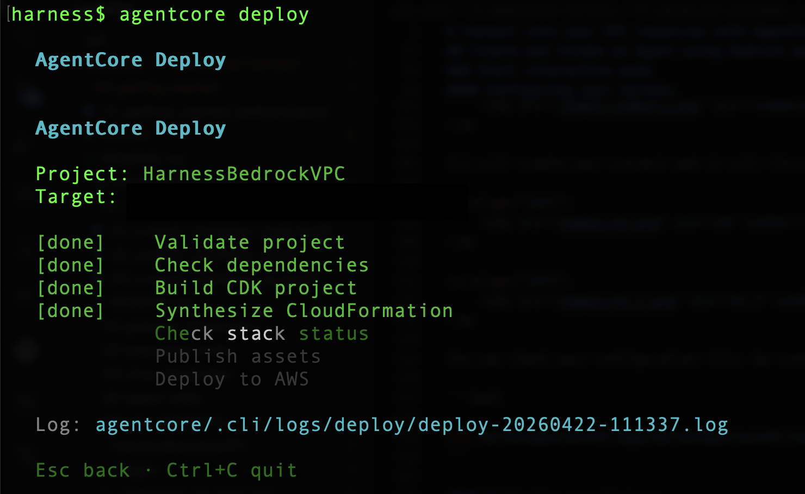
</p>

After your agent is deployed, you will receive a confirmation message. 
You can also open CloudFormation console to check status of the deploy.

#### Testing

You can invoke your harness with `invoke` command:

```bash

agentcore invoke --harness HarnessBedrockVPC "Hello!"
```