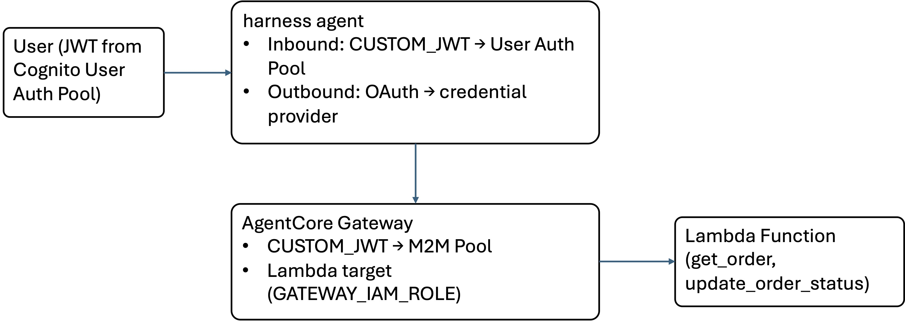

# harness with OAuth Inbound Auth and OAuth-Protected Gateway

This sample demonstrates end-to-end OAuth integration with AgentCore harness:

- **Inbound auth**: User authenticates to the harness via Cognito JWT (USER_PASSWORD_AUTH)
- **Outbound auth**: harness authenticates to AgentCore Gateway via Cognito M2M (client credentials flow)
- **Gateway target**: A Lambda function exposed through the Gateway

For full harness documentation, see the [AgentCore harness Developer Guide](https://docs.aws.amazon.com/bedrock-agentcore/latest/devguide/harness.html).

## Architecture



## What you'll learn

- Configuring `CUSTOM_JWT` inbound auth on a harness (any OIDC provider works)
- Configuring `outboundAuth.oauth` on a gateway tool (client credentials grant)
- Setting up an OAuth2 credential provider in AgentCore Identity
- Creating a Gateway with JWT inbound auth and a Lambda target
- Invoking the harness with a bearer token — secrets never leave the Token Vault

## Project structure

```
├── harness_oauth_gateway.ipynb   ← main notebook
├── utils/
│   ├── setup_helpers.py          ← idempotent infra setup & cleanup
│   └── lambda_function_code.py   ← order management Lambda handler
├── images/
│   └── architecture.jpg          ← architecture diagram
├── requirements.txt
└── README.md
```

## Prerequisites

- AWS account with Bedrock AgentCore access
- AWS credentials configured (`aws configure` or env vars)
- Python 3.10+, `boto3 >= 1.42.80`, `requests`, `jupyter`
- Bedrock model access enabled

## How to run

```bash
pip install -r requirements.txt
jupyter notebook harness_oauth_gateway.ipynb
```

Run cells top-to-bottom. User credentials are prompted via `getpass` — never visible in the notebook. All cells are idempotent — safe to re-run.

## Cleanup

The last cell in the notebook deletes all resources. It discovers resources by name and skips gracefully if they don't exist — works even after a kernel restart.
